2 - deviaTE
================
Matthew Beaumont
2023-09-06

# TE miner & deviaTE analysis

To assess the estimated P-element copy number and coverage across the
lines, we used the DeviaTE tool.

This began by first using the Fastq-miner.

``` bash
nohup zsh fastq-miner.sh iil /Volumes/Data/Projects/invaded_inbred_lines/dna/raw/output/FastQ > /Volumes/Data/Projects/invaded_inbred_lines/logs/IIlines.log &
```

Then using deviaTE, targeting the P-element (PPI251), to generate
coverage plots.

``` bash
nohup zsh deviate-family.sh iil PPI251 > /Volumes/Data/Projects/invaded_inbred_lines/logs/IIlines.log &
```

## Coverage plots

After converting them to pngs, this provided us with the following
DeviaTE plots for each of the lines assessed (NB: three lines are
excluded, further explanation below).

``` r
knitr::include_graphics("figs/deviaTE_png/Dmel_1.PPI251.png")
```


``` r
knitr::include_graphics("figs/deviaTE_png/Dmel_2.PPI251.png")
```


``` r
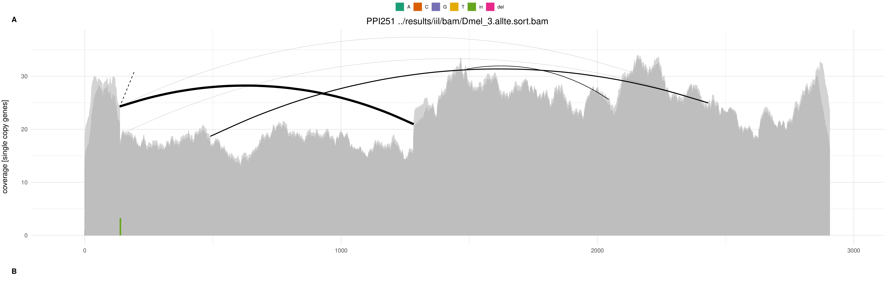
```


``` r
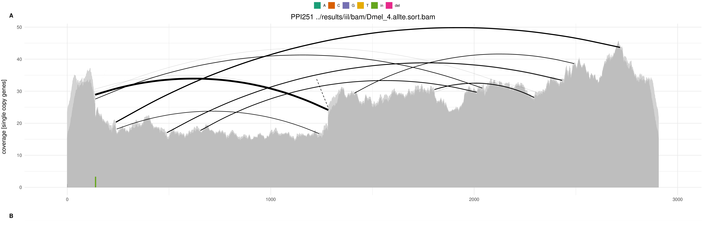
```


``` r
knitr::include_graphics("figs/deviaTE_png/Dmel_5.PPI251.png")
```


``` r
knitr::include_graphics("figs/deviaTE_png/Dmel_6.PPI251.png")
```


``` r
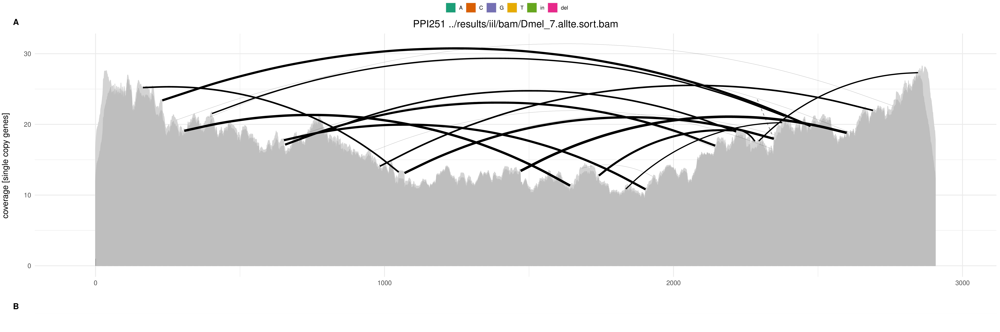
```


``` r
knitr::include_graphics("figs/deviaTE_png/Dmel_8.PPI251.png")
```


``` r
knitr::include_graphics("figs/deviaTE_png/Dmel_9.PPI251.png")
```


``` r
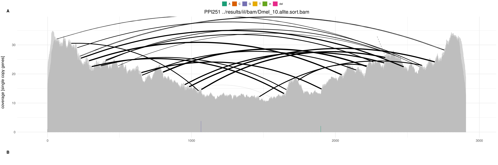
```


``` r
knitr::include_graphics("figs/deviaTE_png/Dmel_N1.PPI251.png")
```


``` r
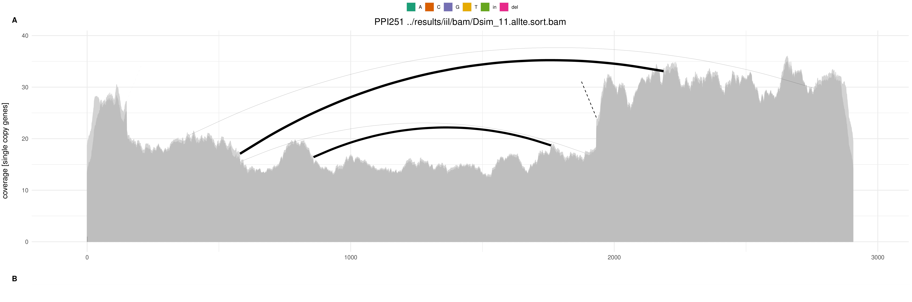
```


``` r
knitr::include_graphics("figs/deviaTE_png/Dsim_12.PPI251.png")
```


``` r
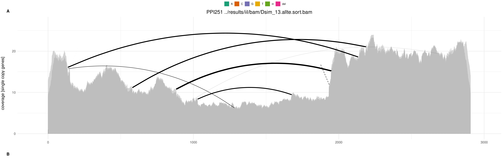
```


``` r
knitr::include_graphics("figs/deviaTE_png/Dsim_14.PPI251.png")
```


``` r
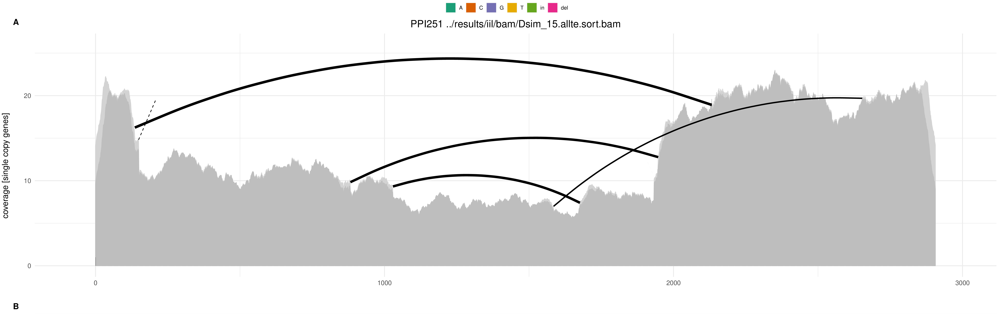
```


``` r
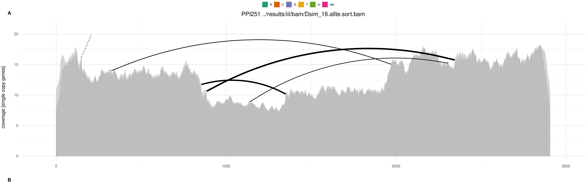
```


``` r
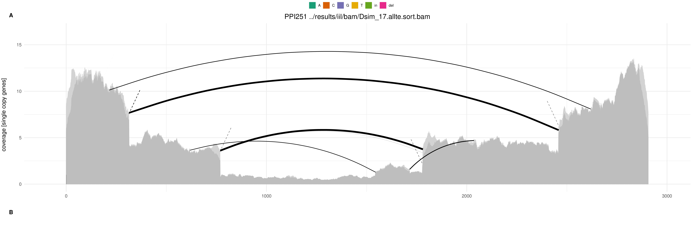
```


``` r
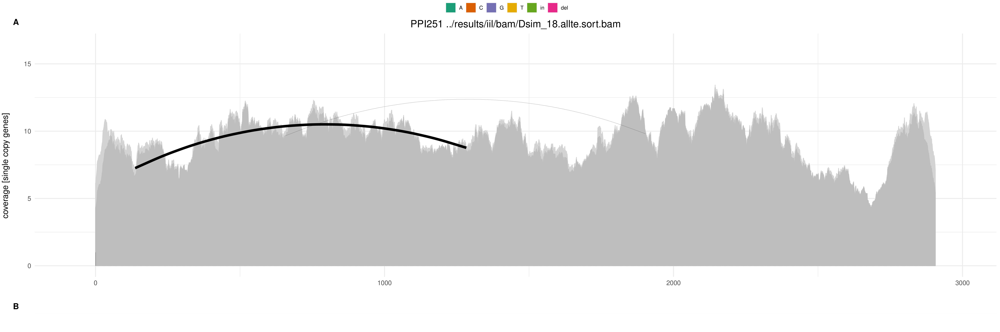
```


``` r
knitr::include_graphics("figs/deviaTE_png/Dsim_19.PPI251.png")
```


``` r
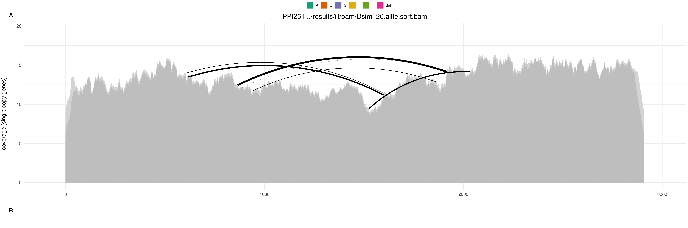
```


``` r
knitr::include_graphics("figs/deviaTE_png/Dyak_21.PPI251.png")
```


``` r
knitr::include_graphics("figs/deviaTE_png/Dyak_23.PPI251.png")
```


``` r
knitr::include_graphics("figs/deviaTE_png/Dyak_24.PPI251.png")
```


``` r
knitr::include_graphics("figs/deviaTE_png/Dyak_25.PPI251.png")
```


``` r
knitr::include_graphics("figs/deviaTE_png/Dyak_26.PPI251.png")
```


``` r
knitr::include_graphics("figs/deviaTE_png/Dyak_27.PPI251.png")
```


``` r
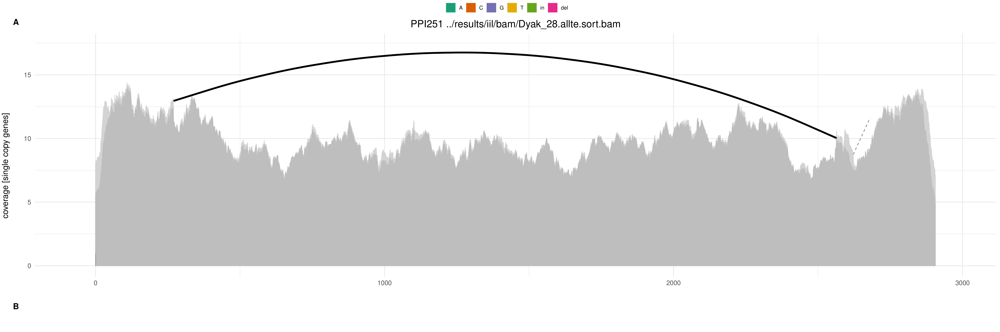
```


``` r
knitr::include_graphics("figs/deviaTE_png/Dyak_29.PPI251.png")
```


``` r
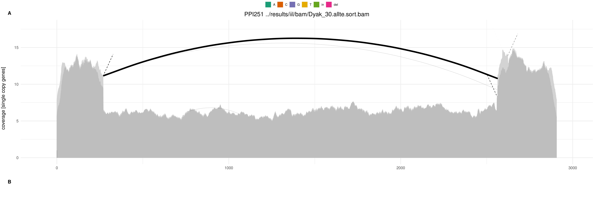
```


``` r
knitr::include_graphics("figs/deviaTE_png/Dyak_N3.PPI251.png")
```


## Other

Note that three of the lines are missing (17, N2 and 22), for line 17,
we believe that this line was at some point contaminated with d.mel, as
it has the same insertion coverage as the original replicate 2 of the
d.mel lines.

``` r

```


As for lines N2 and 22, they returned little to no data after
demultiplexing, even after attempting to use other index sequences in
the hope that there was a labeling mishap, nothing was found.

In addition, we can also see that the supposed naive lines (N1, N2 and
N3), were perhaps not so naive after all. As their respective deviaTE
coverage plots show at least a low level of coverage throughout,
denoting a potential contamination of these two samples by their invaded
coounterparts.

However, PCR results for these lines came back clean, suggesting that
the error instead lied with the sequencing data, rather than the
experimental populations themselves.
