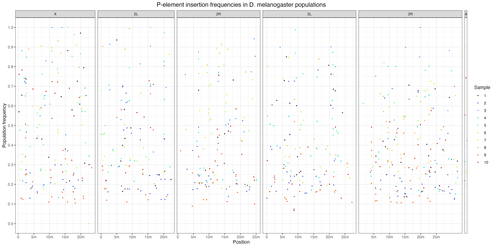
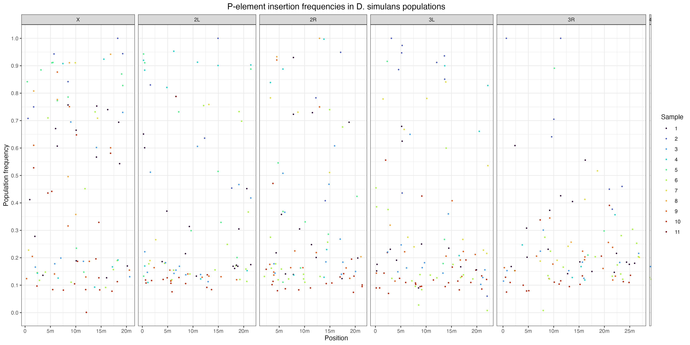
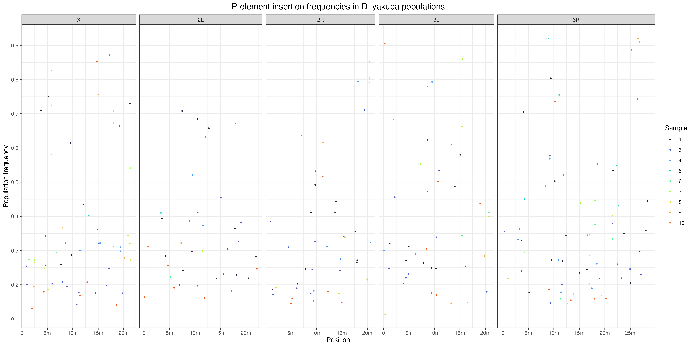
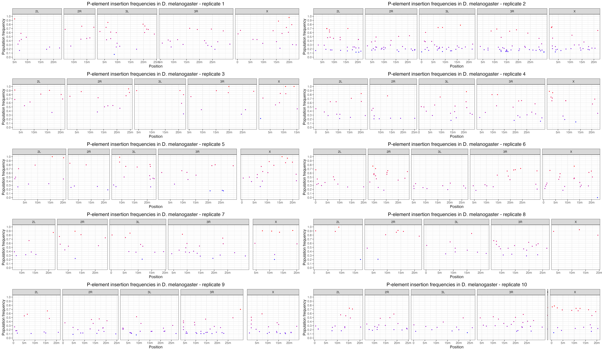
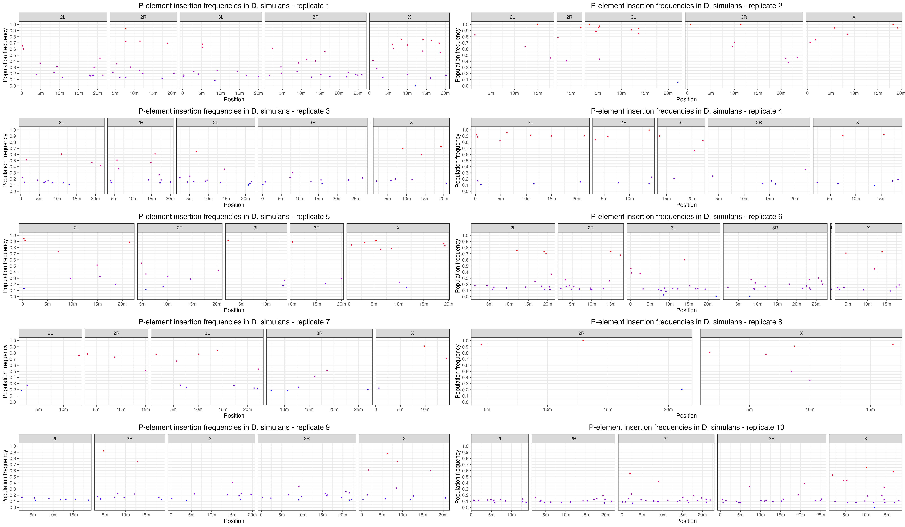
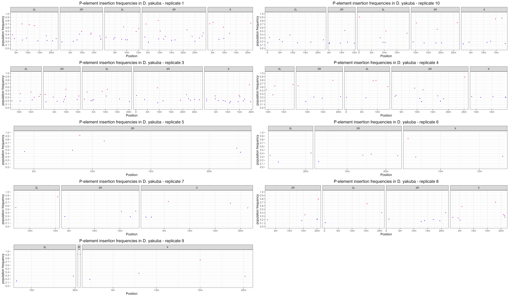

```{r setup, include=FALSE}
knitr::opts_chunk$set(echo = TRUE)
```

## PPileup generation

First, we needed to construct the required ppileup file.

To begin, we concatenated the D. mel reference genome (r6.51) with the P-element to generate the following FASTA file -

```{bash}
cd /Volumes/Data/Tools/RefGenomes/dmel/dna/dmel_PPI251/
ls -h dmelall*.fasta
```

Then created an index and /map directory for later steps.

```{bash eval=FALSE}
bwa index walkthrough-refgenome/2R-603-consensusTE.fasta

dyak % bwa index /Volumes/Data/Tools/RefGenomes/dyak/dna_pele/dyak_allchrom_1.3_PPI251.fasta 
mkdir map
```

Then we ran the following PPileupGen.sh script on the pairs of forward and reverse reads, generating the required PPileup file.

```{bash eval=FALSE}
nohup zsh PopoolationTE2/PPileupGen.sh > logs/PPileupGen.log
```

```{bash eval=FALSE}
#!/bin/bash

ref_genome="/Volumes/Data/Tools/RefGenomes/dyak/dyak_prin_Tai18E2_2.1_PPI251.fasta"
popte2_jar="/Volumes/Data/Tools/PopoolationTE2/popte2-v1.10.03.jar"
hier_file="/Volumes/Data/Tools/RefGenomes/hierarchies/pelement.hier"
samples=("Dyak_21" "Dyak_22" "Dyak_23" "Dyak_24" "Dyak_25" "Dyak_26" "Dyak_27" "Dyak_28" "Dyak_29" "Dyak_30" "Dyak_N3")

for sample in "${samples[@]}"; do
   bwa mem -M -t 2 "$ref_genome" "/Volumes/Data/Projects/invaded_inbred_lines/dna/demultiplexed/fastq/${sample}_1.fq.gz" > "/Volumes/Data/Projects/invaded_inbred_lines/dna/map/unpaired/${sample}_1.sam" &
   bwa mem -M -t 2 "$ref_genome" "/Volumes/Data/Projects/invaded_inbred_lines/dna/demultiplexed/fastq/${sample}_2.fq.gz" > "/Volumes/Data/Projects/invaded_inbred_lines/dna/map/unpaired/${sample}_2.sam" &
done
wait

for sample in "${samples[@]}"; do
    java -Duser.country=US -Duser.language=en -jar "$popte2_jar" se2pe --fastq1 "/Volumes/Data/Projects/invaded_inbred_lines/dna/demultiplexed/fastq/${sample}_1.fq.gz" \
        --fastq2 "/Volumes/Data/Projects/invaded_inbred_lines/dna/demultiplexed/fastq/${sample}_2.fq.gz" \
        --bam1 "/Volumes/Data/Projects/invaded_inbred_lines/dna/map/unpaired/${sample}_1.sam" \
        --bam2 "/Volumes/Data/Projects/invaded_inbred_lines/dna/map/unpaired/${sample}_2.sam" \
        --sort --output "/Volumes/Data/Projects/invaded_inbred_lines/dna/map/paired/${sample}.sort.bam" &
done
wait

java -Duser.country=US -Duser.language=en -jar "$popte2_jar" ppileup \
    --bam /Volumes/Data/Projects/invaded_inbred_lines/dna/map/paired/Dyak_21.sort.bam \
    --bam /Volumes/Data/Projects/invaded_inbred_lines/dna/map/paired/Dyak_22.sort.bam \
    --bam /Volumes/Data/Projects/invaded_inbred_lines/dna/map/paired/Dyak_23.sort.bam \
    --bam /Volumes/Data/Projects/invaded_inbred_lines/dna/map/paired/Dyak_24.sort.bam \
    --bam /Volumes/Data/Projects/invaded_inbred_lines/dna/map/paired/Dyak_25.sort.bam \
    --bam /Volumes/Data/Projects/invaded_inbred_lines/dna/map/paired/Dyak_26.sort.bam \
    --bam /Volumes/Data/Projects/invaded_inbred_lines/dna/map/paired/Dyak_27.sort.bam \
    --bam /Volumes/Data/Projects/invaded_inbred_lines/dna/map/paired/Dyak_28.sort.bam \
    --bam /Volumes/Data/Projects/invaded_inbred_lines/dna/map/paired/Dyak_29.sort.bam \
    --bam /Volumes/Data/Projects/invaded_inbred_lines/dna/map/paired/Dyak_30.sort.bam \
    --bam /Volumes/Data/Projects/invaded_inbred_lines/dna/map/paired/Dyak_N3.sort.bam \
    --map-qual 15 --hier "$hier_file" --output /Volumes/Data/Projects/invaded_inbred_lines/dna/ppileup/Dyak.ppileup.gz
```

Then we ran the basic PoPoolationTE2 pipeline to assess P-element insertion location and abundance in the different populations.

``` {bash eval=FALSE}
# We need to subsample the ppileup file to a chosen coverage depth to generate am unbiased comparison of P-element abundance.
# java -Duser.country=US -Duser.language=en -jar popte2.jar subsampleppileup --ppileup dmel.ppileup.gz --target-coverage 100 --output output.ss100.ppileup.gz

# First we generate a file of the found P-element insertions and their locations.
java -Duser.country=US -Duser.language=en -jar /Volumes/Data/Tools/PopoolationTE2/popte2-v1.10.03.jar identifySignatures --ppileup /Volumes/Data/Projects/invaded_inbred_lines/dna/ppileup/Dmel.ppileup.gz --mode separate --output /Volumes/Data/Projects/invaded_inbred_lines/dna/popTE2/dmel.signatures --min-count 3

java -Duser.country=US -Duser.language=en -jar /Volumes/Data/Tools/PopoolationTE2/popte2-v1.10.03.jar identifySignatures --ppileup /Volumes/Data/Projects/invaded_inbred_lines/dna/ppileup/Dsim.ppileup.gz --mode separate --output /Volumes/Data/Projects/invaded_inbred_lines/dna/popTE2/dsim.signatures --min-count 3

java -Duser.country=US -Duser.language=en -jar /Volumes/Data/Tools/PopoolationTE2/popte2-v1.10.03.jar identifySignatures --ppileup /Volumes/Data/Projects/invaded_inbred_lines/dna/ppileup/Dyak.ppileup.gz --mode separate --output /Volumes/Data/Projects/invaded_inbred_lines/dna/popTE2/dyak.signatures --min-count 3

# Then we look at the frequency of the found signatures.
java -Duser.country=US -Duser.language=en -jar /Volumes/Data/Tools/PopoolationTE2/popte2-v1.10.03.jar frequency --ppileup /Volumes/Data/Projects/invaded_inbred_lines/dna/ppileup/Dmel.ppileup.gz --signature /Volumes/Data/Projects/invaded_inbred_lines/dna/popTE2/dmel.signatures --output /Volumes/Data/Projects/invaded_inbred_lines/dna/popTE2/dmel.freqsig

java -Duser.country=US -Duser.language=en -jar /Volumes/Data/Tools/PopoolationTE2/popte2-v1.10.03.jar frequency --ppileup /Volumes/Data/Projects/invaded_inbred_lines/dna/ppileup/Dsim.ppileup.gz --signature /Volumes/Data/Projects/invaded_inbred_lines/dna/popTE2/dsim.signatures --output /Volumes/Data/Projects/invaded_inbred_lines/dna/popTE2/dsim.freqsig

java -Duser.country=US -Duser.language=en -jar /Volumes/Data/Tools/PopoolationTE2/popte2-v1.10.03.jar frequency --ppileup /Volumes/Data/Projects/invaded_inbred_lines/dna/ppileup/Dyak.ppileup.gz --signature /Volumes/Data/Projects/invaded_inbred_lines/dna/popTE2/dyak.signatures --output /Volumes/Data/Projects/invaded_inbred_lines/dna/popTE2/dyak.freqsig

# Finally, we combine it all together. 
java -Duser.country=US -Duser.language=en -jar /Volumes/Data/Tools/PopoolationTE2/popte2-v1.10.03.jar pairupSignatures --signature /Volumes/Data/Projects/invaded_inbred_lines/dna/popTE2/dmel.freqsig --ref-genome /Volumes/Data/Tools/RefGenomes/dmel/dna/dmel_PPI251/dmelallchrom-r6.51_PPI251.fasta --hier /Volumes/Data/Tools/RefGenomes/hierarchies/pelement.hier --min-distance -200 --max-distance 300 --output /Volumes/Data/Projects/invaded_inbred_lines/dna/popTE2/dmel.teinsertions

java -Duser.country=US -Duser.language=en -jar /Volumes/Data/Tools/PopoolationTE2/popte2-v1.10.03.jar pairupSignatures --signature /Volumes/Data/Projects/invaded_inbred_lines/dna/popTE2/dsim.freqsig --ref-genome /Volumes/Data/Tools/RefGenomes/dsim/dsim_ASM75419v3_PPI251.fasta --hier /Volumes/Data/Tools/RefGenomes/hierarchies/pelement.hier --min-distance -200 --max-distance 300 --output /Volumes/Data/Projects/invaded_inbred_lines/dna/popTE2/dsim.teinsertions

java -Duser.country=US -Duser.language=en -jar /Volumes/Data/Tools/PopoolationTE2/popte2-v1.10.03.jar pairupSignatures --signature /Volumes/Data/Projects/invaded_inbred_lines/dna/popTE2/dyak.freqsig --ref-genome /Volumes/Data/Tools/RefGenomes/dyak/dna_pele/dyak_allchrom_1.3_PPI251.fasta --hier /Volumes/Data/Tools/RefGenomes/hierarchies/pelement.hier --min-distance -200 --max-distance 300 --output /Volumes/Data/Projects/invaded_inbred_lines/dna/popTE2/dyak.teinsertions
```

This provides us with a list of P-element insertions found in all 11 samples for each species, their location and population frequency.

## Manhattan plots

We then visualised the .teinsertion files in Manhattan plots for all samples in each species.

``` {R}
library(viridisLite)
library(ggplot2)
library(gridExtra)
theme_set(theme_bw())

dm <- read.table("/Volumes/Data/Projects/invaded_inbred_lines/dna/popTE2/dmel/dmel.teinsertions")
names(dm) <- c("Sample", "Chromosome", "Position", "Strand", "TE", "Order", "FR", "Comment", "Frequency")

ds <- read.table("/Volumes/Data/Projects/invaded_inbred_lines/dna/popTE2/dsim/dsim.teinsertions")
names(ds) <- c("Sample", "Chromosome", "Position", "Strand", "TE", "Order", "FR", "Comment", "Frequency")

dy <- read.table("/Volumes/Data/Projects/invaded_inbred_lines/dna/popTE2/dyak/dyak.teinsertions")
names(dy) <- c("Sample", "Chromosome", "Position", "Strand", "TE", "Order", "FR", "Comment", "Frequency")

dm <- subset(dm, Chromosome == "X" | Chromosome == "2L" | Chromosome == "2R" | Chromosome == "3L" | Chromosome == "3R" | Chromosome == "4")
ds <- subset(ds, Chromosome == "X" | Chromosome == "2L" | Chromosome == "2R" | Chromosome == "3L" | Chromosome == "3R" | Chromosome == "4")
dy <- subset(dy, Chromosome == "X" | Chromosome == "2L" | Chromosome == "2R" | Chromosome == "3L" | Chromosome == "3R" | Chromosome == "4")

dm$Chromosome <- factor(dm$Chromosome, levels = c("X", "2L", "2R", "3L", "3R", "4"))
lim <- c(0.0, 0.51)
ybreaks <- c(0, 0.1, 0.2, 0.3, 0.4, 0.5)
ds$Chromosome <- factor(ds$Chromosome, levels = c("X", "2L", "2R", "3L", "3R", "4"))
lim <- c(0.0, 0.51)
ybreaks <- c(0, 0.1, 0.2, 0.3, 0.4, 0.5)
dy$Chromosome <- factor(dy$Chromosome, levels = c("X", "2L", "2R", "3L", "3R", "4"))
lim <- c(0.0, 0.51)
ybreaks <- c(0, 0.1, 0.2, 0.3, 0.4, 0.5)

sample_colors <- viridisLite::turbo(11)

dm$Sample <- as.factor(dm$Sample)
ds$Sample <- as.factor(ds$Sample)
dy$Sample <- as.factor(dy$Sample)

dmp <- ggplot(dm, aes(x = Position, y = Frequency, color = Sample)) +
  geom_point(size = 0.5) +
  facet_grid(. ~ Chromosome, scales = "free_x", space = "free_x") +
  scale_x_continuous(breaks = c(0, 5000000, 10000000, 15000000, 20000000, 25000000),
                     labels = c("0", "5m", "10m", "15m", "20m", "25m")) +
  scale_y_continuous(name = "Population frequency", limits = c(min(dm$Frequency), max(dm$Frequency)),
                     breaks = seq(0, 1, by = 0.1)) +
  scale_color_manual(values = sample_colors) +  
  theme(legend.position = "right", 
          plot.title = element_text(hjust = 0.5, size = 14)) +
  labs(title = "P-element insertion frequencies in D. melanogaster populations")


dsp <- ggplot(ds, aes(x = Position, y = Frequency, color = Sample)) +
  geom_point(size = 0.5) +
  facet_grid(. ~ Chromosome, scales = "free_x", space = "free_x") +
  scale_x_continuous(breaks = c(0, 5000000, 10000000, 15000000, 20000000, 25000000),
                     labels = c("0", "5m", "10m", "15m", "20m", "25m")) +
  scale_y_continuous(name = "Population frequency", limits = c(min(ds$Frequency), max(ds$Frequency)),
                     breaks = seq(0, 1, by = 0.1)) +
  scale_color_manual(values = sample_colors) +  
  theme(legend.position = "right", 
          plot.title = element_text(hjust = 0.5, size = 14)) +
  labs(title = "P-element insertion frequencies in D. simulans populations")


dyp <- ggplot(dy, aes(x = Position, y = Frequency, color = Sample)) +
  geom_point(size = 0.5) +
  facet_grid(. ~ Chromosome, scales = "free_x", space = "free_x") +
  scale_x_continuous(breaks = c(0, 5000000, 10000000, 15000000, 20000000, 25000000),
                     labels = c("0", "5m", "10m", "15m", "20m", "25m")) +
  scale_y_continuous(name = "Population frequency", limits = c(min(dy$Frequency), max(dy$Frequency)),
                     breaks = seq(0, 1, by = 0.1)) +
  scale_color_manual(values = sample_colors) +  
  theme(legend.position = "right",
          plot.title = element_text(hjust = 0.5, size = 14)) +
  labs(title = "P-element insertion frequencies in D. yakuba populations")

ggsave("dna/figs/dmel_popTE2_all.png", dmp, width = 16, height = 8, dpi = 300)
ggsave("dna/figs/dsim_popTE2_all.png", dsp, width = 16, height = 8, dpi = 300)
ggsave("dna/figs/dyak_popTE2_all.png", dyp, width = 16, height = 8, dpi = 300)




```

### Dmel

Then we looked at each sample individually, starting with D. mel.

``` {R}
library(ggplot2)
library(gridExtra)
theme_set(theme_bw())

datasets <- list()

for (i in 1:10) {
  file_path <- sprintf("/Volumes/Data/Projects/invaded_inbred_lines/dna/popTE2/dmel/replicates/%d.teinsertions", i)
  dataset <- read.table(file_path)
  names(dataset) <- c("Sample", "Chromosome", "Position", "Strand", "TE", "Order", "FR", "Comment", "Frequency")
  
  dataset <- subset(dataset, Chromosome %in% c("X", "2L", "2R", "3L", "3R", "4"))
  
  datasets[[i]] <- dataset
}

plots <- list()

for (i in 1:10) {
  dataset <- datasets[[i]]

  plot <- ggplot(dataset, aes(x = Position, y = Frequency, color = Frequency)) +
    geom_point(size = 0.5) +
    facet_grid(. ~ Chromosome, scales = "free_x", space = "free_x") +
    scale_x_continuous(breaks = c(0, 5000000, 10000000, 15000000, 20000000, 25000000),
                       labels = c("0", "5m", "10m", "15m", "20m", "25m")) +
    scale_y_continuous(name = "population frequency", limits = c(0, 1),
                       breaks = seq(0, 1, by = 0.1)) +
    scale_color_gradient(low = "blue", high = "red") +
    theme(legend.position = "none", plot.title = element_text(hjust = 0.5, size = 14)) +
    labs(title = paste("P-element insertion frequencies in D. melanogaster - replicate", i))
  
  plots[[i]] <- plot
}

grid <- do.call(grid.arrange, c(plots, ncol = 2))

ggsave("dna/figs/dmel_popTE2.png", grid, width = 24, height = 14, dpi = 300)


```

### Dsim 

Then for D. sim.

``` {R}
library(ggplot2)
library(gridExtra)
theme_set(theme_bw())

datasets <- list()

for (i in 1:10) {
  file_path <- sprintf("/Volumes/Data/Projects/invaded_inbred_lines/dna/popTE2/dsim/replicates/%d.teinsertions", i)
  dataset <- read.table(file_path)
  names(dataset) <- c("Sample", "Chromosome", "Position", "Strand", "TE", "Order", "FR", "Comment", "Frequency")

  dataset <- subset(dataset, Chromosome %in% c("X", "2L", "2R", "3L", "3R", "4"))

  datasets[[i]] <- dataset
}

plots <- list()

for (i in 1:10) {
  dataset <- datasets[[i]]

  plot <- ggplot(dataset, aes(x = Position, y = Frequency, color = Frequency)) +
    geom_point(size = 0.5) +
    facet_grid(. ~ Chromosome, scales = "free_x", space = "free_x") +
    scale_x_continuous(breaks = c(0, 5000000, 10000000, 15000000, 20000000, 25000000),
                       labels = c("0", "5m", "10m", "15m", "20m", "25m")) +
    scale_y_continuous(name = "population frequency", limits = c(0, 1),
                       breaks = seq(0, 1, by = 0.1)) +
    scale_color_gradient(low = "blue", high = "red") +
    theme(legend.position = "none", plot.title = element_text(hjust = 0.5, size = 14)) +
    labs(title = paste("P-element insertion frequencies in D. simulans - replicate", i))
  
  plots[[i]] <- plot
}

grid <- do.call(grid.arrange, c(plots, ncol = 2))

ggsave("dna/figs/dsim_popTE2.png", grid, width = 24, height = 14, dpi = 300)


```

### Dyak

And finally D. yak.

``` {R}
library(ggplot2)
library(gridExtra)
theme_set(theme_bw())

datasets <- list()

directory_path <- "/Volumes/Data/Projects/invaded_inbred_lines/dna/popTE2/dyak/replicates/"

replicate_files <- list.files(directory_path, pattern = "\\.teinsertions", full.names = TRUE)

replicate_numbers <- sub(".*/(\\d+)\\.teinsertions", "\\1", replicate_files)

for (i in replicate_numbers) {
  file_path <- file.path(directory_path, paste0(i, ".teinsertions"))
  
  if (file.exists(file_path)) {
    dataset <- read.table(file_path)
    names(dataset) <- c("Sample", "Chromosome", "Position", "Strand", "TE", "Order", "FR", "Comment", "Frequency")

    dataset <- subset(dataset, Chromosome %in% c("X", "2L", "2R", "3L", "3R", "4"))
  
    datasets[[i]] <- dataset
  } else {
    cat("File not found for replicate", i, "\n")
  }
}

plots <- list()

for (i in replicate_numbers) {
  dataset <- datasets[[i]]

  plot <- ggplot(dataset, aes(x = Position, y = Frequency, color = Frequency)) +
    geom_point(size = 0.5) +
    facet_grid(. ~ Chromosome, scales = "free_x", space = "free_x") +
    scale_x_continuous(breaks = c(0, 5000000, 10000000, 15000000, 20000000, 25000000),
                       labels = c("0", "5m", "10m", "15m", "20m", "25m")) +
    scale_y_continuous(name = "population frequency", limits = c(0, 1),
                       breaks = seq(0, 1, by = 0.1)) +
    scale_color_gradient(low = "blue", high = "red") +
    theme(legend.position = "none", plot.title = element_text(hjust = 0.5, size = 14)) +
    labs(title = paste("P-element insertion frequencies in D. yakuba - replicate", i))
  
  plots[[i]] <- plot
}

grid <- do.call(grid.arrange, c(plots, ncol = 2))

ggsave("dna/figs/dyak_popTE2.png", grid, width = 24, height = 14, dpi = 300)


```

There are only a few replicates across all species which have seen the frequency of their P-element insertions generally reach fixation. These replicates are as such -

- D. mel R3*
- D. mel R7* 
- D. mel R8*
- D. sim R2
- D. sim R4*
- D. sim R5*

*would require extra validation/inbreeding, low frequency insertions present could likely be due to cross-contamination.

Additionally, all of the D. yak replicates show wide variation in both the number and frequency of their insertions, suggesting that, when the replicates where taken for inbreeding, the original P-element invasion had not yet been suppressed and copy number was not stable.

