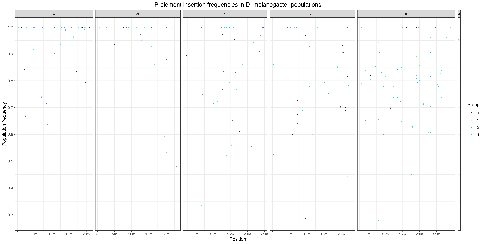
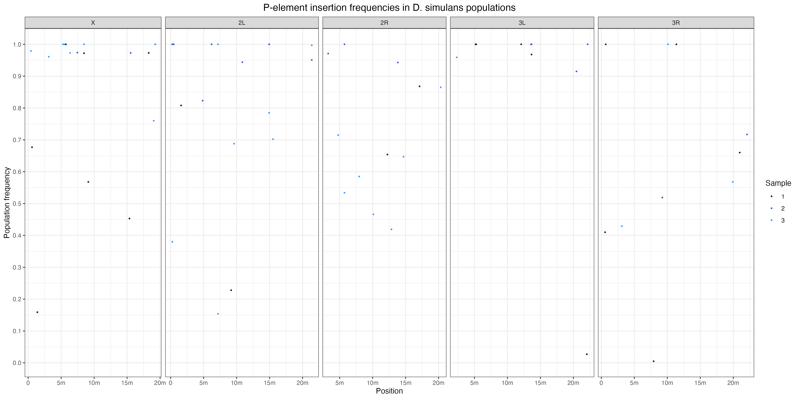
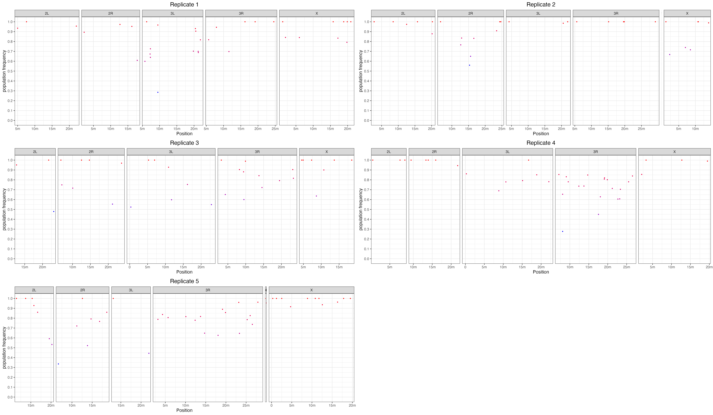
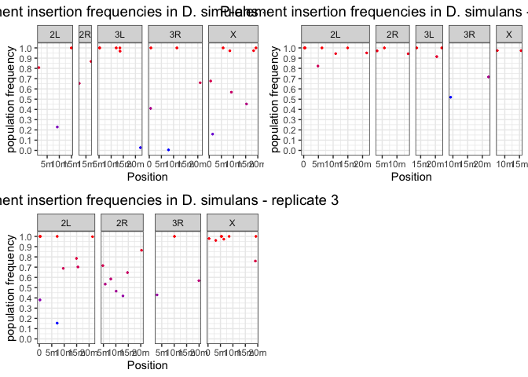
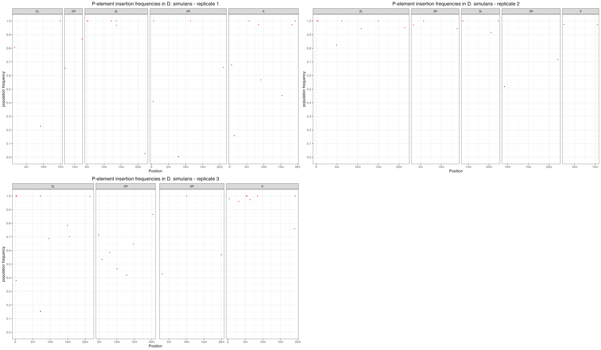
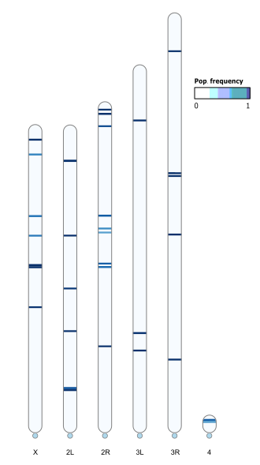
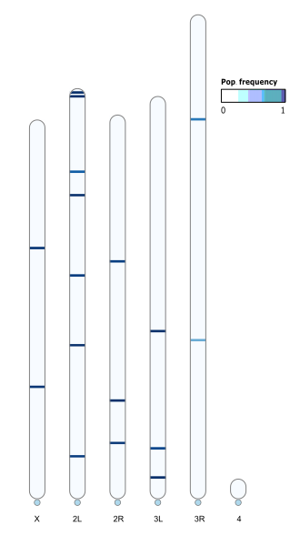

5 - BGI data analysis
================
Matthew Beaumont
2024-05-31

After sending 5 of the most inbred populations, plus the 2 d.mel lines
used for the original PALs, to BGI instead of VBCF, we aimed to gain a
clearer insight into the population frequency of P-element insertions.

## Manhattan plots

First, we visualised the PopTE2 output as manahattan plots, displaying
the pop frequency of insertions as done before.

``` r
library(viridisLite)
library(ggplot2)
library(gridExtra)
theme_set(theme_bw())

dm <- read.table("/Volumes/Data/Projects/invaded_inbred_lines/dna/popTE2/dmel/bgi/dmel_bgi.teinsertions")
names(dm) <- c("Sample", "Chromosome", "Position", "Strand", "TE", "Order", "FR", "Comment", "Frequency")

ds <- read.table("/Volumes/Data/Projects/invaded_inbred_lines/dna/popTE2/dsim/bgi/dsim_bgi.teinsertions")
names(ds) <- c("Sample", "Chromosome", "Position", "Strand", "TE", "Order", "FR", "Comment", "Frequency")

dm <- subset(dm, Chromosome == "X" | Chromosome == "2L" | Chromosome == "2R" | Chromosome == "3L" | Chromosome == "3R" | Chromosome == "4")
ds <- subset(ds, Chromosome == "X" | Chromosome == "2L" | Chromosome == "2R" | Chromosome == "3L" | Chromosome == "3R" | Chromosome == "4")

dm$Chromosome <- factor(dm$Chromosome, levels = c("X", "2L", "2R", "3L", "3R", "4"))
lim <- c(0.0, 0.51)
ybreaks <- c(0, 0.1, 0.2, 0.3, 0.4, 0.5)
ds$Chromosome <- factor(ds$Chromosome, levels = c("X", "2L", "2R", "3L", "3R", "4"))
lim <- c(0.0, 0.51)
ybreaks <- c(0, 0.1, 0.2, 0.3, 0.4, 0.5)

sample_colors <- viridisLite::turbo(11)

dm$Sample <- as.factor(dm$Sample)
ds$Sample <- as.factor(ds$Sample)

dmp <- ggplot(dm, aes(x = Position, y = Frequency, color = Sample)) +
  geom_point(size = 0.5) +
  facet_grid(. ~ Chromosome, scales = "free_x", space = "free_x") +
  scale_x_continuous(breaks = c(0, 5000000, 10000000, 15000000, 20000000, 25000000),
                     labels = c("0", "5m", "10m", "15m", "20m", "25m")) +
  scale_y_continuous(name = "Population frequency", limits = c(min(dm$Frequency), max(dm$Frequency)),
                     breaks = seq(0, 1, by = 0.1)) +
  scale_color_manual(values = sample_colors) +  
  theme(legend.position = "right", 
          plot.title = element_text(hjust = 0.5, size = 14)) +
  labs(title = "P-element insertion frequencies in D. melanogaster populations")


dsp <- ggplot(ds, aes(x = Position, y = Frequency, color = Sample)) +
  geom_point(size = 0.5) +
  facet_grid(. ~ Chromosome, scales = "free_x", space = "free_x") +
  scale_x_continuous(breaks = c(0, 5000000, 10000000, 15000000, 20000000, 25000000),
                     labels = c("0", "5m", "10m", "15m", "20m", "25m")) +
  scale_y_continuous(name = "Population frequency", limits = c(min(ds$Frequency), max(ds$Frequency)),
                     breaks = seq(0, 1, by = 0.1)) +
  scale_color_manual(values = sample_colors) +  
  theme(legend.position = "right", 
          plot.title = element_text(hjust = 0.5, size = 14)) +
  labs(title = "P-element insertion frequencies in D. simulans populations")

ggsave("dna/figs/dmel_bgi_popTE2_all.png", dmp, width = 16, height = 8, dpi = 300)
ggsave("dna/figs/dsim_bgi_popTE2_all.png", dsp, width = 16, height = 8, dpi = 300)


```


``` r

```


We then assessed each line individually.

### Dmel

``` bash
awk '{print > "bgi/replicates/" $1 ".teinsertions"}' bgi/dmel_bgi.teinsertions
```

``` r
library(ggplot2)
library(gridExtra)
theme_set(theme_bw())

datasets <- list()

for (i in 1:5) {
  file_path <- sprintf("/Volumes/Data/Projects/invaded_inbred_lines/dna/popTE2/dmel/bgi/replicates/%d.teinsertions", i)
  dataset <- read.table(file_path)
  names(dataset) <- c("Sample", "Chromosome", "Position", "Strand", "TE", "Order", "FR", "Comment", "Frequency")
  
  dataset <- subset(dataset, Chromosome %in% c("X", "2L", "2R", "3L", "3R", "4"))
  
  datasets[[i]] <- dataset
}

plots <- list()

for (i in 1:5) {
  dataset <- datasets[[i]]

  plot <- ggplot(dataset, aes(x = Position, y = Frequency, color = Frequency)) +
    geom_point(size = 0.5) +
    facet_grid(. ~ Chromosome, scales = "free_x", space = "free_x") +
    scale_x_continuous(breaks = c(0, 5000000, 10000000, 15000000, 20000000, 25000000),
                       labels = c("0", "5m", "10m", "15m", "20m", "25m")) +
    scale_y_continuous(name = "population frequency", limits = c(0, 1),
                       breaks = seq(0, 1, by = 0.1)) +
    scale_color_gradient(low = "blue", high = "red") +
    theme(legend.position = "none", plot.title = element_text(hjust = 0.5, size = 14)) +
    labs(title = paste("Replicate", i))
  
  plots[[i]] <- plot
}

grid <- do.call(grid.arrange, c(plots, ncol = 2))
```

<!-- -->

``` r
ggsave("dna/figs/dmel_bgi_popTE2.png", grid, width = 24, height = 14, dpi = 300)


```


### Dsim

``` r
library(ggplot2)
library(gridExtra)
theme_set(theme_bw())

datasets <- list()

for (i in 1:3) {
  file_path <- sprintf("/Volumes/Data/Projects/invaded_inbred_lines/dna/popTE2/dsim/bgi/replicates/%d.teinsertions", i)
  dataset <- read.table(file_path)
  names(dataset) <- c("Sample", "Chromosome", "Position", "Strand", "TE", "Order", "FR", "Comment", "Frequency")
  
  dataset <- subset(dataset, Chromosome %in% c("X", "2L", "2R", "3L", "3R", "4"))
  
  datasets[[i]] <- dataset
}

plots <- list()

for (i in 1:3) {
  dataset <- datasets[[i]]

  plot <- ggplot(dataset, aes(x = Position, y = Frequency, color = Frequency)) +
    geom_point(size = 0.5) +
    facet_grid(. ~ Chromosome, scales = "free_x", space = "free_x") +
    scale_x_continuous(breaks = c(0, 5000000, 10000000, 15000000, 20000000, 25000000),
                       labels = c("0", "5m", "10m", "15m", "20m", "25m")) +
    scale_y_continuous(name = "population frequency", limits = c(0, 1),
                       breaks = seq(0, 1, by = 0.1)) +
    scale_color_gradient(low = "blue", high = "red") +
    theme(legend.position = "none", plot.title = element_text(hjust = 0.5, size = 14)) +
    labs(title = paste("P-element insertion frequencies in D. simulans - replicate", i))
  
  plots[[i]] <- plot
}

grid <- do.call(grid.arrange, c(plots, ncol = 2))
```

<!-- -->

``` r
ggsave("dna/figs/dsim_bgi_popTE2.png", grid, width = 24, height = 14, dpi = 300)


```


We can plainly see that the BGI data is far cleaner than the VBCF data,
with the majority of insertions found now being shown to be near
fixation. This highlights the index-hopping issue suffered with the
previous sequencing dataset.

Unfortunately, the two lines used for the original PAL generation
(d. mel replicates 1 & 5 above), were the two lines with the lowest
amount of fixation of all the lines assessed. This led us to restart the
PAL lines, this time using the two best lines we identified above (d.mel
replicate 2 and d.sim replicate 2).

## RIdeogram

We wanted to create ideograms of the drosophila karyotypes containing
the P-element, to better visualise the insertions across the genome. To
do so we used a package called RIdeogram.

First, we must create a dataset containing the d.mel and d.sim karyotype
data (obtained from the NCBI uploads of the reference genomes).

``` r
dmel_karyotype <- read.table("/Volumes/Data/Tools/RefGenomes/karyotypes_dmel.txt", sep = "\t", header = T, stringsAsFactors = F)
dsim_karyotype <- read.table("/Volumes/Data/Tools/RefGenomes/karyotypes_dsim.txt", sep = "\t", header = T, stringsAsFactors = F)

head(dmel_karyotype)
```

    ##   Chr Start      End
    ## 1   X     0 23542271
    ## 2  2L     0 23513712
    ## 3  2R     0 25286936
    ## 4  3L     0 28110227
    ## 5  3R     0 32079331
    ## 6   4     0  1348131

``` r
head(dsim_karyotype)
```

    ##   Chr Start      End
    ## 1   X     0 23542271
    ## 2  2L     0 23513712
    ## 3  2R     0 25286936
    ## 4  3L     0 28110227
    ## 5  3R     0 32079331
    ## 6   4     0  1348131

We then need to transform the output .txt file from PopTE2 in. order to
fit the RIdeogram package.

``` python
input_file_path = '/Volumes/Data/Projects/invaded_inbred_lines/dna/popTE2/dsim/bgi/dsim_bgi.teinsertions'
output_file_path = '/Volumes/Data/Projects/invaded_inbred_lines/dna/popTE2/dsim/bgi/dsim_all_10x.txt'

with open(input_file_path, 'r') as f:
    lines = f.readlines()

# Set offset value (How much you want to increase size of insertion)
offset_multiplier = 5
offset = 2907 * offset_multiplier

new_content = []
for line in lines:
    columns = line.strip().split('\t')
    chromosome = columns[1]
    start = int(columns[2]) - offset
    end = int(columns[2]) + offset
    frequency = columns[-1]
    new_line = f"{chromosome}\t{start}\t{end}\t{frequency}\n"
    new_content.append(new_line)

with open(output_file_path, 'w') as f:
    f.writelines(new_content)

# Load karyotype dataset
karyotype_data = {
    'X': (0, 22032822),
    '2L': (0, 23857595),
    '2R': (0, 22319025),
    '3L': (0, 23399903),
    '3R': (0, 28149585),
    '4': (0, 1146867)
}

with open(output_file_path, 'r') as f:
    existing_lines = f.readlines()

new_content = []
for chromosome, (start, end) in karyotype_data.items():
    chromosome_lines = []
    for line in existing_lines:
        columns = line.strip().split('\t')
        chr_name = columns[0]
        chr_start = int(columns[1])
        chr_end = int(columns[2])

        if chr_name == chromosome:
            chromosome_lines.append((chr_start, chr_end, line))

    chromosome_lines.sort()  # Sort based on start / end

    prev_end = start
    for chr_start, chr_end, line in chromosome_lines:
        if prev_end < chr_start:
            new_line = f"{chromosome}\t{prev_end}\t{chr_start}\t0\n"
            new_content.append(new_line)
        new_content.append(line)
        prev_end = chr_end

    if prev_end < end:
        new_line = f"{chromosome}\t{prev_end}\t{end}\t0\n"
        new_content.append(new_line)

new_header = "Chr\tStart\tEnd\tValue\n"

final_content = new_header + ''.join(new_content)

with open(output_file_path, 'w') as f:
    f.write(final_content)
```

The above python script converts the .teinsertions file into a usable
format, increasing the size of the P-element insertions 50-fold, for
visual clarity (data for d.sim karyotype is shown).

We then fill in the blanks in between the insertions, with frequency of
0, using the ascertained karyotype data from NCBI.

We then run the RIdeogram package to generate the ideogram for each
population, using the newly generated insertion dataset, and the
karyotype data.

``` r
require(RIdeogram)
library(RColorBrewer)

dmel_karyotype <- read.table("/Volumes/Data/Tools/RefGenomes/karyotypes_dmel.txt", sep = "\t", header = T, stringsAsFactors = F)
dsim_karyotype <- read.table("/Volumes/Data/Tools/RefGenomes/karyotypes_dsim.txt", sep = "\t", header = T, stringsAsFactors = F)

dmel_freq <- read.table("/Volumes/Data/Projects/invaded_inbred_lines/dna/popTE2/dmel/bgi/dmel_all_10x.txt", sep = "\t", header = T, stringsAsFactors = F)

dsim_freq <- read.table("/Volumes/Data/Projects/invaded_inbred_lines/dna/popTE2/dsim/bgi/dsim_all_10x.txt", sep = "\t", header = T, stringsAsFactors = F)

ideogram(karyotype = dmel_karyotype, overlaid = dmel_freq, width = 75, colorset1 = brewer.pal(9, "Blues"))
convertSVG("figs/RIdeogram/chromosome.svg", device = "png", dpi = 1200)

ideogram(karyotype = dsim_karyotype, overlaid = dsim_freq, width = 75, colorset1 = brewer.pal(9, "Blues"))
convertSVG("figs/RIdeogram/chromosome.svg", device = "png")
```

This will generate an svg and a png of the ideogram, titled “chromosome”
(can’t be changed?), which we then manually altered in inkscape for
greater visibility/neater output (centromeres added, 2R, 3R and 4
rotated so all centromeres appear at base).

### D.mel - replicate 2

``` r

```


### D.sim - replicate 2

``` r

```


