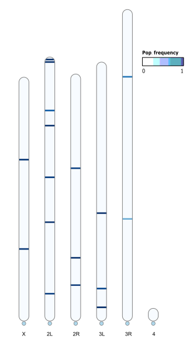

```{r setup, include=FALSE}
knitr::opts_chunk$set(echo = TRUE)
```

``` {R}
library(viridisLite)
library(ggplot2)
library(gridExtra)
theme_set(theme_bw())

dm <- read.table("/Volumes/Data/Projects/invaded_inbred_lines/dna/popTE2/dmel/bgi/dmel_bgi.teinsertions")
names(dm) <- c("Sample", "Chromosome", "Position", "Strand", "TE", "Order", "FR", "Comment", "Frequency")

ds <- read.table("/Volumes/Data/Projects/invaded_inbred_lines/dna/popTE2/dsim/bgi/dsim_bgi.teinsertions")
names(ds) <- c("Sample", "Chromosome", "Position", "Strand", "TE", "Order", "FR", "Comment", "Frequency")

dm <- subset(dm, Chromosome == "X" | Chromosome == "2L" | Chromosome == "2R" | Chromosome == "3L" | Chromosome == "3R" | Chromosome == "4")
ds <- subset(ds, Chromosome == "X" | Chromosome == "2L" | Chromosome == "2R" | Chromosome == "3L" | Chromosome == "3R" | Chromosome == "4")

dm$Chromosome <- factor(dm$Chromosome, levels = c("X", "2L", "2R", "3L", "3R", "4"))
lim <- c(0.0, 0.51)
ybreaks <- c(0, 0.1, 0.2, 0.3, 0.4, 0.5)
ds$Chromosome <- factor(ds$Chromosome, levels = c("X", "2L", "2R", "3L", "3R", "4"))
lim <- c(0.0, 0.51)
ybreaks <- c(0, 0.1, 0.2, 0.3, 0.4, 0.5)

sample_colors <- viridisLite::turbo(11)

dm$Sample <- as.factor(dm$Sample)
ds$Sample <- as.factor(ds$Sample)

dmp <- ggplot(dm, aes(x = Position, y = Frequency, color = Sample)) +
  geom_point(size = 0.5) +
  facet_grid(. ~ Chromosome, scales = "free_x", space = "free_x") +
  scale_x_continuous(breaks = c(0, 5000000, 10000000, 15000000, 20000000, 25000000),
                     labels = c("0", "5m", "10m", "15m", "20m", "25m")) +
  scale_y_continuous(name = "Population frequency", limits = c(min(dm$Frequency), max(dm$Frequency)),
                     breaks = seq(0, 1, by = 0.1)) +
  scale_color_manual(values = sample_colors) +  
  theme(legend.position = "right", 
          plot.title = element_text(hjust = 0.5, size = 14)) +
  labs(title = "P-element insertion frequencies in D. melanogaster populations")


dsp <- ggplot(ds, aes(x = Position, y = Frequency, color = Sample)) +
  geom_point(size = 0.5) +
  facet_grid(. ~ Chromosome, scales = "free_x", space = "free_x") +
  scale_x_continuous(breaks = c(0, 5000000, 10000000, 15000000, 20000000, 25000000),
                     labels = c("0", "5m", "10m", "15m", "20m", "25m")) +
  scale_y_continuous(name = "Population frequency", limits = c(min(ds$Frequency), max(ds$Frequency)),
                     breaks = seq(0, 1, by = 0.1)) +
  scale_color_manual(values = sample_colors) +  
  theme(legend.position = "right", 
          plot.title = element_text(hjust = 0.5, size = 14)) +
  labs(title = "P-element insertion frequencies in D. simulans populations")

ggsave("dna/figs/dmel_bgi_popTE2_all.png", dmp, width = 16, height = 8, dpi = 300)
ggsave("dna/figs/dsim_bgi_popTE2_all.png", dsp, width = 16, height = 8, dpi = 300)

knitr::include_graphics("dna/figs/dmel_bgi_popTE2_all.png")
knitr::include_graphics("dna/figs/dsim_bgi_popTE2_all.png")

```

```{bash}
awk '{print > "bgi/replicates/" $1 ".teinsertions"}' bgi/dmel_bgi.teinsertions

```

``` {R}
library(ggplot2)
library(gridExtra)
theme_set(theme_bw())

datasets <- list()

for (i in 1:5) {
  file_path <- sprintf("/Volumes/Data/Projects/invaded_inbred_lines/dna/popTE2/dmel/bgi/replicates/%d.teinsertions", i)
  dataset <- read.table(file_path)
  names(dataset) <- c("Sample", "Chromosome", "Position", "Strand", "TE", "Order", "FR", "Comment", "Frequency")
  
  dataset <- subset(dataset, Chromosome %in% c("X", "2L", "2R", "3L", "3R", "4"))
  
  datasets[[i]] <- dataset
}

plots <- list()

for (i in 1:5) {
  dataset <- datasets[[i]]

  plot <- ggplot(dataset, aes(x = Position, y = Frequency, color = Frequency)) +
    geom_point(size = 0.5) +
    facet_grid(. ~ Chromosome, scales = "free_x", space = "free_x") +
    scale_x_continuous(breaks = c(0, 5000000, 10000000, 15000000, 20000000, 25000000),
                       labels = c("0", "5m", "10m", "15m", "20m", "25m")) +
    scale_y_continuous(name = "population frequency", limits = c(0, 1),
                       breaks = seq(0, 1, by = 0.1)) +
    scale_color_gradient(low = "blue", high = "red") +
    theme(legend.position = "none", plot.title = element_text(hjust = 0.5, size = 14)) +
    labs(title = paste("P-element insertion frequencies in D. melanogaster - replicate", i))
  
  plots[[i]] <- plot
}

grid <- do.call(grid.arrange, c(plots, ncol = 2))

ggsave("dna/figs/dmel_bgi_popTE2.png", grid, width = 24, height = 14, dpi = 300)

knitr::include_graphics("dna/figs/dmel_bgi_popTE2.png")

```


``` {R}
library(ggplot2)
library(gridExtra)
theme_set(theme_bw())

datasets <- list()

for (i in 1:3) {
  file_path <- sprintf("/Volumes/Data/Projects/invaded_inbred_lines/dna/popTE2/dsim/bgi/replicates/%d.teinsertions", i)
  dataset <- read.table(file_path)
  names(dataset) <- c("Sample", "Chromosome", "Position", "Strand", "TE", "Order", "FR", "Comment", "Frequency")
  
  dataset <- subset(dataset, Chromosome %in% c("X", "2L", "2R", "3L", "3R", "4"))
  
  datasets[[i]] <- dataset
}

plots <- list()

for (i in 1:3) {
  dataset <- datasets[[i]]

  plot <- ggplot(dataset, aes(x = Position, y = Frequency, color = Frequency)) +
    geom_point(size = 0.5) +
    facet_grid(. ~ Chromosome, scales = "free_x", space = "free_x") +
    scale_x_continuous(breaks = c(0, 5000000, 10000000, 15000000, 20000000, 25000000),
                       labels = c("0", "5m", "10m", "15m", "20m", "25m")) +
    scale_y_continuous(name = "population frequency", limits = c(0, 1),
                       breaks = seq(0, 1, by = 0.1)) +
    scale_color_gradient(low = "blue", high = "red") +
    theme(legend.position = "none", plot.title = element_text(hjust = 0.5, size = 14)) +
    labs(title = paste("P-element insertion frequencies in D. simulans - replicate", i))
  
  plots[[i]] <- plot
}

grid <- do.call(grid.arrange, c(plots, ncol = 2))

ggsave("dna/figs/dsim_bgi_popTE2.png", grid, width = 24, height = 14, dpi = 300)

knitr::include_graphics("dna/figs/dsim_bgi_popTE2.png")

```


#RIdeogram


To create ideograms of the drosophila karyotypes containing the P-element, we use a package called RIdeogram.

First, we must create a dataset containing the d. mel and d. sim karyotype data (obtained from the NCBI uploads of the reference genomes).

```{R}
dmel_karyotype <- read.table("/Volumes/Data/Tools/RefGenomes/karyotypes_dmel.txt", sep = "\t", header = T, stringsAsFactors = F)
dsim_karyotype <- read.table("/Volumes/Data/Tools/RefGenomes/karyotypes_dsim.txt", sep = "\t", header = T, stringsAsFactors = F)

head(dmel_karyotype)
head(dsim_karyotype)

```

We then need to transform the output .txt file from PopTE2 in. order to fit the RIdeogram package.

```{Python, eval=FALSE}
with open('/Volumes/Data/Projects/invaded_inbred_lines/dna/popTE2/dsim/bgi/replicates/2.teinsertions', 'r') as f:
    lines = f.readlines()

new_content = []
for line in lines:
    columns = line.strip().split('\t')
    second_column = int(columns[2]) - (2907*25)
    third_column = int(columns[2]) + (2907*25)
    last_column = columns[-1]
    new_line = f"{columns[1]}\t{second_column}\t{third_column}\t{last_column}\n"  # Change first column value
    new_content.append(new_line)

with open('/Volumes/Data/Projects/invaded_inbred_lines/dna/popTE2/dsim/bgi/dsim_14_50x.txt', 'w') as f:
    f.writelines(new_content)

```

The above python script converts the .teinsertions file into a usable format, increasing the size of the P-element insertions 50x, for visual clarity. 

```{Python, eval=FALSE}
with open('/Volumes/Data/Projects/invaded_inbred_lines/dna/popTE2/dsim/bgi/dsim_14_100x.txt', 'r') as f:
    existing_lines = f.readlines()

#Add in Karyotype dataset
karyotype_data = {
    'X': (0, 22032822),
    '2L': (0, 23857595),
    '2R': (0, 22319025),
    '3L': (0, 23399903),
    '3R': (0, 28149585),
    '4': (0, 1146867)
}

new_content = []
for chromosome, (start, end) in karyotype_data.items():
    chromosome_lines = []
    for line in existing_lines:
        columns = line.strip().split('\t')
        chr_name = columns[0]
        chr_start = int(columns[1])
        chr_end = int(columns[2])

        if chr_name == chromosome:
            chromosome_lines.append((chr_start, chr_end, line))

    chromosome_lines.sort()  # Sort by chromosome

    prev_end = start
    for chr_start, chr_end, line in chromosome_lines:
        if prev_end < chr_start:
            new_line = f"{chromosome}\t{prev_end}\t{chr_start}\t0\n"
            new_content.append(new_line)
        new_content.append(line)
        prev_end = chr_end

    if prev_end < end:
        new_line = f"{chromosome}\t{prev_end}\t{end}\t0\n"
        new_content.append(new_line)

new_header = "Chr\tStart\tEnd\tValue\n"

final_content = new_header + ''.join(new_content)  

with open('/Volumes/Data/Projects/invaded_inbred_lines/dna/popTE2/dsim/bgi/dsim_14_100x.txt', 'w') as f:
    f.write(final_content)

```

We then fill in the blanks in between the insertions, with frequency of 0, using the ascertained karyotype data from NCBI.

We then run the RIdeogram package to generate the ideogram for each population, using the newly generated insertion dataset, and the karyotype data

```{R}
require(RIdeogram)
library(RColorBrewer)

dmel_karyotype <- read.table("/Volumes/Data/Tools/RefGenomes/karyotypes_dmel.txt", sep = "\t", header = T, stringsAsFactors = F)
dsim_karyotype <- read.table("/Volumes/Data/Tools/RefGenomes/karyotypes_dsim.txt", sep = "\t", header = T, stringsAsFactors = F)

dmel_freq <- read.table("/Volumes/Data/Projects/invaded_inbred_lines/dna/popTE2/dmel/bgi/dmel_all_10x.txt", sep = "\t", header = T, stringsAsFactors = F)
#dsim_freq <- read.table("/Volumes/Data/Projects/invaded_inbred_lines/dna/popTE2/dsim/bgi/dsim_14_50x.txt", sep = "\t", header = T, stringsAsFactors = F)

ideogram(karyotype = dmel_karyotype, overlaid = dmel_freq, width = 75, colorset1 = brewer.pal(9, "Blues"))
convertSVG("chromosome.svg", device = "png", dpi = 1200)

#ideogram(karyotype = dsim_karyotype, overlaid = dsim_freq, width = 75, colorset1 = brewer.pal(9, "Blues"))
#convertSVG("chromosome.svg", device = "png")

```

This will generate an svg and a png of the ideogram, titled "chromosome" (can't be changed?), which we then manually altered in inkscape for greater visibility/neater output.

```{R}
knitr::include_graphics("dmel_3_50x.png")


```