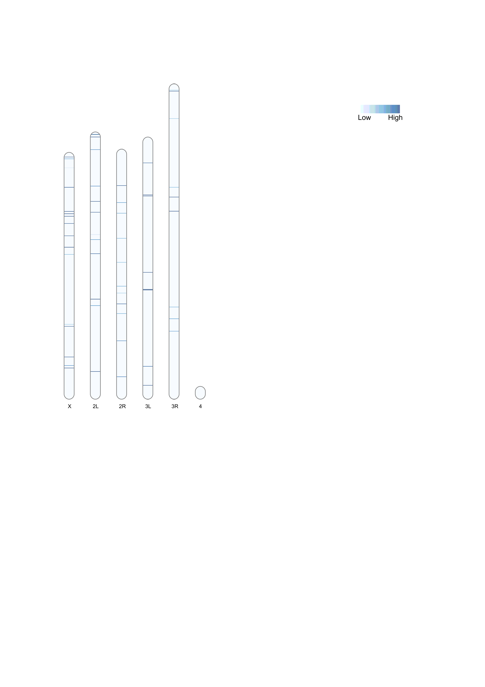

```{r setup, include=FALSE}
knitr::opts_chunk$set(echo = TRUE)
```

``` {R}
library(viridisLite)
library(ggplot2)
library(gridExtra)
theme_set(theme_bw())

dm <- read.table("/Volumes/Data/Projects/invaded_inbred_lines/dna/popTE2/dmel/bgi/dmel_bgi.teinsertions")
names(dm) <- c("Sample", "Chromosome", "Position", "Strand", "TE", "Order", "FR", "Comment", "Frequency")

ds <- read.table("/Volumes/Data/Projects/invaded_inbred_lines/dna/popTE2/dsim/bgi/dsim_bgi.teinsertions")
names(ds) <- c("Sample", "Chromosome", "Position", "Strand", "TE", "Order", "FR", "Comment", "Frequency")

dm <- subset(dm, Chromosome == "X" | Chromosome == "2L" | Chromosome == "2R" | Chromosome == "3L" | Chromosome == "3R" | Chromosome == "4")
ds <- subset(ds, Chromosome == "X" | Chromosome == "2L" | Chromosome == "2R" | Chromosome == "3L" | Chromosome == "3R" | Chromosome == "4")

dm$Chromosome <- factor(dm$Chromosome, levels = c("X", "2L", "2R", "3L", "3R", "4"))
lim <- c(0.0, 0.51)
ybreaks <- c(0, 0.1, 0.2, 0.3, 0.4, 0.5)
ds$Chromosome <- factor(ds$Chromosome, levels = c("X", "2L", "2R", "3L", "3R", "4"))
lim <- c(0.0, 0.51)
ybreaks <- c(0, 0.1, 0.2, 0.3, 0.4, 0.5)

sample_colors <- viridisLite::turbo(11)

dm$Sample <- as.factor(dm$Sample)
ds$Sample <- as.factor(ds$Sample)

dmp <- ggplot(dm, aes(x = Position, y = Frequency, color = Sample)) +
  geom_point(size = 0.5) +
  facet_grid(. ~ Chromosome, scales = "free_x", space = "free_x") +
  scale_x_continuous(breaks = c(0, 5000000, 10000000, 15000000, 20000000, 25000000),
                     labels = c("0", "5m", "10m", "15m", "20m", "25m")) +
  scale_y_continuous(name = "Population frequency", limits = c(min(dm$Frequency), max(dm$Frequency)),
                     breaks = seq(0, 1, by = 0.1)) +
  scale_color_manual(values = sample_colors) +  
  theme(legend.position = "right", 
          plot.title = element_text(hjust = 0.5, size = 14)) +
  labs(title = "P-element insertion frequencies in D. melanogaster populations")


dsp <- ggplot(ds, aes(x = Position, y = Frequency, color = Sample)) +
  geom_point(size = 0.5) +
  facet_grid(. ~ Chromosome, scales = "free_x", space = "free_x") +
  scale_x_continuous(breaks = c(0, 5000000, 10000000, 15000000, 20000000, 25000000),
                     labels = c("0", "5m", "10m", "15m", "20m", "25m")) +
  scale_y_continuous(name = "Population frequency", limits = c(min(ds$Frequency), max(ds$Frequency)),
                     breaks = seq(0, 1, by = 0.1)) +
  scale_color_manual(values = sample_colors) +  
  theme(legend.position = "right", 
          plot.title = element_text(hjust = 0.5, size = 14)) +
  labs(title = "P-element insertion frequencies in D. simulans populations")

ggsave("dna/figs/dmel_bgi_popTE2_all.png", dmp, width = 16, height = 8, dpi = 300)
ggsave("dna/figs/dsim_bgi_popTE2_all.png", dsp, width = 16, height = 8, dpi = 300)

knitr::include_graphics("dna/figs/dmel_bgi_popTE2_all.png")
knitr::include_graphics("dna/figs/dsim_bgi_popTE2_all.png")

```

```{bash}
awk '{print > "bgi/replicates/" $1 ".teinsertions"}' bgi/dmel_bgi.teinsertions

```

``` {R}
library(ggplot2)
library(gridExtra)
theme_set(theme_bw())

datasets <- list()

for (i in 1:5) {
  file_path <- sprintf("/Volumes/Data/Projects/invaded_inbred_lines/dna/popTE2/dmel/bgi/replicates/%d.teinsertions", i)
  dataset <- read.table(file_path)
  names(dataset) <- c("Sample", "Chromosome", "Position", "Strand", "TE", "Order", "FR", "Comment", "Frequency")
  
  dataset <- subset(dataset, Chromosome %in% c("X", "2L", "2R", "3L", "3R", "4"))
  
  datasets[[i]] <- dataset
}

plots <- list()

for (i in 1:5) {
  dataset <- datasets[[i]]

  plot <- ggplot(dataset, aes(x = Position, y = Frequency, color = Frequency)) +
    geom_point(size = 0.5) +
    facet_grid(. ~ Chromosome, scales = "free_x", space = "free_x") +
    scale_x_continuous(breaks = c(0, 5000000, 10000000, 15000000, 20000000, 25000000),
                       labels = c("0", "5m", "10m", "15m", "20m", "25m")) +
    scale_y_continuous(name = "population frequency", limits = c(0, 1),
                       breaks = seq(0, 1, by = 0.1)) +
    scale_color_gradient(low = "blue", high = "red") +
    theme(legend.position = "none", plot.title = element_text(hjust = 0.5, size = 14)) +
    labs(title = paste("P-element insertion frequencies in D. melanogaster - replicate", i))
  
  plots[[i]] <- plot
}

grid <- do.call(grid.arrange, c(plots, ncol = 2))

ggsave("dna/figs/dmel_bgi_popTE2.png", grid, width = 24, height = 14, dpi = 300)

knitr::include_graphics("dna/figs/dmel_bgi_popTE2.png")

```


``` {R}
library(ggplot2)
library(gridExtra)
theme_set(theme_bw())

datasets <- list()

for (i in 1:3) {
  file_path <- sprintf("/Volumes/Data/Projects/invaded_inbred_lines/dna/popTE2/dsim/bgi/replicates/%d.teinsertions", i)
  dataset <- read.table(file_path)
  names(dataset) <- c("Sample", "Chromosome", "Position", "Strand", "TE", "Order", "FR", "Comment", "Frequency")
  
  dataset <- subset(dataset, Chromosome %in% c("X", "2L", "2R", "3L", "3R", "4"))
  
  datasets[[i]] <- dataset
}

plots <- list()

for (i in 1:3) {
  dataset <- datasets[[i]]

  plot <- ggplot(dataset, aes(x = Position, y = Frequency, color = Frequency)) +
    geom_point(size = 0.5) +
    facet_grid(. ~ Chromosome, scales = "free_x", space = "free_x") +
    scale_x_continuous(breaks = c(0, 5000000, 10000000, 15000000, 20000000, 25000000),
                       labels = c("0", "5m", "10m", "15m", "20m", "25m")) +
    scale_y_continuous(name = "population frequency", limits = c(0, 1),
                       breaks = seq(0, 1, by = 0.1)) +
    scale_color_gradient(low = "blue", high = "red") +
    theme(legend.position = "none", plot.title = element_text(hjust = 0.5, size = 14)) +
    labs(title = paste("P-element insertion frequencies in D. simulans - replicate", i))
  
  plots[[i]] <- plot
}

grid <- do.call(grid.arrange, c(plots, ncol = 2))

ggsave("dna/figs/dsim_bgi_popTE2.png", grid, width = 24, height = 14, dpi = 300)

knitr::include_graphics("dna/figs/dsim_bgi_popTE2.png")

```


#RIdeogram

```{R}
require(RIdeogram)
library(RColorBrewer)

dmel_karyotype <- read.table("/Volumes/Data/Tools/RefGenomes/karyotypes_dmel.txt", sep = "\t", header = T, stringsAsFactors = F)
dsim_karyotype <- read.table("/Volumes/Data/Tools/RefGenomes/karyotypes_dsim.txt", sep = "\t", header = T, stringsAsFactors = F)

dmel_freq <- read.table("/Volumes/Data/Projects/invaded_inbred_lines/dna/popTE2/dmel/bgi/replicates/dmel_3.txt", sep = "\t", header = T, stringsAsFactors = F)
dsim_freq <- read.table("/Volumes/Data/Projects/invaded_inbred_lines/dna/popTE2/dsim/bgi/dsim_14_100x.txt", sep = "\t", header = T, stringsAsFactors = F)

ideogram(karyotype = dsim_karyotype)
convertSVG("chromosome.svg", device = "png")

#ideogram(karyotype = dmel_karyotype, overlaid = dmel_freq, width = 100)
#svg2png("chromosome.svg", dpi = 500)

#ideogram(karyotype = dsim_karyotype, overlaid = dsim_freq, width = 75, colorset1 = brewer.pal(9, "Blues"))
#convertSVG("chromosome.svg", device = "png")

#
```