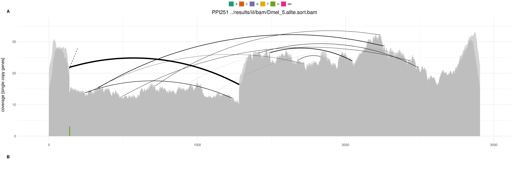

1 - Invaded-inbred lines DNA-seq analysis
================
Matthew Beaumont
2023-09-05

# Data preparation

After inbreeding 10 replicate lines of three Drosophila spp (D.
melanogaster, D. simulans & D. yakuba) for 10 generations each, we
submitted all 30 samples, plus one naive sample for each species, for
sequencing.

We were provided with the following BAM files containing the multiplexed
DNA sequencing reads for all of our samples (plus the i-seq probe).

These two files were merged using the built in samtools command.

``` bash
samtools merge -o iil_merged.bam HY5WYDRX2_1_20230419B_20230420.bam HY5WYDRX2_2_20230419B_20230420.bam
```

``` bash
cd /Volumes/Data/Projects/invaded_inbred_lines/dna/raw
ls -h *.bam
```

    ## HY5WYDRX2_1_20230419B_20230420.bam
    ## HY5WYDRX2_2_20230419B_20230420.bam
    ## i-seq_BSB09408-2634_1_20230329B_20230330.bam
    ## iil_merged.bam

Then, we ran the merged BAM file through the following two scripts,
respectively. This was in order to demultiplex the files and extract out
each read by their index primer sequence. The second script was meant as
a catch-all, for all possible remaining index sequences after the first
script was run. This was done as a result of missing two missing samples
from the first demultiplexing.

``` bash
samtools view --threads 10 /Volumes/Data/Projects/invaded_inbred_lines/dna/raw/iil_merged.bam | paste -d "|" - - | tee >(grep BC:Z:ATCACG |tr "|" "\n" | samtools view --threads 2 -b > /Volumes/Data/Projects/invaded_inbred_lines/dna/raw/demultiplexed/Dmel_1.bam) >(grep BC:Z:CGATGT |tr "|" "\n" | samtools view --threads 2 -b > /Volumes/Data/Projects/invaded_inbred_lines/dna/raw/demultiplexed/Dmel_2.bam) >(grep BC:Z:TTAGGC |tr "|" "\n" | samtools view --threads 2 -b > /Volumes/Data/Projects/invaded_inbred_lines/dna/raw/demultiplexed/Dmel_3.bam) >(grep BC:Z:TGACCA |tr "|" "\n" | samtools view --threads 2 -b > /Volumes/Data/Projects/invaded_inbred_lines/dna/raw/demultiplexed/Dmel_4.bam) >(grep BC:Z:ACAGTG |tr "|" "\n" | samtools view --threads 2 -b > /Volumes/Data/Projects/invaded_inbred_lines/dna/raw/demultiplexed/Dmel_5.bam) >(grep BC:Z:GCCAAT |tr "|" "\n" | samtools view --threads 2 -b > /Volumes/Data/Projects/invaded_inbred_lines/dna/raw/demultiplexed/Dmel_6.bam) >(grep BC:Z:CAGATC |tr "|" "\n" | samtools view --threads 2 -b > /Volumes/Data/Projects/invaded_inbred_lines/dna/raw/demultiplexed/Dmel_7.bam) >(grep BC:Z:ACTTGA |tr "|" "\n" | samtools view --threads 2 -b > /Volumes/Data/Projects/invaded_inbred_lines/dna/raw/demultiplexed/Dmel_8.bam) >(grep BC:Z:GATCAG |tr "|" "\n" | samtools view --threads 2 -b > /Volumes/Data/Projects/invaded_inbred_lines/dna/raw/demultiplexed/Dmel_9.bam) >(grep BC:Z:TAGCTT |tr "|" "\n" | samtools view --threads 2 -b > /Volumes/Data/Projects/invaded_inbred_lines/dna/raw/demultiplexed/Dmel_10.bam) >(grep BC:Z:GGCTAC |tr "|" "\n" | samtools view --threads 2 -b > /Volumes/Data/Projects/invaded_inbred_lines/dna/raw/demultiplexed/Dsim_11.bam) >(grep BC:Z:CTTGTA |tr "|" "\n" | samtools view --threads 2 -b > /Volumes/Data/Projects/invaded_inbred_lines/dna/raw/demultiplexed/Dsim_12.bam) >(grep BC:Z:AGTCAA |tr "|" "\n" | samtools view --threads 2 -b > /Volumes/Data/Projects/invaded_inbred_lines/dna/raw/demultiplexed/Dsim_13.bam) >(grep BC:Z:AGTTCC |tr "|" "\n" | samtools view --threads 2 -b > /Volumes/Data/Projects/invaded_inbred_lines/dna/raw/demultiplexed/Dsim_14.bam) >(grep BC:Z:ATGTCA |tr "|" "\n" | samtools view --threads 2 -b > /Volumes/Data/Projects/invaded_inbred_lines/dna/raw/demultiplexed/Dsim_15.bam) >(grep BC:Z:CCGTCC |tr "|" "\n" | samtools view --threads 2 -b > /Volumes/Data/Projects/invaded_inbred_lines/dna/raw/demultiplexed/Dsim_16.bam) >(grep BC:Z:GTAGAG |tr "|" "\n" | samtools view --threads 2 -b > /Volumes/Data/Projects/invaded_inbred_lines/dna/raw/demultiplexed/Dsim_17.bam) >(grep BC:Z:GTCCGC |tr "|" "\n" | samtools view --threads 2 -b > /Volumes/Data/Projects/invaded_inbred_lines/dna/raw/demultiplexed/Dsim_18.bam) >(grep BC:Z:GTGAAA |tr "|" "\n" | samtools view --threads 2 -b > /Volumes/Data/Projects/invaded_inbred_lines/dna/raw/demultiplexed/Dsim_19.bam) >(grep BC:Z:GTGGCC |tr "|" "\n" | samtools view --threads 2 -b > /Volumes/Data/Projects/invaded_inbred_lines/dna/raw/demultiplexed/Dsim_20.bam) >(grep BC:Z:GTTTCG |tr "|" "\n" | samtools view --threads 2 -b > /Volumes/Data/Projects/invaded_inbred_lines/dna/raw/demultiplexed/Dyak_21.bam) >(grep BC:Z:CGTACG |tr "|" "\n" | samtools view --threads 2 -b > /Volumes/Data/Projects/invaded_inbred_lines/dna/raw/demultiplexed/Dyak_22.bam) >(grep BC:Z:GAGTGG |tr "|" "\n" | samtools view --threads 2 -b > /Volumes/Data/Projects/invaded_inbred_lines/dna/raw/demultiplexed/Dyak_23.bam) >(grep BC:Z:GGTAGC |tr "|" "\n" | samtools view --threads 2 -b > /Volumes/Data/Projects/invaded_inbred_lines/dna/raw/demultiplexed/Dyak_24.bam) >(grep BC:Z:ACTGAT |tr "|" "\n" | samtools view --threads 2 -b > /Volumes/Data/Projects/invaded_inbred_lines/dna/raw/demultiplexed/Dyak_25.bam) >(grep BC:Z:ATGAGC |tr "|" "\n" | samtools view --threads 2 -b > /Volumes/Data/Projects/invaded_inbred_lines/dna/raw/demultiplexed/Dyak_26.bam) >(grep BC:Z:ATTCCT |tr "|" "\n" | samtools view --threads 2 -b > /Volumes/Data/Projects/invaded_inbred_lines/dna/raw/demultiplexed/Dyak_27.bam) >(grep BC:Z:CAAAAG |tr "|" "\n" | samtools view --threads 2 -b > /Volumes/Data/Projects/invaded_inbred_lines/dna/raw/demultiplexed/Dyak_28.bam) >(grep BC:Z:CAACTA |tr "|" "\n" | samtools view --threads 2 -b > /Volumes/Data/Projects/invaded_inbred_lines/dna/raw/demultiplexed/Dyak_29.bam) >(grep BC:Z:CACCGG |tr "|" "\n" | samtools view --threads 2 -b > /Volumes/Data/Projects/invaded_inbred_lines/dna/raw/demultiplexed/Dyak_30.bam) >(grep BC:Z:CACGAT |tr "|" "\n" | samtools view --threads 2 -b > /Volumes/Data/Projects/invaded_inbred_lines/dna/raw/demultiplexed/Dmel_N1.bam) >(grep BC:Z:CACTCA |tr "|" "\n" | samtools view --threads 2 -b > /Volumes/Data/Projects/invaded_inbred_lines/dna/raw/demultiplexed/Dsim_N2.bam) >(grep BC:Z:CAGGCG |tr "|" "\n" | samtools view --threads 2 -b > /Volumes/Data/Projects/invaded_inbred_lines/dna/raw/demultiplexed/Dyak_N3.bam) >(grep BC:Z:CATTTT |tr "|" "\n" | samtools view --threads 2 -b > /Volumes/Data/Projects/invaded_inbred_lines/dna/raw/demultiplexed/Dere_A2.bam) >(grep BC:Z:GGGGGG |tr "|" "\n" | samtools view --threads 2 -b > /Volumes/Data/Projects/invaded_inbred_lines/dna/raw/demultiplexed/GGGGGG.bam) | grep BC:Z:NNNNNN |tr "|" "\n" | samtools view --threads 2 -b > /Volumes/Data/Projects/invaded_inbred_lines/dna/raw/demultiplexed/NNNNNN.bam

samtools view --threads 10 /Volumes/Data/Projects/invaded_inbred_lines/dna/raw/HY5WYDRX2_1_20230419B_20230420.bam | paste -d "|" - - | tee   >(grep BC:Z:CATGGC |tr "|" "\n" | samtools view --threads 2 -b > /Volumes/Data/Projects/invaded_inbred_lines/dna/raw/output/primer34.bam) >(grep BC:Z:CCAACA |tr "|" "\n" | samtools view --threads 2 -b > /Volumes/Data/Projects/invaded_inbred_lines/dna/raw/output/primer36.bam) >(grep BC:Z:TAATCG |tr "|" "\n" | samtools view --threads 2 -b > /Volumes/Data/Projects/invaded_inbred_lines/dna/raw/output/primer42.bam) >(grep BC:Z:CGGAAT |tr "|" "\n" | samtools view --threads 2 -b > /Volumes/Data/Projects/invaded_inbred_lines/dna/raw/output/primer37.bam) >(grep BC:Z:CTAGCT |tr "|" "\n" | samtools view --threads 2 -b > /Volumes/Data/Projects/invaded_inbred_lines/dna/raw/output/primer38.bam) >(grep BC:Z:CTATAC |tr "|" "\n" | samtools view --threads 2 -b > /Volumes/Data/Projects/invaded_inbred_lines/dna/raw/output/primer39.bam) >(grep BC:Z:GTGATC |tr "|" "\n" | samtools view --threads 2 -b > /Volumes/Data/Projects/invaded_inbred_lines/dna/raw/output/primer40.bam) >(grep BC:Z:GACGAC |tr "|" "\n" | samtools view --threads 2 -b > /Volumes/Data/Projects/invaded_inbred_lines/dna/raw/output/primer41.bam) >(grep BC:Z:TACAGC |tr "|" "\n" | samtools view --threads 2 -b > /Volumes/Data/Projects/invaded_inbred_lines/dna/raw/output/primer43.bam) >(grep BC:Z:TATAAT |tr "|" "\n" | samtools view --threads 2 -b > /Volumes/Data/Projects/invaded_inbred_lines/dna/raw/output/primer44.bam) >(grep BC:Z:TCATTC |tr "|" "\n" | samtools view --threads 2 -b > /Volumes/Data/Projects/invaded_inbred_lines/dna/raw/output/primer45.bam) >(grep BC:Z:TCCCGA |tr "|" "\n" | samtools view --threads 2 -b > /Volumes/Data/Projects/invaded_inbred_lines/dna/raw/output/primer46.bam) >(grep BC:Z:TCGAAG |tr "|" "\n" | samtools view --threads 2 -b > /Volumes/Data/Projects/invaded_inbred_lines/dna/raw/output/primer47.bam) >(grep BC:Z:TCGGCA |tr "|" "\n" | samtools view --threads 2 -b > /Volumes/Data/Projects/invaded_inbred_lines/dna/raw/output/primer48.bam)
```

## BAM to FASTQ

Converting directory of BAM files to gzipped FASTQ files and splitting
PE into separate forward and reverse reads.

``` bash
for file in /path/to/directory/*.bam; do
    base=$(basename "$file" .bam)
    samtools fastq -1 "demultiplexed/${base}_1.fq.gz" -2 "demultiplexed/${base}_2.fq.gz" -0 /dev/null -s /dev/null -n "$file"
done
```

## Quality control

We then ran the fastQC tool to assess the quality of the fq.gz files for
each individual sample, granting the following results.

``` bash
```

# DeviaTE analysis

To assess the estimated P-element copy number and coverage across the
lines, we used the DeviaTE tool.

This began by first using the Fastq-miner.

``` bash
nohup zsh fastq-miner.sh iil /Volumes/Data/Projects/invaded_inbred_lines/dna/raw/output/FastQ > /Volumes/Data/Projects/invaded_inbred_lines/logs/IIlines.log &
```

Then using deviaTE, targeting the P-element (PPI251), to generate
coverage plots.

``` bash
nohup zsh deviate-family.sh iil PPI251 > /Volumes/Data/Projects/invaded_inbred_lines/logs/IIlines.log &
```

This provided us with the following PDFs for each of the lines assessed
()

``` r

```


``` r

```


``` r
knitr::include_graphics("figs/deviaTE_png/Dmel_3.PPI251.png")
```


``` r
knitr::include_graphics("figs/deviaTE_png/Dmel_4.PPI251.png")
```


``` r

```


``` r
knitr::include_graphics("figs/deviaTE_png/Dmel_6.PPI251.png")
```


``` r
knitr::include_graphics("figs/deviaTE_png/Dmel_7.PPI251.png")
```


``` r

```


``` r
knitr::include_graphics("figs/deviaTE_png/Dmel_9.PPI251.png")
```


``` r
knitr::include_graphics("figs/deviaTE_png/Dmel_10.PPI251.png")
```


``` r
knitr::include_graphics("figs/deviaTE_png/Dmel_N1.PPI251.png")
```


``` r
knitr::include_graphics("figs/deviaTE_png/Dsim_11.PPI251.png")
```


``` r

```


``` r
knitr::include_graphics("figs/deviaTE_png/Dsim_13.PPI251.png")
```


``` r

```


``` r
knitr::include_graphics("figs/deviaTE_png/Dsim_15.PPI251.png")
```


``` r
knitr::include_graphics("figs/deviaTE_png/Dsim_16.PPI251.png")
```


``` r
knitr::include_graphics("figs/deviaTE_png/Dsim_17.PPI251.png")
```


``` r
knitr::include_graphics("figs/deviaTE_png/Dsim_18.PPI251.png")
```


``` r

```


``` r
knitr::include_graphics("figs/deviaTE_png/Dsim_20.PPI251.png")
```


``` r
knitr::include_graphics("figs/deviaTE_png/Dsim_N2.PPI251.png")
```


``` r

```


``` r

```


``` r
knitr::include_graphics("figs/deviaTE_png/Dyak_24.PPI251.png")
```


``` r

```


``` r

```


``` r
knitr::include_graphics("figs/deviaTE_png/Dyak_27.PPI251.png")
```


``` r
knitr::include_graphics("figs/deviaTE_png/Dyak_28.PPI251.png")
```


``` r

```


``` r
knitr::include_graphics("figs/deviaTE_png/Dyak_30.PPI251.png")
```


``` r

```


