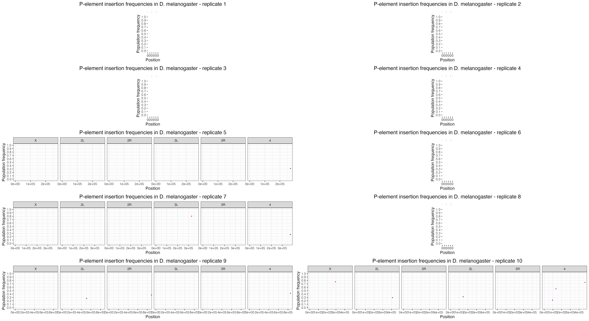
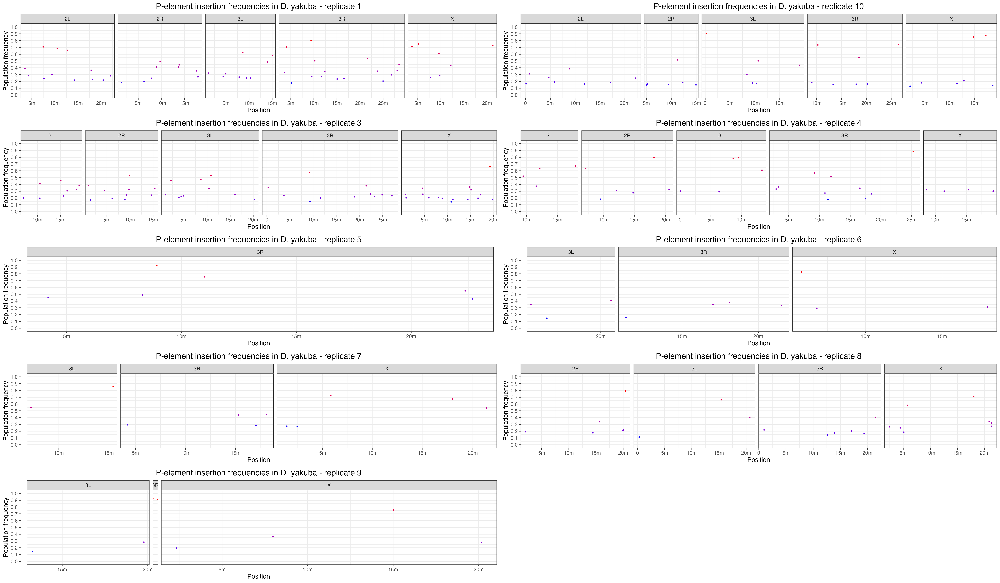
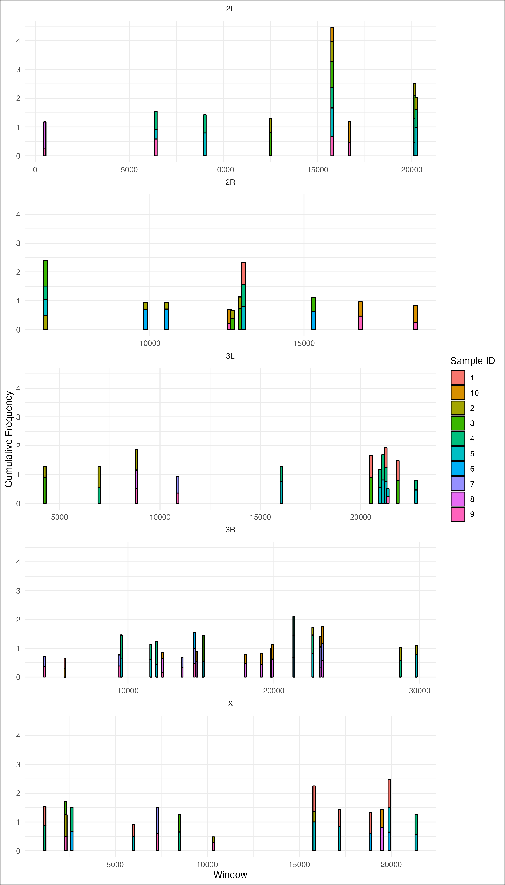
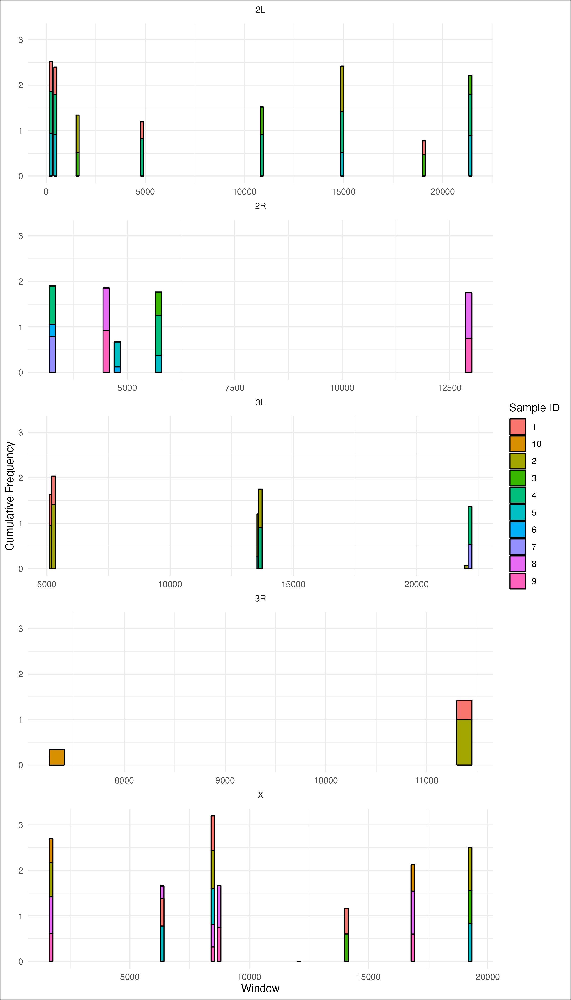
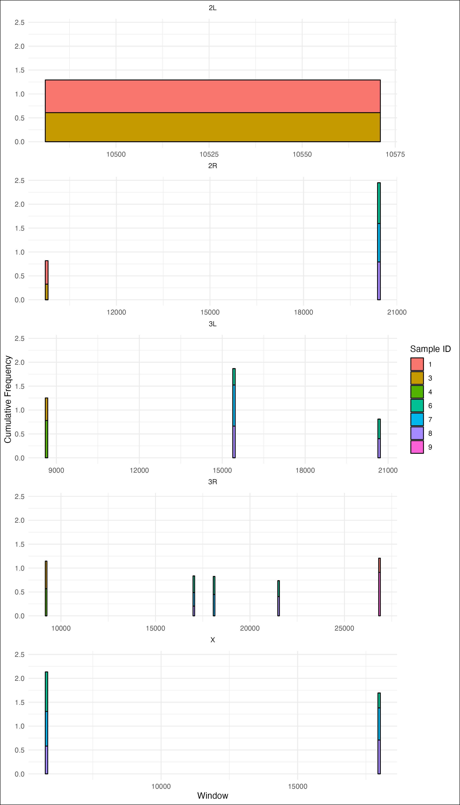
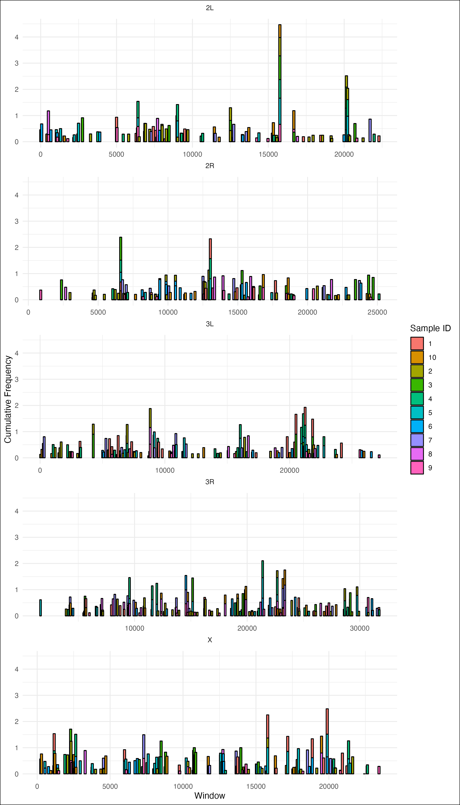
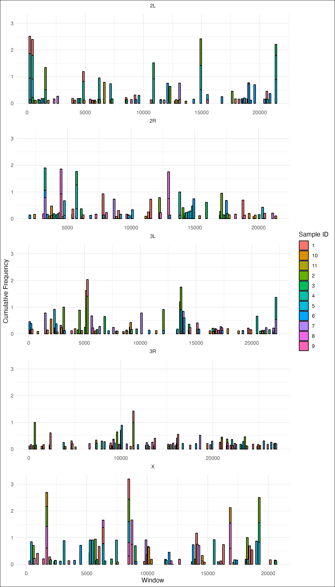
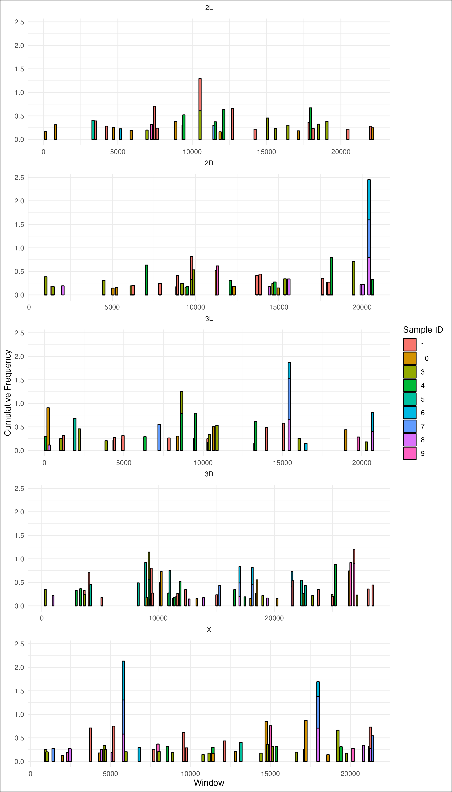

PopTE2
================
Matthew Beaumont
2023-06-15

# PopoolationTE2

First, we needed to construct the required ppileup file.

To begin, we concatenated the D. mel reference genome (r6.51) with the
P-element to generate the following FASTA file -

``` bash
cd /Volumes/Data/Tools/RefGenomes/dmel/dna/dmel_PPI251/
ls -h dmelall*.fasta
```

    ## dmelallchrom-r6.51_PPI251.fasta

Then created an index and /map directory for later steps.

``` bash
bwa index walkthrough-refgenome/2R-603-consensusTE.fasta

dyak % bwa index /Volumes/Data/Tools/RefGenomes/dyak/dna_pele/dyak_allchrom_1.3_PPI251.fasta 
mkdir map
```

Then we ran the following PPileupGen.sh script on the pairs of forward
and reverse reads, generating the required PPileup file.

``` bash
nohup zsh PopoolationTE2/PPileupGen.sh > logs/PPileupGen.log
```

``` bash
#!/bin/bash

ref_genome="/Volumes/Data/Tools/RefGenomes/dyak/dyak_prin_Tai18E2_2.1_PPI251.fasta"
popte2_jar="/Volumes/Data/Tools/PopoolationTE2/popte2-v1.10.03.jar"
hier_file="/Volumes/Data/Tools/RefGenomes/hierarchies/pelement.hier"
samples=("Dyak_21" "Dyak_22" "Dyak_23" "Dyak_24" "Dyak_25" "Dyak_26" "Dyak_27" "Dyak_28" "Dyak_29" "Dyak_30" "Dyak_N3")

for sample in "${samples[@]}"; do
   bwa mem -M -t 2 "$ref_genome" "/Volumes/Data/Projects/invaded_inbred_lines/dna/demultiplexed/fastq/${sample}_1.fq.gz" > "/Volumes/Data/Projects/invaded_inbred_lines/dna/map/unpaired/${sample}_1.sam" &
   bwa mem -M -t 2 "$ref_genome" "/Volumes/Data/Projects/invaded_inbred_lines/dna/demultiplexed/fastq/${sample}_2.fq.gz" > "/Volumes/Data/Projects/invaded_inbred_lines/dna/map/unpaired/${sample}_2.sam" &
done
wait

for sample in "${samples[@]}"; do
    java -Duser.country=US -Duser.language=en -jar "$popte2_jar" se2pe --fastq1 "/Volumes/Data/Projects/invaded_inbred_lines/dna/demultiplexed/fastq/${sample}_1.fq.gz" \
        --fastq2 "/Volumes/Data/Projects/invaded_inbred_lines/dna/demultiplexed/fastq/${sample}_2.fq.gz" \
        --bam1 "/Volumes/Data/Projects/invaded_inbred_lines/dna/map/unpaired/${sample}_1.sam" \
        --bam2 "/Volumes/Data/Projects/invaded_inbred_lines/dna/map/unpaired/${sample}_2.sam" \
        --sort --output "/Volumes/Data/Projects/invaded_inbred_lines/dna/map/paired/${sample}.sort.bam" &
done
wait

java -Duser.country=US -Duser.language=en -jar "$popte2_jar" ppileup \
    --bam /Volumes/Data/Projects/invaded_inbred_lines/dna/map/paired/Dyak_21.sort.bam \
    --bam /Volumes/Data/Projects/invaded_inbred_lines/dna/map/paired/Dyak_22.sort.bam \
    --bam /Volumes/Data/Projects/invaded_inbred_lines/dna/map/paired/Dyak_23.sort.bam \
    --bam /Volumes/Data/Projects/invaded_inbred_lines/dna/map/paired/Dyak_24.sort.bam \
    --bam /Volumes/Data/Projects/invaded_inbred_lines/dna/map/paired/Dyak_25.sort.bam \
    --bam /Volumes/Data/Projects/invaded_inbred_lines/dna/map/paired/Dyak_26.sort.bam \
    --bam /Volumes/Data/Projects/invaded_inbred_lines/dna/map/paired/Dyak_27.sort.bam \
    --bam /Volumes/Data/Projects/invaded_inbred_lines/dna/map/paired/Dyak_28.sort.bam \
    --bam /Volumes/Data/Projects/invaded_inbred_lines/dna/map/paired/Dyak_29.sort.bam \
    --bam /Volumes/Data/Projects/invaded_inbred_lines/dna/map/paired/Dyak_30.sort.bam \
    --bam /Volumes/Data/Projects/invaded_inbred_lines/dna/map/paired/Dyak_N3.sort.bam \
    --map-qual 15 --hier "$hier_file" --output /Volumes/Data/Projects/invaded_inbred_lines/dna/ppileup/Dyak.ppileup.gz
```

Then we ran the basic PoPoolationTE2 pipeline to assess P-element
insertion location and abundance in the different populations.

``` bash
# We need to subsample the ppileup file to a chosen coverage depth to generate am unbiased comparison of P-element abundance.
# java -Duser.country=US -Duser.language=en -jar popte2.jar subsampleppileup --ppileup dmel.ppileup.gz --target-coverage 100 --output output.ss100.ppileup.gz

# First we generate a file of the found P-element insertions and their locations.
java -Duser.country=US -Duser.language=en -jar /Volumes/Data/Tools/PopoolationTE2/popte2-v1.10.03.jar identifySignatures --ppileup /Volumes/Data/Projects/invaded_inbred_lines/dna/ppileup/Dmel.ppileup.gz --mode separate --output /Volumes/Data/Projects/invaded_inbred_lines/dna/popTE2/dmel.signatures --min-count 3

java -Duser.country=US -Duser.language=en -jar /Volumes/Data/Tools/PopoolationTE2/popte2-v1.10.03.jar identifySignatures --ppileup /Volumes/Data/Projects/invaded_inbred_lines/dna/ppileup/Dsim.ppileup.gz --mode separate --output /Volumes/Data/Projects/invaded_inbred_lines/dna/popTE2/dsim.signatures --min-count 3

java -Duser.country=US -Duser.language=en -jar /Volumes/Data/Tools/PopoolationTE2/popte2-v1.10.03.jar identifySignatures --ppileup /Volumes/Data/Projects/invaded_inbred_lines/dna/ppileup/Dyak.ppileup.gz --mode separate --output /Volumes/Data/Projects/invaded_inbred_lines/dna/popTE2/dyak.signatures --min-count 3

# Then we look at the frequency of the found signatures.
java -Duser.country=US -Duser.language=en -jar /Volumes/Data/Tools/PopoolationTE2/popte2-v1.10.03.jar frequency --ppileup /Volumes/Data/Projects/invaded_inbred_lines/dna/ppileup/Dmel.ppileup.gz --signature /Volumes/Data/Projects/invaded_inbred_lines/dna/popTE2/dmel.signatures --output /Volumes/Data/Projects/invaded_inbred_lines/dna/popTE2/dmel.freqsig

java -Duser.country=US -Duser.language=en -jar /Volumes/Data/Tools/PopoolationTE2/popte2-v1.10.03.jar frequency --ppileup /Volumes/Data/Projects/invaded_inbred_lines/dna/ppileup/Dsim.ppileup.gz --signature /Volumes/Data/Projects/invaded_inbred_lines/dna/popTE2/dsim.signatures --output /Volumes/Data/Projects/invaded_inbred_lines/dna/popTE2/dsim.freqsig

java -Duser.country=US -Duser.language=en -jar /Volumes/Data/Tools/PopoolationTE2/popte2-v1.10.03.jar frequency --ppileup /Volumes/Data/Projects/invaded_inbred_lines/dna/ppileup/Dyak.ppileup.gz --signature /Volumes/Data/Projects/invaded_inbred_lines/dna/popTE2/dyak.signatures --output /Volumes/Data/Projects/invaded_inbred_lines/dna/popTE2/dyak.freqsig

# Finally, we combine it all together. 
java -Duser.country=US -Duser.language=en -jar /Volumes/Data/Tools/PopoolationTE2/popte2-v1.10.03.jar pairupSignatures --signature /Volumes/Data/Projects/invaded_inbred_lines/dna/popTE2/dmel.freqsig --ref-genome /Volumes/Data/Tools/RefGenomes/dmel/dna/dmel_PPI251/dmelallchrom-r6.51_PPI251.fasta --hier /Volumes/Data/Tools/RefGenomes/hierarchies/pelement.hier --min-distance -200 --max-distance 300 --output /Volumes/Data/Projects/invaded_inbred_lines/dna/popTE2/dmel.teinsertions

java -Duser.country=US -Duser.language=en -jar /Volumes/Data/Tools/PopoolationTE2/popte2-v1.10.03.jar pairupSignatures --signature /Volumes/Data/Projects/invaded_inbred_lines/dna/popTE2/dsim.freqsig --ref-genome /Volumes/Data/Tools/RefGenomes/dsim/dsim_ASM75419v3_PPI251.fasta --hier /Volumes/Data/Tools/RefGenomes/hierarchies/pelement.hier --min-distance -200 --max-distance 300 --output /Volumes/Data/Projects/invaded_inbred_lines/dna/popTE2/dsim.teinsertions

java -Duser.country=US -Duser.language=en -jar /Volumes/Data/Tools/PopoolationTE2/popte2-v1.10.03.jar pairupSignatures --signature /Volumes/Data/Projects/invaded_inbred_lines/dna/popTE2/dyak.freqsig --ref-genome /Volumes/Data/Tools/RefGenomes/dyak/dna_pele/dyak_allchrom_1.3_PPI251.fasta --hier /Volumes/Data/Tools/RefGenomes/hierarchies/pelement.hier --min-distance -200 --max-distance 300 --output /Volumes/Data/Projects/invaded_inbred_lines/dna/popTE2/dyak.teinsertions
```

This provides us with a list of P-element insertions found in all 11
samples for each species, their location and population frequency.

# Manhattan plots

We then visualised the .teinsertion files in Manhattan plots for all
samples in each species.

``` r
library(viridisLite)
library(ggplot2)
library(gridExtra)
theme_set(theme_bw())

dm <- read.table("/Volumes/Data/Projects/invaded_inbred_lines/dna/popTE2/dmel/dmel.teinsertions")
names(dm) <- c("Sample", "Chromosome", "Position", "Strand", "TE", "Order", "FR", "Comment", "Frequency")

ds <- read.table("/Volumes/Data/Projects/invaded_inbred_lines/dna/popTE2/dsim/dsim.teinsertions")
names(ds) <- c("Sample", "Chromosome", "Position", "Strand", "TE", "Order", "FR", "Comment", "Frequency")

dy <- read.table("/Volumes/Data/Projects/invaded_inbred_lines/dna/popTE2/dyak/dyak.teinsertions")
names(dy) <- c("Sample", "Chromosome", "Position", "Strand", "TE", "Order", "FR", "Comment", "Frequency")

dm <- subset(dm, Chromosome == "X" | Chromosome == "2L" | Chromosome == "2R" | Chromosome == "3L" | Chromosome == "3R" | Chromosome == "4")
ds <- subset(ds, Chromosome == "X" | Chromosome == "2L" | Chromosome == "2R" | Chromosome == "3L" | Chromosome == "3R" | Chromosome == "4")
dy <- subset(dy, Chromosome == "X" | Chromosome == "2L" | Chromosome == "2R" | Chromosome == "3L" | Chromosome == "3R" | Chromosome == "4")

dm$Chromosome <- factor(dm$Chromosome, levels = c("X", "2L", "2R", "3L", "3R", "4"))
lim <- c(0.0, 0.51)
ybreaks <- c(0, 0.1, 0.2, 0.3, 0.4, 0.5)
ds$Chromosome <- factor(ds$Chromosome, levels = c("X", "2L", "2R", "3L", "3R", "4"))
lim <- c(0.0, 0.51)
ybreaks <- c(0, 0.1, 0.2, 0.3, 0.4, 0.5)
dy$Chromosome <- factor(dy$Chromosome, levels = c("X", "2L", "2R", "3L", "3R", "4"))
lim <- c(0.0, 0.51)
ybreaks <- c(0, 0.1, 0.2, 0.3, 0.4, 0.5)

sample_colors <- viridisLite::turbo(11)

dm$Sample <- as.factor(dm$Sample)
ds$Sample <- as.factor(ds$Sample)
dy$Sample <- as.factor(dy$Sample)

dmp <- ggplot(dm, aes(x = Position, y = Frequency, color = Sample)) +
  geom_point(size = 0.5) +
  facet_grid(. ~ Chromosome, scales = "free_x", space = "free_x") +
  scale_x_continuous(breaks = c(0, 5000000, 10000000, 15000000, 20000000, 25000000),
                     labels = c("0", "5m", "10m", "15m", "20m", "25m")) +
  scale_y_continuous(name = "Population frequency", limits = c(min(dm$Frequency), max(dm$Frequency)),
                     breaks = seq(0, 1, by = 0.1)) +
  scale_color_manual(values = sample_colors) +  
  theme(legend.position = "right", 
          plot.title = element_text(hjust = 0.5, size = 14)) +
  labs(title = "P-element insertion frequencies in D. melanogaster populations")


dsp <- ggplot(ds, aes(x = Position, y = Frequency, color = Sample)) +
  geom_point(size = 0.5) +
  facet_grid(. ~ Chromosome, scales = "free_x", space = "free_x") +
  scale_x_continuous(breaks = c(0, 5000000, 10000000, 15000000, 20000000, 25000000),
                     labels = c("0", "5m", "10m", "15m", "20m", "25m")) +
  scale_y_continuous(name = "Population frequency", limits = c(min(ds$Frequency), max(ds$Frequency)),
                     breaks = seq(0, 1, by = 0.1)) +
  scale_color_manual(values = sample_colors) +  
  theme(legend.position = "right", 
          plot.title = element_text(hjust = 0.5, size = 14)) +
  labs(title = "P-element insertion frequencies in D. simulans populations")


dyp <- ggplot(dy, aes(x = Position, y = Frequency, color = Sample)) +
  geom_point(size = 0.5) +
  facet_grid(. ~ Chromosome, scales = "free_x", space = "free_x") +
  scale_x_continuous(breaks = c(0, 5000000, 10000000, 15000000, 20000000, 25000000),
                     labels = c("0", "5m", "10m", "15m", "20m", "25m")) +
  scale_y_continuous(name = "Population frequency", limits = c(min(dy$Frequency), max(dy$Frequency)),
                     breaks = seq(0, 1, by = 0.1)) +
  scale_color_manual(values = sample_colors) +  
  theme(legend.position = "right",
          plot.title = element_text(hjust = 0.5, size = 14)) +
  labs(title = "P-element insertion frequencies in D. yakuba populations")

plot(dmp)
```

<!-- -->

``` r
plot(dsp)
```

<!-- -->

``` r
plot(dyp)
```

<!-- -->

Then we looked at each sample individually, starting with D. mel.

``` r
library(ggplot2)
library(gridExtra)
theme_set(theme_bw())

datasets <- list()

for (i in 1:10) {
  file_path <- sprintf("/Volumes/Data/Projects/invaded_inbred_lines/dna/popTE2/dmel/replicates/%d.teinsertions", i)
  dataset <- read.table(file_path)
  names(dataset) <- c("Sample", "Chromosome", "Position", "Strand", "TE", "Order", "FR", "Comment", "Frequency")
  
  dataset <- subset(dataset, Chromosome %in% c("X", "2L", "2R", "3L", "3R", "4"))
  
  datasets[[i]] <- dataset
}

plots <- list()

for (i in 1:10) {
  dataset <- datasets[[i]]

  plot <- ggplot(dataset, aes(x = Position, y = Frequency, color = Frequency)) +
    geom_point(size = 0.5) +
    facet_grid(. ~ Chromosome, scales = "free_x", space = "free_x") +
    scale_x_continuous(breaks = c(0, 5000000, 10000000, 15000000, 20000000, 25000000),
                       labels = c("0", "5m", "10m", "15m", "20m", "25m")) +
    scale_y_continuous(name = "Population frequency", limits = c(0, 1),
                       breaks = seq(0, 1, by = 0.1)) +
    scale_color_gradient(low = "blue", high = "red") +
    theme(legend.position = "none", plot.title = element_text(hjust = 0.5, size = 14)) +
    labs(title = paste("P-element insertion frequencies in D. melanogaster - replicate", i))
  
  plots[[i]] <- plot
}

grid <- do.call(grid.arrange, c(plots, ncol = 2))
```

<!-- -->

``` r
ggsave("/Volumes/Data/Projects/invaded_inbred_lines/R/iil_analysis/dna/dmel_popTE2.png", grid, width = 24, height = 14, dpi = 300)

knitr::include_graphics("/Volumes/Data/Projects/invaded_inbred_lines/R/iil_analysis/dna/dmel_popTE2.png")
```



Then for D. sim.

``` r
library(ggplot2)
library(gridExtra)
theme_set(theme_bw())

datasets <- list()

for (i in 1:10) {
  file_path <- sprintf("/Volumes/Data/Projects/invaded_inbred_lines/dna/popTE2/dsim/replicates/%d.teinsertions", i)
  dataset <- read.table(file_path)
  names(dataset) <- c("Sample", "Chromosome", "Position", "Strand", "TE", "Order", "FR", "Comment", "Frequency")

  dataset <- subset(dataset, Chromosome %in% c("X", "2L", "2R", "3L", "3R", "4"))

  datasets[[i]] <- dataset
}

plots <- list()

for (i in 1:10) {
  dataset <- datasets[[i]]

  plot <- ggplot(dataset, aes(x = Position, y = Frequency, color = Frequency)) +
    geom_point(size = 0.5) +
    facet_grid(. ~ Chromosome, scales = "free_x", space = "free_x") +
    scale_x_continuous(breaks = c(0, 5000000, 10000000, 15000000, 20000000, 25000000),
                       labels = c("0", "5m", "10m", "15m", "20m", "25m")) +
    scale_y_continuous(name = "Population frequency", limits = c(0, 1),
                       breaks = seq(0, 1, by = 0.1)) +
    scale_color_gradient(low = "blue", high = "red") +
    theme(legend.position = "none", plot.title = element_text(hjust = 0.5, size = 14)) +
    labs(title = paste("P-element insertion frequencies in D. simulans - replicate", i))
  
  plots[[i]] <- plot
}

grid <- do.call(grid.arrange, c(plots, ncol = 2))
```

<!-- -->

``` r
ggsave("/Volumes/Data/Projects/invaded_inbred_lines/R/iil_analysis/dna/dsim_popTE2.png", grid, width = 24, height = 14, dpi = 300)

knitr::include_graphics("/Volumes/Data/Projects/invaded_inbred_lines/R/iil_analysis/dna/dsim_popTE2.png")
```


``` r
library(ggplot2)
library(gridExtra)
theme_set(theme_bw())

datasets <- list()

directory_path <- "/Volumes/Data/Projects/invaded_inbred_lines/dna/popTE2/dyak/replicates/"

replicate_files <- list.files(directory_path, pattern = "\\.teinsertions", full.names = TRUE)

replicate_numbers <- sub(".*/(\\d+)\\.teinsertions", "\\1", replicate_files)

for (i in replicate_numbers) {
  file_path <- file.path(directory_path, paste0(i, ".teinsertions"))
  
  if (file.exists(file_path)) {
    dataset <- read.table(file_path)
    names(dataset) <- c("Sample", "Chromosome", "Position", "Strand", "TE", "Order", "FR", "Comment", "Frequency")

    dataset <- subset(dataset, Chromosome %in% c("X", "2L", "2R", "3L", "3R", "4"))
  
    datasets[[i]] <- dataset
  } else {
    cat("File not found for replicate", i, "\n")
  }
}

plots <- list()

for (i in replicate_numbers) {
  dataset <- datasets[[i]]

  plot <- ggplot(dataset, aes(x = Position, y = Frequency, color = Frequency)) +
    geom_point(size = 0.5) +
    facet_grid(. ~ Chromosome, scales = "free_x", space = "free_x") +
    scale_x_continuous(breaks = c(0, 5000000, 10000000, 15000000, 20000000, 25000000),
                       labels = c("0", "5m", "10m", "15m", "20m", "25m")) +
    scale_y_continuous(name = "Population frequency", limits = c(0, 1),
                       breaks = seq(0, 1, by = 0.1)) +
    scale_color_gradient(low = "blue", high = "red") +
    theme(legend.position = "none", plot.title = element_text(hjust = 0.5, size = 14)) +
    labs(title = paste("P-element insertion frequencies in D. yakuba - replicate", i))
  
  plots[[i]] <- plot
}

grid <- do.call(grid.arrange, c(plots, ncol = 2))
```

<!-- -->

``` r
ggsave("/Volumes/Data/Projects/invaded_inbred_lines/R/iil_analysis/dna/dyak_popTE2.png", grid, width = 24, height = 14, dpi = 300)

knitr::include_graphics("/Volumes/Data/Projects/invaded_inbred_lines/R/iil_analysis/dna/dyak_popTE2.png")
```



# Overlapping insertions

We wanted to assess the number and frequency of similar/overlapping
insertions across all replicates in each species. This way, if we had
insertions of high frequencies overlapping with insertions of lower
frequencies in other samples, we could attribute this to
cross-contamination. This would also give us an idea as to the degree of
cross-contamination, were we to find any.

To do so, we used th following script to identify insertions on the same
chromosome which overlap (+-500 bases).

``` python
#!/usr/bin/env python

import pandas as pd

df = pd.read_csv('/Volumes/Data/Projects/invaded_inbred_lines/dna/popTE2/dyak/dyak.teinsertions', delimiter='\t', header=None)
df.columns = ['sample_id', 'chromosome', 'position', 'strand', 'TE_family', 'TE_order', 'support', 'comment', 'frequency']

# Sort dataframe
df.sort_values(['chromosome', 'position'], inplace=True)

window_size = 500

# Create new column for window
df['window_start'] = df['position'] - window_size
df['window_end'] = df['position'] + window_size

# Group data by chromosome
groups = df.groupby('chromosome')

output_lines = [] 

for _, group in groups:
    overlaps = set()  # Store unique combos
    for _, row in group.iterrows():
        overlapping_rows = group[
            (group['window_end'] >= row['window_start']) & (group['window_start'] <= row['window_end'])
        ]
        # Exclude current row
        overlapping_rows = overlapping_rows[overlapping_rows['sample_id'] != row['sample_id']]
        
        if len(overlapping_rows) > 0:
            # Store unique combos of overlapping ins
            for _, overlap_row in overlapping_rows.iterrows():
                overlap_info = f"Sample ID: {overlap_row['sample_id']} | Chromosome: {overlap_row['chromosome']} | " \
                               f"Position: {overlap_row['position']} | Frequency: {overlap_row['frequency']}"
                overlaps.add(overlap_info)
    
    if len(overlaps) > 0:
        chromosome = group['chromosome'].iloc[0]
        output_lines.append(f"Chromosome {chromosome}:")
        output_lines.append("Samples with overlapping insertions:\n")
        output_lines.extend(sorted(overlaps, key=lambda x: int(x.split("Position:")[1].split(" |")[0].strip())))
        output_lines.append("\n")

with open('dyak_window_overlap.txt', 'w') as output_file:
    output_file.write('\n'.join(output_lines))
```

We took this output and visualised it on a stacked bar graph, where each
chromosome another divided into 1000bp windows and overlapping
insertions within these windows are stacked on-top one another, showing
the cumulative frequency of the insertion across all replicates.

``` r
data <- read.delim("/Volumes/Data/Projects/invaded_inbred_lines/scripts/dmel_window_overlap.txt", header = FALSE, sep = "\t", col.names = c("Sample_ID", "Chromosome", "Position", "Frequency"))

desired_chromosomes <- c("X", "2L", "2R", "3L", "3R")
data <- subset(data, Chromosome %in% desired_chromosomes)

data$Sample_ID <- as.factor(data$Sample_ID)

library(dplyr)
```

    ## 
    ## Attaching package: 'dplyr'

    ## The following object is masked from 'package:gridExtra':
    ## 
    ##     combine

    ## The following objects are masked from 'package:stats':
    ## 
    ##     filter, lag

    ## The following objects are masked from 'package:base':
    ## 
    ##     intersect, setdiff, setequal, union

``` r
data <- data %>%
  group_by(Chromosome, Sample_ID, Window = floor(Position/1000)) %>%
  summarise(Cumulative_Frequency_dm = sum(Frequency)) %>%
  ungroup()
```

    ## `summarise()` has grouped output by 'Chromosome', 'Sample_ID'. You can override
    ## using the `.groups` argument.

``` r
library(tidyr)
data_stacked <- data %>%
  pivot_wider(names_from = Sample_ID, values_from = Cumulative_Frequency_dm, values_fill = 0) %>%
  gather(Sample_ID, Cumulative_Frequency_dm, -Chromosome, -Window) %>%
  arrange(Chromosome, Window)

library(ggplot2)

plot_dmel <- ggplot(data_stacked, aes(x = Window, y = Cumulative_Frequency_dm, fill = Sample_ID)) +
  geom_bar(stat = "identity", position = "stack", color = "black", width = 125) +
  labs(x = "Window", y = "Cumulative Frequency", fill = "Sample ID") +
  theme_minimal() +
  facet_wrap(~ Chromosome, scales = "free_x", ncol = 1) +
  theme(plot.background = element_rect(fill = "white"),
        strip.placement = "outside",
        strip.background = element_blank(),
        strip.text = element_text(hjust = 0.5, margin = margin(b = 10)))

output_dmel <- "/Volumes/Data/Projects/invaded_inbred_lines/R/iil_analysis/dna/dmel_overlap.png"
ggsave(output_dmel, plot = plot_dmel, width = 8, height = 14)
```

    ## Warning: `position_stack()` requires non-overlapping x intervals
    ## `position_stack()` requires non-overlapping x intervals
    ## `position_stack()` requires non-overlapping x intervals
    ## `position_stack()` requires non-overlapping x intervals
    ## `position_stack()` requires non-overlapping x intervals

``` r
knitr::include_graphics(output_dmel)
```



``` r
data <- read.delim("/Volumes/Data/Projects/invaded_inbred_lines/scripts/dsim_window_overlap.txt", header = FALSE, sep = "\t", col.names = c("Sample_ID", "Chromosome", "Position", "Frequency"))

desired_chromosomes <- c("X", "2L", "2R", "3L", "3R")
data <- subset(data, Chromosome %in% desired_chromosomes)

data$Sample_ID <- as.factor(data$Sample_ID)

library(dplyr)
data <- data %>%
  group_by(Chromosome, Sample_ID, Window = floor(Position/1000)) %>%
  summarise(Cumulative_Frequency_ds = sum(Frequency)) %>%
  ungroup()
```

    ## `summarise()` has grouped output by 'Chromosome', 'Sample_ID'. You can override
    ## using the `.groups` argument.

``` r
library(tidyr)
data_stacked_ds <- data %>%
  pivot_wider(names_from = Sample_ID, values_from = Cumulative_Frequency_ds, values_fill = 0) %>%
  gather(Sample_ID, Cumulative_Frequency_ds, -Chromosome, -Window) %>%
  arrange(Chromosome, Window)

library(ggplot2)

plot_dsim <- ggplot(data_stacked_ds, aes(x = Window, y = Cumulative_Frequency_ds, fill = Sample_ID)) +
  geom_bar(stat = "identity", position = "stack", color = "black", width = 150) +
  labs(x = "Window", y = "Cumulative Frequency", fill = "Sample ID") +
  theme_minimal() +
  facet_wrap(~ Chromosome, scales = "free_x", ncol = 1) +
  theme(plot.background = element_rect(fill = "white"),
        strip.placement = "outside",
        strip.background = element_blank(),
        strip.text = element_text(hjust = 0.5, margin = margin(b = 10)))

output_dsim <- "/Volumes/Data/Projects/invaded_inbred_lines/R/iil_analysis/dna/dsim_overlap.png"
ggsave(output_dsim, plot = plot_dsim, width = 8, height = 14)
```

    ## Warning: `position_stack()` requires non-overlapping x intervals
    ## `position_stack()` requires non-overlapping x intervals
    ## `position_stack()` requires non-overlapping x intervals

``` r
knitr::include_graphics(output_dsim)
```



``` r
data <- read.delim("/Volumes/Data/Projects/invaded_inbred_lines/scripts/dyak_window_overlap.txt", header = FALSE, sep = "\t", col.names = c("Sample_ID", "Chromosome", "Position", "Frequency"))

desired_chromosomes <- c("X", "2L", "2R", "3L", "3R")
data <- subset(data, Chromosome %in% desired_chromosomes)

data$Sample_ID <- as.factor(data$Sample_ID)

library(dplyr)
data <- data %>%
  group_by(Chromosome, Sample_ID, Window = floor(Position/1000)) %>%
  summarise(Cumulative_Frequency_dy = sum(Frequency)) %>%
  ungroup()
```

    ## `summarise()` has grouped output by 'Chromosome', 'Sample_ID'. You can override
    ## using the `.groups` argument.

``` r
library(tidyr)
data_stacked <- data %>%
  pivot_wider(names_from = Sample_ID, values_from = Cumulative_Frequency_dy, values_fill = 0) %>%
  gather(Sample_ID, Cumulative_Frequency_dy, -Chromosome, -Window) %>%
  arrange(Chromosome, Window)

library(ggplot2)

plot_dyak <- ggplot(data_stacked, aes(x = Window, y = Cumulative_Frequency_dy, fill = Sample_ID)) +
  geom_bar(stat = "identity", position = "stack", color = "black", width = 90) +
  labs(x = "Window", y = "Cumulative Frequency", fill = "Sample ID") +
  theme_minimal() +
  facet_wrap(~ Chromosome, scales = "free_x", ncol = 1) +
  theme(plot.background = element_rect(fill = "white"),
        strip.placement = "outside",
        strip.background = element_blank(),
        strip.text = element_text(hjust = 0.5, margin = margin(b = 10)))

output_dyak <- "/Volumes/Data/Projects/invaded_inbred_lines/R/iil_analysis/dna/dyak_overlap.png"
ggsave(output_dyak, plot = plot_dyak, width = 8, height = 14)

knitr::include_graphics(output_dyak)
```

 Then we tried it again
without filtering using the aforementioned python script.

``` r
dma <- read.delim("/Volumes/Data/Projects/invaded_inbred_lines/dna/popTE2/dmel/dmel.teinsertions", header = FALSE, sep = "\t", col.names = c("Sample_ID", "Chromosome", "Position", "Empty", "TE", "Order", "Strand", "Comment", "Frequency"))

desired_chromosomes <- c("X", "2L", "2R", "3L", "3R")
dma <- subset(dma, Chromosome %in% desired_chromosomes)

dma$Sample_ID <- as.factor(dma$Sample_ID)

library(dplyr)
dma <- dma %>%
  mutate(Position = as.numeric(Position)) %>%
  group_by(Chromosome, Sample_ID, Window = floor(Position/1000)) %>%
  summarise(Cumulative_Frequency_dma = sum(Frequency)) %>%
  ungroup()
```

    ## `summarise()` has grouped output by 'Chromosome', 'Sample_ID'. You can override
    ## using the `.groups` argument.

``` r
library(tidyr)
data_stacked_dma <- dma %>%
  pivot_wider(names_from = Sample_ID, values_from = Cumulative_Frequency_dma, values_fill = 0) %>%
  gather(Sample_ID, Cumulative_Frequency_dma, -Chromosome, -Window) %>%
  arrange(Chromosome, Window)

library(ggplot2)

plot_dmelall <- ggplot(data_stacked_dma, aes(x = Window, y = Cumulative_Frequency_dma, fill = Sample_ID)) +
  geom_bar(stat = "identity", position = "stack", color = "black", width = 150) +
  labs(x = "Window", y = "Cumulative Frequency", fill = "Sample ID") +
  theme_minimal() +
  facet_wrap(~ Chromosome, scales = "free_x", ncol = 1) +
  theme(plot.background = element_rect(fill = "white"),
        strip.placement = "outside",
        strip.background = element_blank(),
        strip.text = element_text(hjust = 0.5, margin = margin(b = 10)))

output_dmelall <- "/Volumes/Data/Projects/invaded_inbred_lines/R/iil_analysis/dna/dmel_overlap_all.png"
ggsave(output_dmelall, plot = plot_dmelall, width = 8, height = 14)
```

    ## Warning: `position_stack()` requires non-overlapping x intervals
    ## `position_stack()` requires non-overlapping x intervals
    ## `position_stack()` requires non-overlapping x intervals
    ## `position_stack()` requires non-overlapping x intervals
    ## `position_stack()` requires non-overlapping x intervals

``` r
knitr::include_graphics(output_dmelall)
```



``` r
dsa <- read.delim("/Volumes/Data/Projects/invaded_inbred_lines/dna/popTE2/dsim/dsim.teinsertions", header = FALSE, sep = "\t", col.names = c("Sample_ID", "Chromosome", "Position", "Empty", "TE", "Order", "Strand", "Comment", "Frequency"))

desired_chromosomes <- c("X", "2L", "2R", "3L", "3R")
dsa <- subset(dsa, Chromosome %in% desired_chromosomes)

dsa$Sample_ID <- as.factor(dsa$Sample_ID)

library(dplyr)
dsa <- dsa %>%
  group_by(Chromosome, Sample_ID, Window = floor(Position/1000)) %>%
  summarise(Cumulative_Frequency_dsa = sum(Frequency)) %>%
  ungroup()
```

    ## `summarise()` has grouped output by 'Chromosome', 'Sample_ID'. You can override
    ## using the `.groups` argument.

``` r
library(tidyr)
data_stacked_dsa <- dsa %>%
  pivot_wider(names_from = Sample_ID, values_from = Cumulative_Frequency_dsa, values_fill = 0) %>%
  gather(Sample_ID, Cumulative_Frequency_dsa, -Chromosome, -Window) %>%
  arrange(Chromosome, Window)

library(ggplot2)

plot_dsimall <- ggplot(data_stacked_dsa, aes(x = Window, y = Cumulative_Frequency_dsa, fill = Sample_ID)) +
  geom_bar(stat = "identity", position = "stack", color = "black", width = 150) +
  labs(x = "Window", y = "Cumulative Frequency", fill = "Sample ID") +
  theme_minimal() +
  facet_wrap(~ Chromosome, scales = "free_x", ncol = 1) +
  theme(plot.background = element_rect(fill = "white"),
        strip.placement = "outside",
        strip.background = element_blank(),
        strip.text = element_text(hjust = 0.5, margin = margin(b = 10)))

output_dsimall <- "/Volumes/Data/Projects/invaded_inbred_lines/R/iil_analysis/dna/dsim_overlap_all.png"
ggsave(output_dsimall, plot = plot_dsimall, width = 8, height = 14)
```

    ## Warning: `position_stack()` requires non-overlapping x intervals
    ## `position_stack()` requires non-overlapping x intervals
    ## `position_stack()` requires non-overlapping x intervals
    ## `position_stack()` requires non-overlapping x intervals
    ## `position_stack()` requires non-overlapping x intervals

``` r
knitr::include_graphics(output_dsimall)
```



``` r
dya <- read.delim("/Volumes/Data/Projects/invaded_inbred_lines/dna/popTE2/dyak/dyak.teinsertions", header = FALSE, sep = "\t", col.names = c("Sample_ID", "Chromosome", "Position", "Empty", "TE", "Order", "Strand", "Comment", "Frequency"))

desired_chromosomes <- c("X", "2L", "2R", "3L", "3R")
dya <- subset(dya, Chromosome %in% desired_chromosomes)

dya$Sample_ID <- as.factor(dya$Sample_ID)

library(dplyr)
dya <- dya %>%
  group_by(Chromosome, Sample_ID, Window = floor(Position/1000)) %>%
  summarise(Cumulative_Frequency_dya = sum(Frequency)) %>%
  ungroup()
```

    ## `summarise()` has grouped output by 'Chromosome', 'Sample_ID'. You can override
    ## using the `.groups` argument.

``` r
library(tidyr)
data_stacked_dya <- dya %>%
  pivot_wider(names_from = Sample_ID, values_from = Cumulative_Frequency_dya, values_fill = 0) %>%
  gather(Sample_ID, Cumulative_Frequency_dya, -Chromosome, -Window) %>%
  arrange(Chromosome, Window)

library(ggplot2)

plot_dyakall <- ggplot(data_stacked_dya, aes(x = Window, y = Cumulative_Frequency_dya, fill = Sample_ID)) +
  geom_bar(stat = "identity", position = "stack", color = "black", width = 150) +
  labs(x = "Window", y = "Cumulative Frequency", fill = "Sample ID") +
  theme_minimal() +
  facet_wrap(~ Chromosome, scales = "free_x", ncol = 1) +
  theme(plot.background = element_rect(fill = "white"),
        strip.placement = "outside",
        strip.background = element_blank(),
        strip.text = element_text(hjust = 0.5, margin = margin(b = 10)))

output_dyakall <- "/Volumes/Data/Projects/invaded_inbred_lines/R/iil_analysis/dna/dyak_overlap_all.png"
ggsave(output_dyakall, plot = plot_dyakall, width = 8, height = 14)
```

    ## Warning: `position_stack()` requires non-overlapping x intervals
    ## `position_stack()` requires non-overlapping x intervals
    ## `position_stack()` requires non-overlapping x intervals
    ## `position_stack()` requires non-overlapping x intervals
    ## `position_stack()` requires non-overlapping x intervals

``` r
knitr::include_graphics(output_dyakall)
```



# IGV

We wanted to assess whether the results from PopoolationTE2 were
expected based on the coverage of input files relative to a reference.
To do this, we simply gave a quick visual assessment on IGV.

First, we needed to map the files against the indexed ISO1 reference
with bwa, convert them to BAM files and sort them.

``` bash
#!/bin/bash

ref="/Volumes/Data/Tools/RefGenomes/dmel/dna/dmel-all-chromosome-r6.51.fasta"
if="/Volumes/Data/Projects/invaded_inbred_lines/dna/demultiplexed/fastq"
of="/Volumes/Data/Projects/invaded_inbred_lines/dna/demultiplexed/map-bwamem"

bwa mem -t 12 $ref $if/Dmel_1_1.fq.gz $if/Dmel_1_2.fq.gz | samtools sort -m 2G --output-fmt BAM --threads 2 -o $of/dmel_1.sort.bam
bwa mem -t 12 $ref $if/Dmel_2_1.fq.gz $if/Dmel_2_2.fq.gz | samtools sort -m 2G --output-fmt BAM --threads 2 -o $of/dmel_2.sort.bam
bwa mem -t 12 $ref $if/Dmel_3_1.fq.gz $if/Dmel_3_2.fq.gz | samtools sort -m 2G --output-fmt BAM --threads 2 -o $of/dmel_3.sort.bam
bwa mem -t 12 $ref $if/Dmel_4_1.fq.gz $if/Dmel_4_2.fq.gz | samtools sort -m 2G --output-fmt BAM --threads 2 -o $of/dmel_4.sort.bam
bwa mem -t 12 $ref $if/Dmel_5_1.fq.gz $if/Dmel_5_2.fq.gz | samtools sort -m 2G --output-fmt BAM --threads 2 -o $of/dmel_5.sort.bam
bwa mem -t 12 $ref $if/Dmel_6_1.fq.gz $if/Dmel_6_2.fq.gz | samtools sort -m 2G --output-fmt BAM --threads 2 -o $of/dmel_6.sort.bam
bwa mem -t 12 $ref $if/Dmel_7_1.fq.gz $if/Dmel_7_2.fq.gz | samtools sort -m 2G --output-fmt BAM --threads 2 -o $of/dmel_7.sort.bam
bwa mem -t 12 $ref $if/Dmel_8_1.fq.gz $if/Dmel_8_2.fq.gz | samtools sort -m 2G --output-fmt BAM --threads 2 -o $of/dmel_8.sort.bam
bwa mem -t 12 $ref $if/Dmel_9_1.fq.gz $if/Dmel_9_2.fq.gz | samtools sort -m 2G --output-fmt BAM --threads 2 -o $of/dmel_9.sort.bam
bwa mem -t 2 $ref $if/Dmel_10_1.fq.gz $if/Dmel_10_2.fq.gz | samtools sort -m 2G --output-fmt BAM --threads 2 -o $of/dmel_10.sort.bam
bwa mem -t 2 $ref $if/Dmel_N1_1.fq.gz $if/Dmel_N1_2.fq.gz | samtools sort -m 2G --output-fmt BAM --threads 2 -o $of/dmel_N1.sort.bam
```

We then open the BAM files in IGV and compare to the reference.

(.png of coverage)
