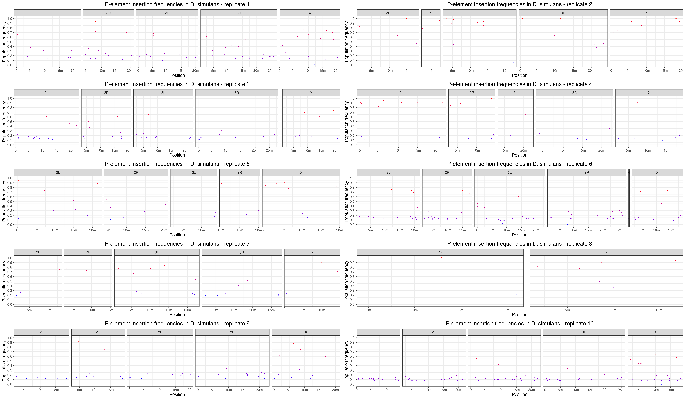

PopTE2
================
Matthew Beaumont
2023-06-14

# PopoolationTE2

First, we needed to construct the required ppileup file.

To begin, we concatenated the D. mel reference genome (r6.51) with the
P-element to generate the following FASTA file -

``` bash
cd /Volumes/Data/Tools/RefGenomes/dmel/dna/dmel_PPI251/
ls -h dmelall*.fasta
```

    ## dmelallchrom-r6.51_PPI251.fasta

Then created an index and /map directory for later steps.

``` bash
bwa index walkthrough-refgenome/2R-603-consensusTE.fasta

dyak % bwa index /Volumes/Data/Tools/RefGenomes/dyak/dna_pele/dyak_allchrom_1.3_PPI251.fasta 
mkdir map
```

Then we ran the following PPileupGen.sh script on the pairs of forward
and reverse reads, generating the required PPileup file.

``` bash
nohup zsh PopoolationTE2/PPileupGen.sh > logs/PPileupGen.log
```

``` bash
#!/bin/bash

ref_genome="/Volumes/Data/Tools/RefGenomes/dyak/dyak_prin_Tai18E2_2.1_PPI251.fasta"
popte2_jar="/Volumes/Data/Tools/PopoolationTE2/popte2-v1.10.03.jar"
hier_file="/Volumes/Data/Tools/RefGenomes/hierarchies/pelement.hier"
samples=("Dyak_21" "Dyak_22" "Dyak_23" "Dyak_24" "Dyak_25" "Dyak_26" "Dyak_27" "Dyak_28" "Dyak_29" "Dyak_30" "Dyak_N3")

for sample in "${samples[@]}"; do
   bwa mem -M -t 2 "$ref_genome" "/Volumes/Data/Projects/invaded_inbred_lines/dna/demultiplexed/fastq/${sample}_1.fq.gz" > "/Volumes/Data/Projects/invaded_inbred_lines/dna/map/unpaired/${sample}_1.sam" &
   bwa mem -M -t 2 "$ref_genome" "/Volumes/Data/Projects/invaded_inbred_lines/dna/demultiplexed/fastq/${sample}_2.fq.gz" > "/Volumes/Data/Projects/invaded_inbred_lines/dna/map/unpaired/${sample}_2.sam" &
done
wait

for sample in "${samples[@]}"; do
    java -Duser.country=US -Duser.language=en -jar "$popte2_jar" se2pe --fastq1 "/Volumes/Data/Projects/invaded_inbred_lines/dna/demultiplexed/fastq/${sample}_1.fq.gz" \
        --fastq2 "/Volumes/Data/Projects/invaded_inbred_lines/dna/demultiplexed/fastq/${sample}_2.fq.gz" \
        --bam1 "/Volumes/Data/Projects/invaded_inbred_lines/dna/map/unpaired/${sample}_1.sam" \
        --bam2 "/Volumes/Data/Projects/invaded_inbred_lines/dna/map/unpaired/${sample}_2.sam" \
        --sort --output "/Volumes/Data/Projects/invaded_inbred_lines/dna/map/paired/${sample}.sort.bam" &
done
wait

java -Duser.country=US -Duser.language=en -jar "$popte2_jar" ppileup \
    --bam /Volumes/Data/Projects/invaded_inbred_lines/dna/map/paired/Dyak_21.sort.bam \
    --bam /Volumes/Data/Projects/invaded_inbred_lines/dna/map/paired/Dyak_22.sort.bam \
    --bam /Volumes/Data/Projects/invaded_inbred_lines/dna/map/paired/Dyak_23.sort.bam \
    --bam /Volumes/Data/Projects/invaded_inbred_lines/dna/map/paired/Dyak_24.sort.bam \
    --bam /Volumes/Data/Projects/invaded_inbred_lines/dna/map/paired/Dyak_25.sort.bam \
    --bam /Volumes/Data/Projects/invaded_inbred_lines/dna/map/paired/Dyak_26.sort.bam \
    --bam /Volumes/Data/Projects/invaded_inbred_lines/dna/map/paired/Dyak_27.sort.bam \
    --bam /Volumes/Data/Projects/invaded_inbred_lines/dna/map/paired/Dyak_28.sort.bam \
    --bam /Volumes/Data/Projects/invaded_inbred_lines/dna/map/paired/Dyak_29.sort.bam \
    --bam /Volumes/Data/Projects/invaded_inbred_lines/dna/map/paired/Dyak_30.sort.bam \
    --bam /Volumes/Data/Projects/invaded_inbred_lines/dna/map/paired/Dyak_N3.sort.bam \
    --map-qual 15 --hier "$hier_file" --output /Volumes/Data/Projects/invaded_inbred_lines/dna/ppileup/Dyak.ppileup.gz
```

Then we ran the basic PoPoolationTE2 pipeline to assess P-element
insertion location and abundance in the different populations.

``` bash
# We need to subsample the ppileup file to a chosen coverage depth to generate am unbiased comparison of P-element abundance.
# java -Duser.country=US -Duser.language=en -jar popte2.jar subsampleppileup --ppileup dmel.ppileup.gz --target-coverage 100 --output output.ss100.ppileup.gz

# First we generate a file of the found P-element insertions and their locations.
java -Duser.country=US -Duser.language=en -jar /Volumes/Data/Tools/PopoolationTE2/popte2-v1.10.03.jar identifySignatures --ppileup /Volumes/Data/Projects/invaded_inbred_lines/dna/ppileup/Dmel.ppileup.gz --mode separate --output /Volumes/Data/Projects/invaded_inbred_lines/dna/popTE2/dmel.signatures --min-count 3

java -Duser.country=US -Duser.language=en -jar /Volumes/Data/Tools/PopoolationTE2/popte2-v1.10.03.jar identifySignatures --ppileup /Volumes/Data/Projects/invaded_inbred_lines/dna/ppileup/Dsim.ppileup.gz --mode separate --output /Volumes/Data/Projects/invaded_inbred_lines/dna/popTE2/dsim.signatures --min-count 3

java -Duser.country=US -Duser.language=en -jar /Volumes/Data/Tools/PopoolationTE2/popte2-v1.10.03.jar identifySignatures --ppileup /Volumes/Data/Projects/invaded_inbred_lines/dna/ppileup/Dyak.ppileup.gz --mode separate --output /Volumes/Data/Projects/invaded_inbred_lines/dna/popTE2/dyak.signatures --min-count 3

# Then we look at the frequency of the found signatures.
java -Duser.country=US -Duser.language=en -jar /Volumes/Data/Tools/PopoolationTE2/popte2-v1.10.03.jar frequency --ppileup /Volumes/Data/Projects/invaded_inbred_lines/dna/ppileup/Dmel.ppileup.gz --signature /Volumes/Data/Projects/invaded_inbred_lines/dna/popTE2/dmel.signatures --output /Volumes/Data/Projects/invaded_inbred_lines/dna/popTE2/dmel.freqsig

java -Duser.country=US -Duser.language=en -jar /Volumes/Data/Tools/PopoolationTE2/popte2-v1.10.03.jar frequency --ppileup /Volumes/Data/Projects/invaded_inbred_lines/dna/ppileup/Dsim.ppileup.gz --signature /Volumes/Data/Projects/invaded_inbred_lines/dna/popTE2/dsim.signatures --output /Volumes/Data/Projects/invaded_inbred_lines/dna/popTE2/dsim.freqsig

java -Duser.country=US -Duser.language=en -jar /Volumes/Data/Tools/PopoolationTE2/popte2-v1.10.03.jar frequency --ppileup /Volumes/Data/Projects/invaded_inbred_lines/dna/ppileup/Dyak.ppileup.gz --signature /Volumes/Data/Projects/invaded_inbred_lines/dna/popTE2/dyak.signatures --output /Volumes/Data/Projects/invaded_inbred_lines/dna/popTE2/dyak.freqsig

# Finally, we combine it all together. 
java -Duser.country=US -Duser.language=en -jar /Volumes/Data/Tools/PopoolationTE2/popte2-v1.10.03.jar pairupSignatures --signature /Volumes/Data/Projects/invaded_inbred_lines/dna/popTE2/dmel.freqsig --ref-genome /Volumes/Data/Tools/RefGenomes/dmel/dna/dmel_PPI251/dmelallchrom-r6.51_PPI251.fasta --hier /Volumes/Data/Tools/RefGenomes/hierarchies/pelement.hier --min-distance -200 --max-distance 300 --output /Volumes/Data/Projects/invaded_inbred_lines/dna/popTE2/dmel.teinsertions

java -Duser.country=US -Duser.language=en -jar /Volumes/Data/Tools/PopoolationTE2/popte2-v1.10.03.jar pairupSignatures --signature /Volumes/Data/Projects/invaded_inbred_lines/dna/popTE2/dsim.freqsig --ref-genome /Volumes/Data/Tools/RefGenomes/dsim/dsim_ASM75419v3_PPI251.fasta --hier /Volumes/Data/Tools/RefGenomes/hierarchies/pelement.hier --min-distance -200 --max-distance 300 --output /Volumes/Data/Projects/invaded_inbred_lines/dna/popTE2/dsim.teinsertions

java -Duser.country=US -Duser.language=en -jar /Volumes/Data/Tools/PopoolationTE2/popte2-v1.10.03.jar pairupSignatures --signature /Volumes/Data/Projects/invaded_inbred_lines/dna/popTE2/dyak.freqsig --ref-genome /Volumes/Data/Tools/RefGenomes/dyak/dna_pele/dyak_allchrom_1.3_PPI251.fasta --hier /Volumes/Data/Tools/RefGenomes/hierarchies/pelement.hier --min-distance -200 --max-distance 300 --output /Volumes/Data/Projects/invaded_inbred_lines/dna/popTE2/dyak.teinsertions
```

This provides us with a list of P-element insertions found in all 11
samples for each species, their location and population frequency.

# Manhattan plots

We then visualised the .teinsertion files in Manhattan plots for all
samples in each species.

``` r
library(viridisLite)
library(ggplot2)
library(gridExtra)
theme_set(theme_bw())

dm <- read.table("/Volumes/Data/Projects/invaded_inbred_lines/dna/popTE2/dmel/dmel.teinsertions")
names(dm) <- c("Sample", "Chromosome", "Position", "Strand", "TE", "Order", "FR", "Comment", "Frequency")

ds <- read.table("/Volumes/Data/Projects/invaded_inbred_lines/dna/popTE2/dsim/dsim.teinsertions")
names(ds) <- c("Sample", "Chromosome", "Position", "Strand", "TE", "Order", "FR", "Comment", "Frequency")

dy <- read.table("/Volumes/Data/Projects/invaded_inbred_lines/dna/popTE2/dyak/dyak.teinsertions")
names(dy) <- c("Sample", "Chromosome", "Position", "Strand", "TE", "Order", "FR", "Comment", "Frequency")

dm <- subset(dm, Chromosome == "X" | Chromosome == "2L" | Chromosome == "2R" | Chromosome == "3L" | Chromosome == "3R" | Chromosome == "4")
ds <- subset(ds, Chromosome == "X" | Chromosome == "2L" | Chromosome == "2R" | Chromosome == "3L" | Chromosome == "3R" | Chromosome == "4")
dy <- subset(dy, Chromosome == "X" | Chromosome == "2L" | Chromosome == "2R" | Chromosome == "3L" | Chromosome == "3R" | Chromosome == "4")

dm$Chromosome <- factor(dm$Chromosome, levels = c("X", "2L", "2R", "3L", "3R", "4"))
lim <- c(0.0, 0.51)
ybreaks <- c(0, 0.1, 0.2, 0.3, 0.4, 0.5)
ds$Chromosome <- factor(ds$Chromosome, levels = c("X", "2L", "2R", "3L", "3R", "4"))
lim <- c(0.0, 0.51)
ybreaks <- c(0, 0.1, 0.2, 0.3, 0.4, 0.5)
dy$Chromosome <- factor(dy$Chromosome, levels = c("X", "2L", "2R", "3L", "3R", "4"))
lim <- c(0.0, 0.51)
ybreaks <- c(0, 0.1, 0.2, 0.3, 0.4, 0.5)

sample_colors <- viridisLite::turbo(11)

dm$Sample <- as.factor(dm$Sample)
ds$Sample <- as.factor(ds$Sample)
dy$Sample <- as.factor(dy$Sample)

dmp <- ggplot(dm, aes(x = Position, y = Frequency, color = Sample)) +
  geom_point(size = 0.5) +
  facet_grid(. ~ Chromosome, scales = "free_x", space = "free_x") +
  scale_x_continuous(breaks = c(0, 5000000, 10000000, 15000000, 20000000, 25000000),
                     labels = c("0", "5m", "10m", "15m", "20m", "25m")) +
  scale_y_continuous(name = "Population frequency", limits = c(min(dm$Frequency), max(dm$Frequency)),
                     breaks = seq(0, 1, by = 0.1)) +
  scale_color_manual(values = sample_colors) +  
  theme(legend.position = "right", 
          plot.title = element_text(hjust = 0.5, size = 14)) +
  labs(title = "P-element insertion frequencies in D. melanogaster populations")


dsp <- ggplot(ds, aes(x = Position, y = Frequency, color = Sample)) +
  geom_point(size = 0.5) +
  facet_grid(. ~ Chromosome, scales = "free_x", space = "free_x") +
  scale_x_continuous(breaks = c(0, 5000000, 10000000, 15000000, 20000000, 25000000),
                     labels = c("0", "5m", "10m", "15m", "20m", "25m")) +
  scale_y_continuous(name = "Population frequency", limits = c(min(ds$Frequency), max(ds$Frequency)),
                     breaks = seq(0, 1, by = 0.1)) +
  scale_color_manual(values = sample_colors) +  
  theme(legend.position = "right", 
          plot.title = element_text(hjust = 0.5, size = 14)) +
  labs(title = "P-element insertion frequencies in D. simulans populations")


dyp <- ggplot(dy, aes(x = Position, y = Frequency, color = Sample)) +
  geom_point(size = 0.5) +
  facet_grid(. ~ Chromosome, scales = "free_x", space = "free_x") +
  scale_x_continuous(breaks = c(0, 5000000, 10000000, 15000000, 20000000, 25000000),
                     labels = c("0", "5m", "10m", "15m", "20m", "25m")) +
  scale_y_continuous(name = "Population frequency", limits = c(min(dy$Frequency), max(dy$Frequency)),
                     breaks = seq(0, 1, by = 0.1)) +
  scale_color_manual(values = sample_colors) +  
  theme(legend.position = "right",
          plot.title = element_text(hjust = 0.5, size = 14)) +
  labs(title = "P-element insertion frequencies in D. yakuba populations")

plot(dmp)
```

<!-- -->

``` r
plot(dsp)
```

<!-- -->

``` r
plot(dyp)
```

<!-- -->

Then we looked at each sample individually, starting with D. mel.

``` r
# Load libraries
library(ggplot2)
library(gridExtra)
theme_set(theme_bw())

# Function to read data and assign column names
read_data <- function(file_path) {
  data <- read.table(file_path)
  names(data) <- c("Sample", "Chromosome", "Position", "Strand", "TE", "Order", "FR", "Comment", "Frequency")
  data <- subset(data, Chromosome %in% c("X", "2L", "2R", "3L", "3R", "4"))
  data$Chromosome <- factor(data$Chromosome, levels = c("X", "2L", "2R", "3L", "3R", "4"))
  return(data)
}

# Directory path containing the files
directory_path <- "/Volumes/Data/Projects/invaded_inbred_lines/dna/popTE2/dmel/replicates/"

# File pattern to match
file_pattern <- "*.teinsertions"

# Get the file paths
file_paths <- list.files(directory_path, pattern = file_pattern, full.names = TRUE)

# Define custom X-axis limits for each chromosome
chrom_limits <- list(
  X = c(0, 4180000),
  `2L` = c(0, 28400000),
  `2R` = c(0, 32400000),
  `3L` = c(0, 32600000),
  `3R` = c(0, 36200000),
  "4" = c(0, 4300000)
)

# Read data and create plots
plots <- lapply(file_paths, function(file) {
  data <- read_data(file)
  title <- gsub("\\.teinsertions$", "", basename(file))

  # Create empty data frames for missing chromosomes
  for (chrom in names(chrom_limits)) {
    if (!(chrom %in% unique(data$Chromosome))) {
      empty_data <- data.frame(
        Sample = NA,
        Chromosome = factor(chrom, levels = names(chrom_limits)),
        Position = NA,
        Strand = NA,
        TE = NA,
        Order = NA,
        FR = NA,
        Comment = NA,
        Frequency = NA
      )
      data <- rbind(data, empty_data)
    }
  }

  # Sort the data by chromosome to maintain consistent facet order
  data <- data[order(data$Chromosome), ]

  ggplot(data, aes(x = Position, y = Frequency, color = Frequency)) +
    geom_point(size = 0.5) +
    facet_grid(. ~ Chromosome, scales = "free_x", space = "free_x") +
    scale_y_continuous(
      name = "Population frequency",
      limits = c(0, 1),  # Set consistent Y-axis limits from 0 to 1
      breaks = seq(0, 1, by = 0.1)
    ) +
    scale_color_gradient(low = "blue", high = "red") +
    theme(
      legend.position = "none",
      plot.title = element_text(hjust = 0.5, size = 14)
    ) +
    coord_cartesian(xlim = chrom_limits[[as.character(data$Chromosome[1])]]) +
    labs(title = paste("P-element insertion frequencies in D. melanogaster -", title))
})

# Combine and save plots with grid arrangement
combined_plots <- grid.arrange(grobs = plots, ncol = 2, layout_matrix = rbind(c(1,3), c(4,5), c(6,7), c(8,9), c(10,2)))
```

    ## Warning: Removed 1 rows containing missing values (`geom_point()`).
    ## Removed 1 rows containing missing values (`geom_point()`).
    ## Removed 1 rows containing missing values (`geom_point()`).
    ## Removed 1 rows containing missing values (`geom_point()`).
    ## Removed 1 rows containing missing values (`geom_point()`).
    ## Removed 1 rows containing missing values (`geom_point()`).

<!-- -->

``` r
ggsave("dmel_pele_freq.png", combined_plots, width = 18, height = 10, units = "in", dpi = 500)

knitr::include_graphics("dmel_pele_freq.png")
```


Then for D. sim.

``` r
library(ggplot2)
library(gridExtra)
theme_set(theme_bw())

ds1 <- read.table("/Volumes/Data/Projects/invaded_inbred_lines/dna/popTE2/dsim/replicates/1.teinsertions")
names(ds1) <- c("Sample", "Chromosome", "Position", "Strand", "TE", "Order", "FR", "Comment", "Frequency")

ds2 <- read.table("/Volumes/Data/Projects/invaded_inbred_lines/dna/popTE2/dsim/replicates/2.teinsertions")
names(ds2) <- c("Sample", "Chromosome", "Position", "Strand", "TE", "Order", "FR", "Comment", "Frequency")

ds3 <- read.table("/Volumes/Data/Projects/invaded_inbred_lines/dna/popTE2/dsim/replicates/3.teinsertions")
names(ds3) <- c("Sample", "Chromosome", "Position", "Strand", "TE", "Order", "FR", "Comment", "Frequency")

ds4 <- read.table("/Volumes/Data/Projects/invaded_inbred_lines/dna/popTE2/dsim/replicates/4.teinsertions")
names(ds4) <- c("Sample", "Chromosome", "Position", "Strand", "TE", "Order", "FR", "Comment", "Frequency")

ds5 <- read.table("/Volumes/Data/Projects/invaded_inbred_lines/dna/popTE2/dsim/replicates/5.teinsertions")
names(ds5) <- c("Sample", "Chromosome", "Position", "Strand", "TE", "Order", "FR", "Comment", "Frequency")

ds6 <- read.table("/Volumes/Data/Projects/invaded_inbred_lines/dna/popTE2/dsim/replicates/6.teinsertions")
names(ds6) <- c("Sample", "Chromosome", "Position", "Strand", "TE", "Order", "FR", "Comment", "Frequency")

ds7 <- read.table("/Volumes/Data/Projects/invaded_inbred_lines/dna/popTE2/dsim/replicates/7.teinsertions")
names(ds7) <- c("Sample", "Chromosome", "Position", "Strand", "TE", "Order", "FR", "Comment", "Frequency")

ds8 <- read.table("/Volumes/Data/Projects/invaded_inbred_lines/dna/popTE2/dsim/replicates/8.teinsertions")
names(ds8) <- c("Sample", "Chromosome", "Position", "Strand", "TE", "Order", "FR", "Comment", "Frequency")

ds9 <- read.table("/Volumes/Data/Projects/invaded_inbred_lines/dna/popTE2/dsim/replicates/9.teinsertions")
names(ds9) <- c("Sample", "Chromosome", "Position", "Strand", "TE", "Order", "FR", "Comment", "Frequency")

ds10 <- read.table("/Volumes/Data/Projects/invaded_inbred_lines/dna/popTE2/dsim/replicates/10.teinsertions")
names(ds10) <- c("Sample", "Chromosome", "Position", "Strand", "TE", "Order", "FR", "Comment", "Frequency")

ds1 <- subset(ds1, Chromosome == "X" | Chromosome == "2L" | Chromosome == "2R" | Chromosome == "3L" | Chromosome == "3R" | Chromosome == "4")
ds2 <- subset(ds2, Chromosome == "X" | Chromosome == "2L" | Chromosome == "2R" | Chromosome == "3L" | Chromosome == "3R" | Chromosome == "4")
ds3 <- subset(ds3, Chromosome == "X" | Chromosome == "2L" | Chromosome == "2R" | Chromosome == "3L" | Chromosome == "3R" | Chromosome == "4")
ds4 <- subset(ds4, Chromosome == "X" | Chromosome == "2L" | Chromosome == "2R" | Chromosome == "3L" | Chromosome == "3R" | Chromosome == "4")
ds5 <- subset(ds5, Chromosome == "X" | Chromosome == "2L" | Chromosome == "2R" | Chromosome == "3L" | Chromosome == "3R" | Chromosome == "4")
ds6 <- subset(ds6, Chromosome == "X" | Chromosome == "2L" | Chromosome == "2R" | Chromosome == "3L" | Chromosome == "3R" | Chromosome == "4")
ds7 <- subset(ds7, Chromosome == "X" | Chromosome == "2L" | Chromosome == "2R" | Chromosome == "3L" | Chromosome == "3R" | Chromosome == "4")
ds8 <- subset(ds8, Chromosome == "X" | Chromosome == "2L" | Chromosome == "2R" | Chromosome == "3L" | Chromosome == "3R" | Chromosome == "4")
ds9 <- subset(ds9, Chromosome == "X" | Chromosome == "2L" | Chromosome == "2R" | Chromosome == "3L" | Chromosome == "3R" | Chromosome == "4")
ds10 <- subset(ds10, Chromosome == "X" | Chromosome == "2L" | Chromosome == "2R" | Chromosome == "3L" | Chromosome == "3R" | Chromosome == "4")

ds1$Chromosome <- factor(ds1$Chromosome, levels = c("X", "2L", "2R", "3L", "3R", "4")) 
    lim <- c(0.0, 0.51) 
    ybreaks <- c(0, 0.1, 0.2, 0.3, 0.4, 0.5)
ds2$Chromosome <- factor(ds2$Chromosome, levels = c("X", "2L", "2R", "3L", "3R", "4")) 
    lim <- c(0.0, 0.51) 
    ybreaks <- c(0, 0.1, 0.2, 0.3, 0.4, 0.5)
ds3$Chromosome <- factor(ds3$Chromosome, levels = c("X", "2L", "2R", "3L", "3R", "4")) 
    lim <- c(0.0, 0.51) 
    ybreaks <- c(0, 0.1, 0.2, 0.3, 0.4, 0.5)
ds4$Chromosome <- factor(ds4$Chromosome, levels = c("X", "2L", "2R", "3L", "3R", "4")) 
    lim <- c(0.0, 0.51) 
    ybreaks <- c(0, 0.1, 0.2, 0.3, 0.4, 0.5)
ds5$Chromosome <- factor(ds5$Chromosome, levels = c("X", "2L", "2R", "3L", "3R", "4")) 
    lim <- c(0.0, 0.51) 
    ybreaks <- c(0, 0.1, 0.2, 0.3, 0.4, 0.5)
ds6$Chromosome <- factor(ds6$Chromosome, levels = c("X", "2L", "2R", "3L", "3R", "4")) 
    lim <- c(0.0, 0.51) 
    ybreaks <- c(0, 0.1, 0.2, 0.3, 0.4, 0.5)
ds7$Chromosome <- factor(ds7$Chromosome, levels = c("X", "2L", "2R", "3L", "3R", "4")) 
    lim <- c(0.0, 0.51) 
    ybreaks <- c(0, 0.1, 0.2, 0.3, 0.4, 0.5)
ds8$Chromosome <- factor(ds8$Chromosome, levels = c("X", "2L", "2R", "3L", "3R", "4")) 
    lim <- c(0.0, 0.51) 
    ybreaks <- c(0, 0.1, 0.2, 0.3, 0.4, 0.5)
ds9$Chromosome <- factor(ds9$Chromosome, levels = c("X", "2L", "2R", "3L", "3R", "4")) 
    lim <- c(0.0, 0.51) 
    ybreaks <- c(0, 0.1, 0.2, 0.3, 0.4, 0.5)
ds10$Chromosome <- factor(ds10$Chromosome, levels = c("X", "2L", "2R", "3L", "3R", "4")) 
    lim <- c(0.0, 0.51) 
    ybreaks <- c(0, 0.1, 0.2, 0.3, 0.4, 0.5)

dsp1 <- ggplot(ds1, aes(x = Position, y = Frequency, color = Frequency)) +
  geom_point(size = 0.5) +
  facet_grid(. ~ Chromosome, scales = "free_x", space = "free_x") +
  scale_x_continuous(breaks = c(0, 5000000, 10000000, 15000000, 20000000, 25000000),
                     labels = c("0", "5m", "10m", "15m", "20m", "25m")) +
  scale_y_continuous(name = "Population frequency", limits = c(min(dm$Frequency), max(dm$Frequency)),
                     breaks = seq(0, 1, by = 0.1)) +  scale_color_gradient(low = "blue", high = "red") + theme(legend.position = "none", plot.title = element_text(hjust = 0.5, size = 14)) + labs(title = "P-element insertion frequencies in D. simulans - replicate 1")

dsp2 <- ggplot(ds2, aes(x = Position, y = Frequency, color = Frequency)) +
  geom_point(size = 0.5) +
  facet_grid(. ~ Chromosome, scales = "free_x", space = "free_x") +
  scale_x_continuous(breaks = c(0, 5000000, 10000000, 15000000, 20000000, 25000000),
                     labels = c("0", "5m", "10m", "15m", "20m", "25m")) +
  scale_y_continuous(name = "Population frequency", limits = c(min(dm$Frequency), max(dm$Frequency)),
                     breaks = seq(0, 1, by = 0.1)) +  scale_color_gradient(low = "blue", high = "red") + theme(legend.position = "none", plot.title = element_text(hjust = 0.5, size = 14)) + labs(title = "P-element insertion frequencies in D. simulans - replicate 2")

dsp3 <- ggplot(ds3, aes(x = Position, y = Frequency, color = Frequency)) +
  geom_point(size = 0.5) +
  facet_grid(. ~ Chromosome, scales = "free_x", space = "free_x") +
  scale_x_continuous(breaks = c(0, 5000000, 10000000, 15000000, 20000000, 25000000),
                     labels = c("0", "5m", "10m", "15m", "20m", "25m")) +
  scale_y_continuous(name = "Population frequency", limits = c(min(dm$Frequency), max(dm$Frequency)),
                     breaks = seq(0, 1, by = 0.1)) +  scale_color_gradient(low = "blue", high = "red") + theme(legend.position = "none", plot.title = element_text(hjust = 0.5, size = 14)) + labs(title = "P-element insertion frequencies in D. simulans - replicate 3")

dsp3 <- ggplot(ds3, aes(x = Position, y = Frequency, color = Frequency)) +
  geom_point(size = 0.5) +
  facet_grid(. ~ Chromosome, scales = "free_x", space = "free_x") +
  scale_x_continuous(breaks = c(0, 5000000, 10000000, 15000000, 20000000, 25000000),
                     labels = c("0", "5m", "10m", "15m", "20m", "25m")) +
  scale_y_continuous(name = "Population frequency", limits = c(min(dm$Frequency), max(dm$Frequency)),
                     breaks = seq(0, 1, by = 0.1)) +  scale_color_gradient(low = "blue", high = "red") + theme(legend.position = "none", plot.title = element_text(hjust = 0.5, size = 14)) + labs(title = "P-element insertion frequencies in D. simulans - replicate 3")

dsp3 <- ggplot(ds3, aes(x = Position, y = Frequency, color = Frequency)) +
  geom_point(size = 0.5) +
  facet_grid(. ~ Chromosome, scales = "free_x", space = "free_x") +
  scale_x_continuous(breaks = c(0, 5000000, 10000000, 15000000, 20000000, 25000000),
                     labels = c("0", "5m", "10m", "15m", "20m", "25m")) +
  scale_y_continuous(name = "Population frequency", limits = c(min(dm$Frequency), max(dm$Frequency)),
                     breaks = seq(0, 1, by = 0.1)) +  scale_color_gradient(low = "blue", high = "red") + theme(legend.position = "none", plot.title = element_text(hjust = 0.5, size = 14)) + labs(title = "P-element insertion frequencies in D. simulans - replicate 3")

dsp4 <- ggplot(ds4, aes(x = Position, y = Frequency, color = Frequency)) +
  geom_point(size = 0.5) +
  facet_grid(. ~ Chromosome, scales = "free_x", space = "free_x") +
  scale_x_continuous(breaks = c(0, 5000000, 10000000, 15000000, 20000000, 25000000),
                     labels = c("0", "5m", "10m", "15m", "20m", "25m")) +
  scale_y_continuous(name = "Population frequency", limits = c(min(dm$Frequency), max(dm$Frequency)),
                     breaks = seq(0, 1, by = 0.1)) +  scale_color_gradient(low = "blue", high = "red") + theme(legend.position = "none", plot.title = element_text(hjust = 0.5, size = 14)) + labs(title = "P-element insertion frequencies in D. simulans - replicate 4")

dsp5 <- ggplot(ds5, aes(x = Position, y = Frequency, color = Frequency)) +
  geom_point(size = 0.5) +
  facet_grid(. ~ Chromosome, scales = "free_x", space = "free_x") +
  scale_x_continuous(breaks = c(0, 5000000, 10000000, 15000000, 20000000, 25000000),
                     labels = c("0", "5m", "10m", "15m", "20m", "25m")) +
  scale_y_continuous(name = "Population frequency", limits = c(min(dm$Frequency), max(dm$Frequency)),
                     breaks = seq(0, 1, by = 0.1)) +  scale_color_gradient(low = "blue", high = "red") + theme(legend.position = "none", plot.title = element_text(hjust = 0.5, size = 14)) + labs(title = "P-element insertion frequencies in D. simulans - replicate 5")

dsp6 <- ggplot(ds6, aes(x = Position, y = Frequency, color = Frequency)) +
  geom_point(size = 0.5) +
  facet_grid(. ~ Chromosome, scales = "free_x", space = "free_x") +
  scale_x_continuous(breaks = c(0, 5000000, 10000000, 15000000, 20000000, 25000000),
                     labels = c("0", "5m", "10m", "15m", "20m", "25m")) +
  scale_y_continuous(name = "Population frequency", limits = c(min(dm$Frequency), max(dm$Frequency)),
                     breaks = seq(0, 1, by = 0.1)) +  scale_color_gradient(low = "blue", high = "red") + theme(legend.position = "none", plot.title = element_text(hjust = 0.5, size = 14)) + labs(title = "P-element insertion frequencies in D. simulans - replicate 6")

dsp7 <- ggplot(ds7, aes(x = Position, y = Frequency, color = Frequency)) +
  geom_point(size = 0.5) +
  facet_grid(. ~ Chromosome, scales = "free_x", space = "free_x") +
  scale_x_continuous(breaks = c(0, 5000000, 10000000, 15000000, 20000000, 25000000),
                     labels = c("0", "5m", "10m", "15m", "20m", "25m")) +
  scale_y_continuous(name = "Population frequency", limits = c(min(dm$Frequency), max(dm$Frequency)),
                     breaks = seq(0, 1, by = 0.1)) +  scale_color_gradient(low = "blue", high = "red") + theme(legend.position = "none", plot.title = element_text(hjust = 0.5, size = 14)) + labs(title = "P-element insertion frequencies in D. simulans - replicate 7")

dsp8 <- ggplot(ds8, aes(x = Position, y = Frequency, color = Frequency)) +
  geom_point(size = 0.5) +
  facet_grid(. ~ Chromosome, scales = "free_x", space = "free_x") +
  scale_x_continuous(breaks = c(0, 5000000, 10000000, 15000000, 20000000, 25000000),
                     labels = c("0", "5m", "10m", "15m", "20m", "25m")) +
  scale_y_continuous(name = "Population frequency", limits = c(min(dm$Frequency), max(dm$Frequency)),
                     breaks = seq(0, 1, by = 0.1)) +  scale_color_gradient(low = "blue", high = "red") + theme(legend.position = "none", plot.title = element_text(hjust = 0.5, size = 14)) + labs(title = "P-element insertion frequencies in D. melanogaster - replicate 8")

dsp9 <- ggplot(ds9, aes(x = Position, y = Frequency, color = Frequency)) +
  geom_point(size = 0.5) +
  facet_grid(. ~ Chromosome, scales = "free_x", space = "free_x") +
  scale_x_continuous(breaks = c(0, 5000000, 10000000, 15000000, 20000000, 25000000),
                     labels = c("0", "5m", "10m", "15m", "20m", "25m")) +
  scale_y_continuous(name = "Population frequency", limits = c(min(dm$Frequency), max(dm$Frequency)),
                     breaks = seq(0, 1, by = 0.1)) +  scale_color_gradient(low = "blue", high = "red") + theme(legend.position = "none", plot.title = element_text(hjust = 0.5, size = 14)) + labs(title = "P-element insertion frequencies in D. simulans - replicate 9")

dsp10 <- ggplot(ds10, aes(x = Position, y = Frequency, color = Frequency)) +
  geom_point(size = 0.5) +
  facet_grid(. ~ Chromosome, scales = "free_x", space = "free_x") +
  scale_x_continuous(breaks = c(0, 5000000, 10000000, 15000000, 20000000, 25000000),
                     labels = c("0", "5m", "10m", "15m", "20m", "25m")) +
  scale_y_continuous(name = "Population frequency", limits = c(min(dm$Frequency), max(dm$Frequency)),
                     breaks = seq(0, 1, by = 0.1)) +  scale_color_gradient(low = "blue", high = "red") + theme(legend.position = "none", plot.title = element_text(hjust = 0.5, size = 14)) + labs(title = "P-element insertion frequencies in D. simulans - replicate 10")

dsp1
```

<!-- -->

``` r
dsp2
```

<!-- -->

``` r
dsp3
```

<!-- -->

``` r
dsp4
```

<!-- -->

``` r
dsp5
```

<!-- -->

``` r
dsp6
```

<!-- -->

``` r
dsp7
```

<!-- -->

``` r
dsp8
```

<!-- -->

``` r
dsp9
```

<!-- -->

``` r
dsp10
```

<!-- -->

``` r
library(ggplot2)
library(gridExtra)
theme_set(theme_bw())

# Create a list to store the data frames
data_list <- list()

# Read data for each replicate and store in the list
for (i in 1:10) {
  file_path <- paste0("/Volumes/Data/Projects/invaded_inbred_lines/dna/popTE2/dsim/replicates/", i, ".teinsertions")
  data <- read.table(file_path)
  names(data) <- c("Sample", "Chromosome", "Position", "Strand", "TE", "Order", "FR", "Comment", "Frequency")
  data <- subset(data, Chromosome %in% c("X", "2L", "2R", "3L", "3R", "4"))
  data$Chromosome <- factor(data$Chromosome, levels = c("X", "2L", "2R", "3L", "3R", "4"))
  data_list[[i]] <- data
}

# Create a list to store the plots
plot_list <- list()

# Generate plots for each replicate
for (i in 1:10) {
  plot_title <- paste("P-element insertion frequencies in D. simulans - replicate", i)
  p <- ggplot(data_list[[i]], aes(x = Position, y = Frequency, color = Frequency)) +
    geom_point(size = 0.5) +
    facet_grid(. ~ Chromosome, scales = "free_x", space = "free_x") +
    scale_x_continuous(breaks = c(0, 5000000, 10000000, 15000000, 20000000, 25000000),
                       labels = c("0", "5m", "10m", "15m", "20m", "25m")) +
    scale_y_continuous(name = "Population frequency",
                       limits = c(min(unlist(lapply(data_list, function(x) min(x$Frequency)))),
                                  max(unlist(lapply(data_list, function(x) max(x$Frequency))))),
                       breaks = seq(0, 1, by = 0.1)) +
    scale_color_gradient(low = "blue", high = "red") +
    theme(legend.position = "none", plot.title = element_text(hjust = 0.5, size = 14)) +
    labs(title = plot_title)

  plot_list[[i]] <- p
}

# Combine plots using grid.arrange
grid_arrange <- do.call(grid.arrange, c(plot_list, ncol = 2))
```

<!-- -->

``` r
# Increase the size of the final output
output_file <- "/Volumes/Data/Projects/invaded_inbred_lines/R/iil_analysis/dna/dsim_popTE2.png"
ggsave(output_file, plot = grid_arrange, width = 22, height = 12)
 
knitr::include_graphics("/Volumes/Data/Projects/invaded_inbred_lines/R/iil_analysis/dna/dsim_popTE2.png")
```



# Overlapping insertions

We wanted to assess the number and frequency of similar/overlapping
insertions across all replicates in each species. This way, if we had
insertions of high frequencies overlapping with insertions of lower
frequencies in other samples, we could attribute this to
cross-contamination. This would also give us an idea as to the degree of
cross-contamination, were we to find any.

To do so, we used th following script to identify insertions on the same
chromosome which overlap (+-500 bases).

``` python
#!/usr/bin/env python

import pandas as pd

df = pd.read_csv('/Volumes/Data/Projects/invaded_inbred_lines/dna/popTE2/dyak/dyak.teinsertions', delimiter='\t', header=None)
df.columns = ['sample_id', 'chromosome', 'position', 'strand', 'TE_family', 'TE_order', 'support', 'comment', 'frequency']

# Sort DataFrame
df.sort_values(['chromosome', 'position'], inplace=True)

window_size = 500

# Create new column for window
df['window_start'] = df['position'] - window_size
df['window_end'] = df['position'] + window_size

# Group data by chromosome
groups = df.groupby('chromosome')

output_lines = [] 

for _, group in groups:
    overlaps = set()  # Store unique combos
    for _, row in group.iterrows():
        overlapping_rows = group[
            (group['window_end'] >= row['window_start']) & (group['window_start'] <= row['window_end'])
        ]
        # Excludecurrent row
        overlapping_rows = overlapping_rows[overlapping_rows['sample_id'] != row['sample_id']]
        
        if len(overlapping_rows) > 0:
            # Store unique combos of overlapping ins
            for _, overlap_row in overlapping_rows.iterrows():
                overlap_info = f"Sample ID: {overlap_row['sample_id']} | Chromosome: {overlap_row['chromosome']} | " \
                               f"Position: {overlap_row['position']} | Frequency: {overlap_row['frequency']}"
                overlaps.add(overlap_info)
    
    if len(overlaps) > 0:
        chromosome = group['chromosome'].iloc[0]
        output_lines.append(f"Chromosome {chromosome}:")
        output_lines.append("Samples with overlapping insertions:\n")
        output_lines.extend(sorted(overlaps, key=lambda x: int(x.split("Position:")[1].split(" |")[0].strip())))
        output_lines.append("\n")

with open('dyak_window_overlap.txt', 'w') as output_file:
    output_file.write('\n'.join(output_lines))
```

We ran this for each species, and obtained the following results.

``` r
output <- readLines("/Volumes/Data/Projects/invaded_inbred_lines/scripts/dmel_window_overlap.txt")
cat(output, sep = "\n")
```

Chromosome 2L: Samples with overlapping insertions:

Sample ID: 9 \| Chromosome: 2L \| Position: 510693 \| Frequency: 0.272
Sample ID: 8 \| Chromosome: 2L \| Position: 510720 \| Frequency: 0.903
Sample ID: 4 \| Chromosome: 2L \| Position: 6411258 \| Frequency: 0.628
Sample ID: 5 \| Chromosome: 2L \| Position: 6411276 \| Frequency: 0.331
Sample ID: 9 \| Chromosome: 2L \| Position: 6411354 \| Frequency: 0.581
Sample ID: 5 \| Chromosome: 2L \| Position: 9015077 \| Frequency: 0.794
Sample ID: 4 \| Chromosome: 2L \| Position: 9015156 \| Frequency: 0.627
Sample ID: 2 \| Chromosome: 2L \| Position: 12505262 \| Frequency: 0.484
Sample ID: 3 \| Chromosome: 2L \| Position: 12505288 \| Frequency: 0.814
Sample ID: 10 \| Chromosome: 2L \| Position: 15762699 \| Frequency:
0.489 Sample ID: 9 \| Chromosome: 2L \| Position: 15762719 \| Frequency:
0.662 Sample ID: 3 \| Chromosome: 2L \| Position: 15762750 \| Frequency:
0.905 Sample ID: 4 \| Chromosome: 2L \| Position: 15762764 \| Frequency:
0.711 Sample ID: 2 \| Chromosome: 2L \| Position: 15762775 \| Frequency:
0.701 Sample ID: 5 \| Chromosome: 2L \| Position: 15762822 \| Frequency:
1.0 Sample ID: 9 \| Chromosome: 2L \| Position: 16683821 \| Frequency:
0.477 Sample ID: 10 \| Chromosome: 2L \| Position: 16683825 \|
Frequency: 0.709 Sample ID: 5 \| Chromosome: 2L \| Position: 20148527 \|
Frequency: 0.455 Sample ID: 2 \| Chromosome: 2L \| Position: 20148630 \|
Frequency: 0.431 Sample ID: 3 \| Chromosome: 2L \| Position: 20148647 \|
Frequency: 0.804 Sample ID: 4 \| Chromosome: 2L \| Position: 20148666 \|
Frequency: 0.827 Sample ID: 2 \| Chromosome: 2L \| Position: 20223113 \|
Frequency: 0.433 Sample ID: 4 \| Chromosome: 2L \| Position: 20223197 \|
Frequency: 0.634 Sample ID: 5 \| Chromosome: 2L \| Position: 20223218 \|
Frequency: 0.974

Chromosome 2R: Samples with overlapping insertions:

Sample ID: 8 \| Chromosome: 2R \| Position: 6612934 \| Frequency: 0.209
Sample ID: 4 \| Chromosome: 2R \| Position: 6612955 \| Frequency: 0.465
Sample ID: 3 \| Chromosome: 2R \| Position: 6612963 \| Frequency: 0.875
Sample ID: 5 \| Chromosome: 2R \| Position: 6612969 \| Frequency: 0.839
Sample ID: 2 \| Chromosome: 2R \| Position: 6613003 \| Frequency: 0.492
Sample ID: 6 \| Chromosome: 2R \| Position: 9861307 \| Frequency: 0.701
Sample ID: 2 \| Chromosome: 2R \| Position: 9861917 \| Frequency: 0.243
Sample ID: 6 \| Chromosome: 2R \| Position: 10535026 \| Frequency: 0.709
Sample ID: 2 \| Chromosome: 2R \| Position: 10535760 \| Frequency: 0.227
Sample ID: 9 \| Chromosome: 2R \| Position: 12589682 \| Frequency: 0.222
Sample ID: 10 \| Chromosome: 2R \| Position: 12589770 \| Frequency:
0.481 Sample ID: 2 \| Chromosome: 2R \| Position: 12670140 \| Frequency:
0.296 Sample ID: 3 \| Chromosome: 2R \| Position: 12670243 \| Frequency:
0.377 Sample ID: 2 \| Chromosome: 2R \| Position: 12934045 \| Frequency:
0.409 Sample ID: 3 \| Chromosome: 2R \| Position: 12934088 \| Frequency:
0.725 Sample ID: 4 \| Chromosome: 2R \| Position: 13035191 \| Frequency:
0.771 Sample ID: 1 \| Chromosome: 2R \| Position: 13035193 \| Frequency:
0.757 Sample ID: 5 \| Chromosome: 2R \| Position: 13035193 \| Frequency:
0.8 Sample ID: 3 \| Chromosome: 2R \| Position: 15309008 \| Frequency:
0.503 Sample ID: 6 \| Chromosome: 2R \| Position: 15309134 \| Frequency:
0.615 Sample ID: 9 \| Chromosome: 2R \| Position: 16829008 \| Frequency:
0.467 Sample ID: 10 \| Chromosome: 2R \| Position: 16829382 \|
Frequency: 0.497 Sample ID: 9 \| Chromosome: 2R \| Position: 18611907 \|
Frequency: 0.25 Sample ID: 10 \| Chromosome: 2R \| Position: 18611933 \|
Frequency: 0.585

Chromosome 3L: Samples with overlapping insertions:

Sample ID: 3 \| Chromosome: 3L \| Position: 4262486 \| Frequency: 0.899
Sample ID: 2 \| Chromosome: 3L \| Position: 4262525 \| Frequency: 0.386
Sample ID: 2 \| Chromosome: 3L \| Position: 6978629 \| Frequency: 0.725
Sample ID: 4 \| Chromosome: 3L \| Position: 6978676 \| Frequency: 0.547
Sample ID: 8 \| Chromosome: 3L \| Position: 8827481 \| Frequency: 0.633
Sample ID: 2 \| Chromosome: 3L \| Position: 8827486 \| Frequency: 0.727
Sample ID: 9 \| Chromosome: 3L \| Position: 8827544 \| Frequency: 0.52
Sample ID: 7 \| Chromosome: 3L \| Position: 10882856 \| Frequency: 0.57
Sample ID: 9 \| Chromosome: 3L \| Position: 10882883 \| Frequency: 0.355
Sample ID: 5 \| Chromosome: 3L \| Position: 16046878 \| Frequency: 0.747
Sample ID: 4 \| Chromosome: 3L \| Position: 16046952 \| Frequency: 0.521
Sample ID: 3 \| Chromosome: 3L \| Position: 20508202 \| Frequency: 0.901
Sample ID: 1 \| Chromosome: 3L \| Position: 20508203 \| Frequency: 0.762
Sample ID: 5 \| Chromosome: 3L \| Position: 20949617 \| Frequency: 0.536
Sample ID: 4 \| Chromosome: 3L \| Position: 20949637 \| Frequency: 0.627
Sample ID: 5 \| Chromosome: 3L \| Position: 21100108 \| Frequency: 0.809
Sample ID: 4 \| Chromosome: 3L \| Position: 21100127 \| Frequency: 0.873
Sample ID: 1 \| Chromosome: 3L \| Position: 21240120 \| Frequency: 0.685
Sample ID: 5 \| Chromosome: 3L \| Position: 21240121 \| Frequency: 0.761
Sample ID: 4 \| Chromosome: 3L \| Position: 21240151 \| Frequency: 0.483
Sample ID: 9 \| Chromosome: 3L \| Position: 21347152 \| Frequency: 0.24
Sample ID: 5 \| Chromosome: 3L \| Position: 21347802 \| Frequency: 0.262
Sample ID: 3 \| Chromosome: 3L \| Position: 21841278 \| Frequency: 0.8
Sample ID: 1 \| Chromosome: 3L \| Position: 21841282 \| Frequency: 0.677
Sample ID: 4 \| Chromosome: 3L \| Position: 22749349 \| Frequency: 0.345
Sample ID: 5 \| Chromosome: 3L \| Position: 22749461 \| Frequency: 0.462

Chromosome 3R: Samples with overlapping insertions:

Sample ID: 7 \| Chromosome: 3R \| Position: 4281659 \| Frequency: 0.344
Sample ID: 9 \| Chromosome: 3R \| Position: 4281716 \| Frequency: 0.374
Sample ID: 1 \| Chromosome: 3R \| Position: 5685430 \| Frequency: 0.344
Sample ID: 10 \| Chromosome: 3R \| Position: 5685431 \| Frequency: 0.313
Sample ID: 9 \| Chromosome: 3R \| Position: 9394549 \| Frequency: 0.382
Sample ID: 7 \| Chromosome: 3R \| Position: 9394618 \| Frequency: 0.385
Sample ID: 5 \| Chromosome: 3R \| Position: 9551425 \| Frequency: 0.657
Sample ID: 4 \| Chromosome: 3R \| Position: 9551446 \| Frequency: 0.801
Sample ID: 5 \| Chromosome: 3R \| Position: 11569129 \| Frequency: 0.616
Sample ID: 4 \| Chromosome: 3R \| Position: 11569207 \| Frequency: 0.528
Sample ID: 5 \| Chromosome: 3R \| Position: 11974454 \| Frequency: 0.442
Sample ID: 4 \| Chromosome: 3R \| Position: 11974481 \| Frequency: 0.801
Sample ID: 10 \| Chromosome: 3R \| Position: 12372975 \| Frequency:
0.462 Sample ID: 7 \| Chromosome: 3R \| Position: 12372991 \| Frequency:
0.405 Sample ID: 8 \| Chromosome: 3R \| Position: 12373060 \| Frequency:
0.478 Sample ID: 9 \| Chromosome: 3R \| Position: 12373077 \| Frequency:
0.163 Sample ID: 7 \| Chromosome: 3R \| Position: 13714590 \| Frequency:
0.354 Sample ID: 8 \| Chromosome: 3R \| Position: 13714830 \| Frequency:
0.332 Sample ID: 9 \| Chromosome: 3R \| Position: 14558044 \| Frequency:
0.461 Sample ID: 7 \| Chromosome: 3R \| Position: 14558069 \| Frequency:
0.532 Sample ID: 6 \| Chromosome: 3R \| Position: 14558080 \| Frequency:
0.549 Sample ID: 10 \| Chromosome: 3R \| Position: 14724123 \|
Frequency: 0.355 Sample ID: 8 \| Chromosome: 3R \| Position: 14724157 \|
Frequency: 0.543 Sample ID: 3 \| Chromosome: 3R \| Position: 15155054 \|
Frequency: 0.898 Sample ID: 5 \| Chromosome: 3R \| Position: 15155099 \|
Frequency: 0.548 Sample ID: 8 \| Chromosome: 3R \| Position: 18049365 \|
Frequency: 0.462 Sample ID: 10 \| Chromosome: 3R \| Position: 18049375
\| Frequency: 0.333 Sample ID: 8 \| Chromosome: 3R \| Position: 19153527
\| Frequency: 0.43 Sample ID: 10 \| Chromosome: 3R \| Position: 19153564
\| Frequency: 0.402 Sample ID: 3 \| Chromosome: 3R \| Position: 19836853
\| Frequency: 1.0 Sample ID: 6 \| Chromosome: 3R \| Position: 19837051
\| Frequency: 0.438 Sample ID: 8 \| Chromosome: 3R \| Position: 19890747
\| Frequency: 0.622 Sample ID: 10 \| Chromosome: 3R \| Position:
19890770 \| Frequency: 0.504 Sample ID: 4 \| Chromosome: 3R \| Position:
21376463 \| Frequency: 0.646 Sample ID: 5 \| Chromosome: 3R \| Position:
21376479 \| Frequency: 0.781 Sample ID: 6 \| Chromosome: 3R \| Position:
21376556 \| Frequency: 0.675 Sample ID: 5 \| Chromosome: 3R \| Position:
22673439 \| Frequency: 0.803 Sample ID: 4 \| Chromosome: 3R \| Position:
22673462 \| Frequency: 0.655 Sample ID: 2 \| Chromosome: 3R \| Position:
22673517 \| Frequency: 0.265 Sample ID: 8 \| Chromosome: 3R \| Position:
23173273 \| Frequency: 0.318 Sample ID: 7 \| Chromosome: 3R \| Position:
23173300 \| Frequency: 0.725 Sample ID: 10 \| Chromosome: 3R \|
Position: 23173302 \| Frequency: 0.379 Sample ID: 10 \| Chromosome: 3R
\| Position: 23345728 \| Frequency: 0.576 Sample ID: 8 \| Chromosome: 3R
\| Position: 23345789 \| Frequency: 0.588 Sample ID: 7 \| Chromosome: 3R
\| Position: 23345871 \| Frequency: 0.587 Sample ID: 2 \| Chromosome: 3R
\| Position: 28674943 \| Frequency: 0.46 Sample ID: 4 \| Chromosome: 3R
\| Position: 28674992 \| Frequency: 0.576 Sample ID: 2 \| Chromosome: 3R
\| Position: 29765711 \| Frequency: 0.327 Sample ID: 5 \| Chromosome: 3R
\| Position: 29765753 \| Frequency: 0.779

Chromosome X: Samples with overlapping insertions:

Sample ID: 4 \| Chromosome: X \| Position: 1165311 \| Frequency: 0.881
Sample ID: 1 \| Chromosome: X \| Position: 1165371 \| Frequency: 0.655
Sample ID: 3 \| Chromosome: X \| Position: 2293417 \| Frequency: 0.717
Sample ID: 4 \| Chromosome: X \| Position: 2293420 \| Frequency: 0.651
Sample ID: 9 \| Chromosome: X \| Position: 2293454 \| Frequency: 0.341
Sample ID: 2 \| Chromosome: X \| Position: 2317616 \| Frequency: 0.741
Sample ID: 9 \| Chromosome: X \| Position: 2317646 \| Frequency: 0.507
Sample ID: 6 \| Chromosome: X \| Position: 2642655 \| Frequency: 0.664
Sample ID: 4 \| Chromosome: X \| Position: 2642695 \| Frequency: 0.848
Sample ID: 1 \| Chromosome: X \| Position: 5988703 \| Frequency: 0.435
Sample ID: 5 \| Chromosome: X \| Position: 5988794 \| Frequency: 0.489
Sample ID: 7 \| Chromosome: X \| Position: 7307679 \| Frequency: 0.904
Sample ID: 9 \| Chromosome: X \| Position: 7307689 \| Frequency: 0.59
Sample ID: 3 \| Chromosome: X \| Position: 8498724 \| Frequency: 0.603
Sample ID: 4 \| Chromosome: X \| Position: 8498736 \| Frequency: 0.652
Sample ID: 2 \| Chromosome: X \| Position: 10331554 \| Frequency: 0.208
Sample ID: 9 \| Chromosome: X \| Position: 10331889 \| Frequency: 0.274
Sample ID: 5 \| Chromosome: X \| Position: 15804281 \| Frequency: 1.0
Sample ID: 1 \| Chromosome: X \| Position: 15804286 \| Frequency: 0.882
Sample ID: 2 \| Chromosome: X \| Position: 15804385 \| Frequency: 0.371
Sample ID: 5 \| Chromosome: X \| Position: 17178514 \| Frequency: 0.853
Sample ID: 1 \| Chromosome: X \| Position: 17178862 \| Frequency: 0.58
Sample ID: 6 \| Chromosome: X \| Position: 18863831 \| Frequency: 0.615
Sample ID: 1 \| Chromosome: X \| Position: 18863889 \| Frequency: 0.726
Sample ID: 10 \| Chromosome: X \| Position: 19498330 \| Frequency: 0.643
Sample ID: 8 \| Chromosome: X \| Position: 19498330 \| Frequency: 0.797
Sample ID: 5 \| Chromosome: X \| Position: 19887120 \| Frequency: 0.866
Sample ID: 1 \| Chromosome: X \| Position: 19887134 \| Frequency: 0.971
Sample ID: 6 \| Chromosome: X \| Position: 19887181 \| Frequency: 0.648
Sample ID: 4 \| Chromosome: X \| Position: 21350265 \| Frequency: 0.691
Sample ID: 5 \| Chromosome: X \| Position: 21350273 \| Frequency: 0.571

Chromosome mitochondrion_genome: Samples with overlapping insertions:

Sample ID: 2 \| Chromosome: mitochondrion_genome \| Position: 741 \|
Frequency: 0.001 Sample ID: 5 \| Chromosome: mitochondrion_genome \|
Position: 1563 \| Frequency: 0.007 Sample ID: 10 \| Chromosome:
mitochondrion_genome \| Position: 4300 \| Frequency: 0.004 Sample ID: 2
\| Chromosome: mitochondrion_genome \| Position: 4582 \| Frequency:
0.002

``` r
output <- readLines("/Volumes/Data/Projects/invaded_inbred_lines/scripts/dsim_window_overlap.txt")
cat(output, sep = "\n")
```

Chromosome 2L: Samples with overlapping insertions:

Sample ID: 5 \| Chromosome: 2L \| Position: 230504 \| Frequency: 0.943
Sample ID: 4 \| Chromosome: 2L \| Position: 230521 \| Frequency: 0.92
Sample ID: 1 \| Chromosome: 2L \| Position: 230527 \| Frequency: 0.651
Sample ID: 5 \| Chromosome: 2L \| Position: 462699 \| Frequency: 0.911
Sample ID: 1 \| Chromosome: 2L \| Position: 462703 \| Frequency: 0.601
Sample ID: 4 \| Chromosome: 2L \| Position: 462711 \| Frequency: 0.884
Sample ID: 3 \| Chromosome: 2L \| Position: 1585608 \| Frequency: 0.512
Sample ID: 2 \| Chromosome: 2L \| Position: 1585613 \| Frequency: 0.83
Sample ID: 4 \| Chromosome: 2L \| Position: 4840505 \| Frequency: 0.821
Sample ID: 1 \| Chromosome: 2L \| Position: 4840553 \| Frequency: 0.37
Sample ID: 4 \| Chromosome: 2L \| Position: 10873524 \| Frequency: 0.913
Sample ID: 3 \| Chromosome: 2L \| Position: 10873554 \| Frequency: 0.606
Sample ID: 4 \| Chromosome: 2L \| Position: 14932034 \| Frequency: 0.901
Sample ID: 5 \| Chromosome: 2L \| Position: 14932043 \| Frequency: 0.515
Sample ID: 2 \| Chromosome: 2L \| Position: 14932048 \| Frequency: 1.0
Sample ID: 3 \| Chromosome: 2L \| Position: 19044520 \| Frequency: 0.467
Sample ID: 1 \| Chromosome: 2L \| Position: 19044625 \| Frequency: 0.305
Sample ID: 5 \| Chromosome: 2L \| Position: 21391979 \| Frequency: 0.888
Sample ID: 3 \| Chromosome: 2L \| Position: 21391990 \| Frequency: 0.418
Sample ID: 4 \| Chromosome: 2L \| Position: 21391995 \| Frequency: 0.903

Chromosome 2R: Samples with overlapping insertions:

Sample ID: 4 \| Chromosome: 2R \| Position: 3258536 \| Frequency: 0.839
Sample ID: 6 \| Chromosome: 2R \| Position: 3258583 \| Frequency: 0.275
Sample ID: 7 \| Chromosome: 2R \| Position: 3258614 \| Frequency: 0.783
Sample ID: 8 \| Chromosome: 2R \| Position: 4510353 \| Frequency: 0.933
Sample ID: 9 \| Chromosome: 2R \| Position: 4510437 \| Frequency: 0.921
Sample ID: 6 \| Chromosome: 2R \| Position: 4770337 \| Frequency: 0.12
Sample ID: 5 \| Chromosome: 2R \| Position: 4770941 \| Frequency: 0.546
Sample ID: 3 \| Chromosome: 2R \| Position: 5727864 \| Frequency: 0.508
Sample ID: 5 \| Chromosome: 2R \| Position: 5727879 \| Frequency: 0.369
Sample ID: 4 \| Chromosome: 2R \| Position: 5727911 \| Frequency: 0.888
Sample ID: 9 \| Chromosome: 2R \| Position: 12943340 \| Frequency: 0.75
Sample ID: 8 \| Chromosome: 2R \| Position: 12943341 \| Frequency: 1.0

Chromosome 3L: Samples with overlapping insertions:

Sample ID: 1 \| Chromosome: 3L \| Position: 5172003 \| Frequency: 0.679
Sample ID: 2 \| Chromosome: 3L \| Position: 5172019 \| Frequency: 0.947
Sample ID: 2 \| Chromosome: 3L \| Position: 5271269 \| Frequency: 0.974
Sample ID: 1 \| Chromosome: 3L \| Position: 5271318 \| Frequency: 0.625
Sample ID: 2 \| Chromosome: 3L \| Position: 5271352 \| Frequency: 0.436
Sample ID: 2 \| Chromosome: 3L \| Position: 13603543 \| Frequency: 0.936
Sample ID: 5 \| Chromosome: 3L \| Position: 13603694 \| Frequency: 0.267
Sample ID: 2 \| Chromosome: 3L \| Position: 13658535 \| Frequency: 0.851
Sample ID: 4 \| Chromosome: 3L \| Position: 13658563 \| Frequency: 0.9
Sample ID: 2 \| Chromosome: 3L \| Position: 22032358 \| Frequency: 0.06
Sample ID: 6 \| Chromosome: 3L \| Position: 22032483 \| Frequency: 0.008
Sample ID: 4 \| Chromosome: 3L \| Position: 22164443 \| Frequency: 0.828
Sample ID: 7 \| Chromosome: 3L \| Position: 22164844 \| Frequency: 0.536

Chromosome 3R: Samples with overlapping insertions:

Sample ID: 7 \| Chromosome: 3R \| Position: 7330858 \| Frequency: 0.188
Sample ID: 10 \| Chromosome: 3R \| Position: 7331023 \| Frequency: 0.338
Sample ID: 1 \| Chromosome: 3R \| Position: 11373829 \| Frequency: 0.426
Sample ID: 2 \| Chromosome: 3R \| Position: 11373834 \| Frequency: 1.0

Chromosome NODE_295: Samples with overlapping insertions:

Sample ID: 10 \| Chromosome: NODE_295 \| Position: 331 \| Frequency:
0.005 Sample ID: 6 \| Chromosome: NODE_295 \| Position: 378 \|
Frequency: 0.002

Chromosome NODE_36527: Samples with overlapping insertions:

Sample ID: 2 \| Chromosome: NODE_36527 \| Position: 2206 \| Frequency:
0.537 Sample ID: 3 \| Chromosome: NODE_36527 \| Position: 2337 \|
Frequency: 0.594

Chromosome NODE_37551: Samples with overlapping insertions:

Sample ID: 1 \| Chromosome: NODE_37551 \| Position: 559 \| Frequency:
0.003 Sample ID: 3 \| Chromosome: NODE_37551 \| Position: 699 \|
Frequency: 0.001

Chromosome X: Samples with overlapping insertions:

Sample ID: 10 \| Chromosome: X \| Position: 1692564 \| Frequency: 0.528
Sample ID: 9 \| Chromosome: X \| Position: 1692585 \| Frequency: 0.61
Sample ID: 2 \| Chromosome: X \| Position: 1692648 \| Frequency: 0.75
Sample ID: 8 \| Chromosome: X \| Position: 1692661 \| Frequency: 0.808
Sample ID: 8 \| Chromosome: X \| Position: 6352799 \| Frequency: 0.777
Sample ID: 9 \| Chromosome: X \| Position: 6352804 \| Frequency: 0.877
Sample ID: 5 \| Chromosome: X \| Position: 6353020 \| Frequency: 0.773
Sample ID: 1 \| Chromosome: X \| Position: 6353047 \| Frequency: 0.607
Sample ID: 2 \| Chromosome: X \| Position: 8473063 \| Frequency: 0.842
Sample ID: 1 \| Chromosome: X \| Position: 8473076 \| Frequency: 0.757
Sample ID: 5 \| Chromosome: X \| Position: 8473078 \| Frequency: 0.786
Sample ID: 9 \| Chromosome: X \| Position: 8473258 \| Frequency: 0.316
Sample ID: 8 \| Chromosome: X \| Position: 8473259 \| Frequency: 0.496
Sample ID: 8 \| Chromosome: X \| Position: 8734828 \| Frequency: 0.911
Sample ID: 9 \| Chromosome: X \| Position: 8734882 \| Frequency: 0.751
Sample ID: 1 \| Chromosome: X \| Position: 12085749 \| Frequency: 0.001
Sample ID: 10 \| Chromosome: X \| Position: 12085841 \| Frequency: 0.001
Sample ID: 3 \| Chromosome: X \| Position: 14077813 \| Frequency: 0.602
Sample ID: 1 \| Chromosome: X \| Position: 14077814 \| Frequency: 0.567
Sample ID: 10 \| Chromosome: X \| Position: 16859470 \| Frequency: 0.581
Sample ID: 9 \| Chromosome: X \| Position: 16859501 \| Frequency: 0.601
Sample ID: 8 \| Chromosome: X \| Position: 16859526 \| Frequency: 0.942
Sample ID: 5 \| Chromosome: X \| Position: 19254308 \| Frequency: 0.828
Sample ID: 3 \| Chromosome: X \| Position: 19254317 \| Frequency: 0.73
Sample ID: 2 \| Chromosome: X \| Position: 19254326 \| Frequency: 0.944

``` r
output <- readLines("/Volumes/Data/Projects/invaded_inbred_lines/scripts/dyak_window_overlap.txt")
cat(output, sep = "\n")
```

Chromosome 2L: Samples with overlapping insertions:

Sample ID: 3 \| Chromosome: 2L \| Position: 10526218 \| Frequency: 0.197
Sample ID: 1 \| Chromosome: 2L \| Position: 10526510 \| Frequency: 0.685
Sample ID: 3 \| Chromosome: 2L \| Position: 10526510 \| Frequency: 0.411

Chromosome 2R: Samples with overlapping insertions:

Sample ID: 3 \| Chromosome: 2R \| Position: 9764251 \| Frequency: 0.326
Sample ID: 1 \| Chromosome: 2R \| Position: 9764313 \| Frequency: 0.492
Sample ID: 8 \| Chromosome: 2R \| Position: 20418654 \| Frequency: 0.791
Sample ID: 6 \| Chromosome: 2R \| Position: 20418658 \| Frequency: 0.853
Sample ID: 7 \| Chromosome: 2R \| Position: 20418659 \| Frequency: 0.805

Chromosome 3L: Samples with overlapping insertions:

Sample ID: 4 \| Chromosome: 3L \| Position: 8643494 \| Frequency: 0.78
Sample ID: 3 \| Chromosome: 3L \| Position: 8643510 \| Frequency: 0.473
Sample ID: 6 \| Chromosome: 3L \| Position: 15425091 \| Frequency: 0.344
Sample ID: 7 \| Chromosome: 3L \| Position: 15425109 \| Frequency: 0.86
Sample ID: 8 \| Chromosome: 3L \| Position: 15425155 \| Frequency: 0.663
Sample ID: 6 \| Chromosome: 3L \| Position: 20675029 \| Frequency: 0.411
Sample ID: 8 \| Chromosome: 3L \| Position: 20675045 \| Frequency: 0.399

Chromosome 3R: Samples with overlapping insertions:

Sample ID: 3 \| Chromosome: 3R \| Position: 9214606 \| Frequency: 0.577
Sample ID: 4 \| Chromosome: 3R \| Position: 9214606 \| Frequency: 0.568
Sample ID: 7 \| Chromosome: 3R \| Position: 17030897 \| Frequency: 0.285
Sample ID: 6 \| Chromosome: 3R \| Position: 17030963 \| Frequency: 0.347
Sample ID: 8 \| Chromosome: 3R \| Position: 17030979 \| Frequency: 0.203
Sample ID: 6 \| Chromosome: 3R \| Position: 18102428 \| Frequency: 0.377
Sample ID: 7 \| Chromosome: 3R \| Position: 18102461 \| Frequency: 0.447
Sample ID: 8 \| Chromosome: 3R \| Position: 21515151 \| Frequency: 0.402
Sample ID: 6 \| Chromosome: 3R \| Position: 21515200 \| Frequency: 0.334
Sample ID: 9 \| Chromosome: 3R \| Position: 26855683 \| Frequency: 0.91
Sample ID: 1 \| Chromosome: 3R \| Position: 26855702 \| Frequency: 0.297

Chromosome X: Samples with overlapping insertions:

Sample ID: 7 \| Chromosome: X \| Position: 5805412 \| Frequency: 0.725
Sample ID: 6 \| Chromosome: X \| Position: 5805436 \| Frequency: 0.827
Sample ID: 8 \| Chromosome: X \| Position: 5805455 \| Frequency: 0.581
Sample ID: 6 \| Chromosome: X \| Position: 17982733 \| Frequency: 0.312
Sample ID: 7 \| Chromosome: X \| Position: 17982801 \| Frequency: 0.673
Sample ID: 8 \| Chromosome: X \| Position: 17982858 \| Frequency: 0.708

# IGV

We wanted to assess whether the results from PopoolationTE2 were
expected based on the coverage of input files relative to a reference.
To do this, we simply gave a quick visual assessment on IGV.

First, we needed to map the files against the indexed ISO1 reference
with bwa, convert them to BAM files and sort them.

``` bash
#!/bin/bash

ref="/Volumes/Data/Tools/RefGenomes/dmel/dna/dmel-all-chromosome-r6.51.fasta"
if="/Volumes/Data/Projects/invaded_inbred_lines/dna/demultiplexed/fastq"
of="/Volumes/Data/Projects/invaded_inbred_lines/dna/demultiplexed/map-bwamem"

bwa mem -t 12 $ref $if/Dmel_1_1.fq.gz $if/Dmel_1_2.fq.gz | samtools sort -m 2G --output-fmt BAM --threads 2 -o $of/dmel_1.sort.bam
bwa mem -t 12 $ref $if/Dmel_2_1.fq.gz $if/Dmel_2_2.fq.gz | samtools sort -m 2G --output-fmt BAM --threads 2 -o $of/dmel_2.sort.bam
bwa mem -t 12 $ref $if/Dmel_3_1.fq.gz $if/Dmel_3_2.fq.gz | samtools sort -m 2G --output-fmt BAM --threads 2 -o $of/dmel_3.sort.bam
bwa mem -t 12 $ref $if/Dmel_4_1.fq.gz $if/Dmel_4_2.fq.gz | samtools sort -m 2G --output-fmt BAM --threads 2 -o $of/dmel_4.sort.bam
bwa mem -t 12 $ref $if/Dmel_5_1.fq.gz $if/Dmel_5_2.fq.gz | samtools sort -m 2G --output-fmt BAM --threads 2 -o $of/dmel_5.sort.bam
bwa mem -t 12 $ref $if/Dmel_6_1.fq.gz $if/Dmel_6_2.fq.gz | samtools sort -m 2G --output-fmt BAM --threads 2 -o $of/dmel_6.sort.bam
bwa mem -t 12 $ref $if/Dmel_7_1.fq.gz $if/Dmel_7_2.fq.gz | samtools sort -m 2G --output-fmt BAM --threads 2 -o $of/dmel_7.sort.bam
bwa mem -t 12 $ref $if/Dmel_8_1.fq.gz $if/Dmel_8_2.fq.gz | samtools sort -m 2G --output-fmt BAM --threads 2 -o $of/dmel_8.sort.bam
bwa mem -t 12 $ref $if/Dmel_9_1.fq.gz $if/Dmel_9_2.fq.gz | samtools sort -m 2G --output-fmt BAM --threads 2 -o $of/dmel_9.sort.bam
bwa mem -t 2 $ref $if/Dmel_10_1.fq.gz $if/Dmel_10_2.fq.gz | samtools sort -m 2G --output-fmt BAM --threads 2 -o $of/dmel_10.sort.bam
bwa mem -t 2 $ref $if/Dmel_N1_1.fq.gz $if/Dmel_N1_2.fq.gz | samtools sort -m 2G --output-fmt BAM --threads 2 -o $of/dmel_N1.sort.bam
```

We then open the BAM files in IGV and compare to the reference.

(.png of coverage)
